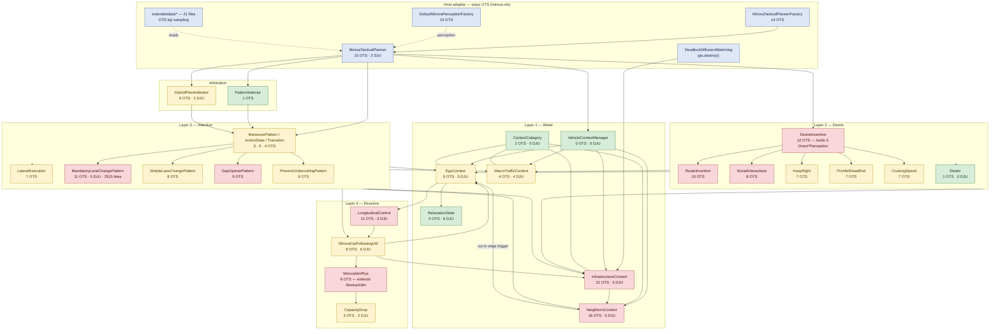

# Phase 0 — Inventory: MiRoVA against OpenTrafficSim

Read-only survey of every place the MiRoVA driver model touches OpenTrafficSim, DJUnits or DSOL,
produced as the input to the `mirova-api` contract design (Phase 1).

**Scope.** `ots-road/src/main/java/org/opentrafficsim/road/gtu/lane/tactical/mirova` (92 files,
20 232 lines) plus the parts of `ots-demo/.../demo/mirova` that supply parameters and random
streams. Nothing was modified.

**Method.** Per-file import extraction and usage counting (mechanical), followed by reading every
class in the `core` tree and the entry points in full. Where code and documentation disagree, the
code is reported and the discrepancy noted.

**Reading the tables.** One row per *(file, API or API group)*. A `file:line` is the first or the
most characteristic occurrence, not the only one; the Notes column gives the count where a group
occurs repeatedly. `Units` rows are per class, as the brief allows. Effort is the cost of writing
the core-side replacement plus the OTS-side adapter: **S** ≤ half a day, **M** ≤ two days,
**L** more than two days or requiring a modelling decision.

---

## A. OTS touchpoint table

### A.1 Entry points and lifecycle (`mirova/*`)

| File:line | OTS/DJUnits API or type | MiRoVA layer | Category | Proposed replacement in core | Effort | Notes |
|---|---|---|---|---|---|---|
| [MirovaTacticalPlanner.java:51](../../ots-road/src/main/java/org/opentrafficsim/road/gtu/lane/tactical/mirova/MirovaTacticalPlanner.java#L51) | `extends AbstractLaneBasedTacticalPlanner` | — | Lifecycle/Time | Nothing. The class splits into a core `DriverAgent` and an OTS adapter that keeps this supertype. | L | The single largest structural change; the class is both the agent and the OTS plug-in. |
| [MirovaTacticalPlanner.java:181](../../ots-road/src/main/java/org/opentrafficsim/road/gtu/lane/tactical/mirova/MirovaTacticalPlanner.java#L181) | `generateOperationalPlan(Time, DirectedPoint2d)` → `OperationalPlan` | — | Command | `DriverAgent.step(dt): TacticalCommand`. The `DirectedPoint2d` is never read. | M | Adapter turns the command into an `OperationalPlan`. |
| [MirovaTacticalPlanner.java:186](../../ots-road/src/main/java/org/opentrafficsim/road/gtu/lane/tactical/mirova/MirovaTacticalPlanner.java#L186) | `OperationalPlan.standStill(...)` | — | Command | Adapter-only. | S | Also :207. |
| [MirovaTacticalPlanner.java:193](../../ots-road/src/main/java/org/opentrafficsim/road/gtu/lane/tactical/mirova/MirovaTacticalPlanner.java#L193) | `Gtu.getFront()`, `getReferencePosition()`, `getOperationalPlan()`, `isDestroyed()` | — | Lifecycle/Time | Adapter-only: the host decides whether the agent is asked to step at all. | S | "GTU not yet fully positioned" gate; a host concern, not a driver one. |
| [MirovaTacticalPlanner.java:197](../../ots-road/src/main/java/org/opentrafficsim/road/gtu/lane/tactical/mirova/MirovaTacticalPlanner.java#L197) | `LaneBasedGtu.getCarFollowingAcceleration()` | 4 | CF model | Core IDM+ free acceleration. | S | Only on the skip-this-tick path. |
| [MirovaTacticalPlanner.java:198](../../ots-road/src/main/java/org/opentrafficsim/road/gtu/lane/tactical/mirova/MirovaTacticalPlanner.java#L198) | `SimpleOperationalPlan` | 3, 4 | Command | `TacticalCommand(acceleration, laneChange?, indicator, requestedInterval)`. | M | 11 imports across the tree; the central output type. |
| [MirovaTacticalPlanner.java:210](../../ots-road/src/main/java/org/opentrafficsim/road/gtu/lane/tactical/mirova/MirovaTacticalPlanner.java#L210) | `LaneOperationalPlanBuilder.buildPlanFromSimplePlan` | — | Command | Adapter-only. | S | Where the lateral geometry is actually executed. |
| [MirovaTacticalPlanner.java:67](../../ots-road/src/main/java/org/opentrafficsim/road/gtu/lane/tactical/mirova/MirovaTacticalPlanner.java#L67), [:154](../../ots-road/src/main/java/org/opentrafficsim/road/gtu/lane/tactical/mirova/MirovaTacticalPlanner.java#L154), [:520](../../ots-road/src/main/java/org/opentrafficsim/road/gtu/lane/tactical/mirova/MirovaTacticalPlanner.java#L520) | `LaneChange` (OTS) | 3, 4 | Command + Query | Split: core emits a lane-change *request*; host reports `isChangingLane` / `fraction` / completion back. | M | Read in 7 places as state, written once as a command. See §B.19–21. |
| [MirovaTacticalPlanner.java:283-305](../../ots-road/src/main/java/org/opentrafficsim/road/gtu/lane/tactical/mirova/MirovaTacticalPlanner.java#L283-L305) | `TurnIndicatorStatus`, `Gtu.setTurnIndicatorStatus` | 3 | Command | `IndicatorState` field of `TacticalCommand`. | S | |
| [MirovaTacticalPlanner.java:159](../../ots-road/src/main/java/org/opentrafficsim/road/gtu/lane/tactical/mirova/MirovaTacticalPlanner.java#L159), [:311](../../ots-road/src/main/java/org/opentrafficsim/road/gtu/lane/tactical/mirova/MirovaTacticalPlanner.java#L311) | `Gtu.getSimulator().getSimulatorTime()` / `getSimulatorAbsTime()` | 1, 4 | Lifecycle/Time | Core keeps its own monotonic clock, advanced by the `dt` passed to `step()`. | M | 10 call sites tree-wide; see §C.2. |
| [MirovaTacticalPlanner.java:156](../../ots-road/src/main/java/org/opentrafficsim/road/gtu/lane/tactical/mirova/MirovaTacticalPlanner.java#L156), [:565-601](../../ots-road/src/main/java/org/opentrafficsim/road/gtu/lane/tactical/mirova/MirovaTacticalPlanner.java#L565-L601) | `Parameters`, `getParameter(MirovaParameters.*)` | all | Parameter | `DriverParameters` (typed keys, defaults, validation) owned by the core. | M | `getDFree/getDMand/getVGain/getVCrit/getSocioSpeedSensitivity` are live lookups that could be snapshot reads. |
| [MirovaTacticalPlanner.java:656](../../ots-road/src/main/java/org/opentrafficsim/road/gtu/lane/tactical/mirova/MirovaTacticalPlanner.java#L656) | `ParameterTypes.DT` used as the tick increment | 3 | Parameter | Use the actual `dt` handed to `step()`. | S | **Red flag §C.2.** `timeSinceLastLaneChange += DT` assumes the call frequency equals the parameter. |
| MirovaTacticalPlanner.java | DJUnits `Acceleration`, `Duration`, `Speed`, `Time`, `Length` (wildcard import :4) | all | Units | kotlin-units `Acceleration`, `Duration`, `Speed`, `Distance`. | S | 2 DJUnits imports, one a wildcard. |
| [MirovaTacticalPlannerFactory.java:48](../../ots-road/src/main/java/org/opentrafficsim/road/gtu/lane/tactical/mirova/MirovaTacticalPlannerFactory.java#L48) | `extends AbstractLaneBasedTacticalPlannerFactory` | — | Lifecycle/Time | `DriverAgentFactory` in the core; the OTS factory delegates. | M | |
| [MirovaTacticalPlannerFactory.java:105-108](../../ots-road/src/main/java/org/opentrafficsim/road/gtu/lane/tactical/mirova/MirovaTacticalPlannerFactory.java#L105-L108) | `setDefaultParameters(ConflictUtil / TrafficLightUtil / LmrsUtil / LmrsParameters)` | — | Parameter | Core defaults. LMRS/Conflict/TrafficLight parameter sets are pulled in wholesale. | M | Which of these are actually read by MiRoVA is not established — see §E.4. |
| [MirovaTacticalPlannerFactory.java:110-125](../../ots-road/src/main/java/org/opentrafficsim/road/gtu/lane/tactical/mirova/MirovaTacticalPlannerFactory.java#L110-L125) | `ParameterTypes.{VCONG,T0,LCDUR,A,B,BCRIT,B0,TMIN,TMAX,TAU,LOOKAHEAD,LOOKBACK}` | all | Parameter | Core `DriverParameters` keys. `LOOKAHEAD`/`LOOKBACK` become *query range arguments*, not driver parameters. | M | |
| [MirovaTacticalPlannerFactory.java:130](../../ots-road/src/main/java/org/opentrafficsim/road/gtu/lane/tactical/mirova/MirovaTacticalPlannerFactory.java#L130) | `setParameter(ParameterTypes.DT, 0.2 s)` | — | Parameter | `requestedInterval` in `TacticalCommand`; the host may honour it or not. | S | The only place the 0.2 s step is fixed. |
| [MirovaTacticalPlannerFactory.java:73](../../ots-road/src/main/java/org/opentrafficsim/road/gtu/lane/tactical/mirova/MirovaTacticalPlannerFactory.java#L73) | `LaneBasedGtu.setParameters` | — | Lifecycle/Time | Adapter-only. | S | |
| [DefaultMirovaPerceptionFactory.java](../../ots-road/src/main/java/org/opentrafficsim/road/gtu/lane/tactical/mirova/DefaultMirovaPerceptionFactory.java) (whole file, 15 OTS imports) | `CategoricalLanePerception` + 6 `Direct*Perception` categories | 1 | Query | Deleted from the core; becomes the OTS `WorldView` implementation. | S | Pure host configuration. |

### A.2 Belief layer (`core/BeliefLayer`)

| File:line | OTS/DJUnits API or type | MiRoVA layer | Category | Proposed replacement in core | Effort | Notes |
|---|---|---|---|---|---|---|
| [EgoContext.java:701](../../ots-road/src/main/java/org/opentrafficsim/road/gtu/lane/tactical/mirova/core/BeliefLayer/EgoContext.java#L701) | `EgoPerception.getSpeed()` | 1 | Query | `WorldView.egoSpeed()` (§B.1). | S | |
| [EgoContext.java:522](../../ots-road/src/main/java/org/opentrafficsim/road/gtu/lane/tactical/mirova/core/BeliefLayer/EgoContext.java#L522) | `LaneBasedGtu.getDesiredSpeed()` | 1 | Query | Either `WorldView.egoDesiredSpeed()` or core-computed as `speedLimit × FSPEED`. | M | Decision needed — see §E.2. Also used at InfrastructureContext:443/478, KeepRightIncentive:92, SocialInteractionsIncentives:172. |
| [EgoContext.java:578](../../ots-road/src/main/java/org/opentrafficsim/road/gtu/lane/tactical/mirova/core/BeliefLayer/EgoContext.java#L578) | `LaneBasedGtu.getLength()` | 1 | Query | Host-supplied vehicle limits (§decision 6). | S | Also NeighborsContext:1270, PreventUndercuttingPattern:470. |
| [EgoContext.java:262](../../ots-road/src/main/java/org/opentrafficsim/road/gtu/lane/tactical/mirova/core/BeliefLayer/EgoContext.java#L262), [:327](../../ots-road/src/main/java/org/opentrafficsim/road/gtu/lane/tactical/mirova/core/BeliefLayer/EgoContext.java#L327), [:408](../../ots-road/src/main/java/org/opentrafficsim/road/gtu/lane/tactical/mirova/core/BeliefLayer/EgoContext.java#L408) | `CarFollowingModel.desiredHeadway(params, speed)` | 1 | CF model | Core IDM+ `desiredHeadway`. | S | **Red flag §C.3** (3 sites) — bypasses `MirovaCarFollowingUtil`, though it queries a headway rather than an acceleration. |
| [EgoContext.java:720](../../ots-road/src/main/java/org/opentrafficsim/road/gtu/lane/tactical/mirova/core/BeliefLayer/EgoContext.java#L720), [:758](../../ots-road/src/main/java/org/opentrafficsim/road/gtu/lane/tactical/mirova/core/BeliefLayer/EgoContext.java#L758) | `ParameterTypes.T` (read, live) | 1 | Parameter | Core `T`, read live because it is mutable. | S | Correctly *not* snapshotted; see §C.4. |
| [EgoContext.java:150](../../ots-road/src/main/java/org/opentrafficsim/road/gtu/lane/tactical/mirova/core/BeliefLayer/EgoContext.java#L150), [:164](../../ots-road/src/main/java/org/opentrafficsim/road/gtu/lane/tactical/mirova/core/BeliefLayer/EgoContext.java#L164), [:365](../../ots-road/src/main/java/org/opentrafficsim/road/gtu/lane/tactical/mirova/core/BeliefLayer/EgoContext.java#L365), [:855](../../ots-road/src/main/java/org/opentrafficsim/road/gtu/lane/tactical/mirova/core/BeliefLayer/EgoContext.java#L855), [:914](../../ots-road/src/main/java/org/opentrafficsim/road/gtu/lane/tactical/mirova/core/BeliefLayer/EgoContext.java#L914) | `getSimulator().getSimulatorTime()` | 1 | Lifecycle/Time | Core clock. | M | Relaxation and the cooperative reserve are both absolute-time mechanisms; they are already `dt`-independent, which is the good case. |
| [EgoContext.java:249](../../ots-road/src/main/java/org/opentrafficsim/road/gtu/lane/tactical/mirova/core/BeliefLayer/EgoContext.java#L249), [:316](../../ots-road/src/main/java/org/opentrafficsim/road/gtu/lane/tactical/mirova/core/BeliefLayer/EgoContext.java#L316), [:390](../../ots-road/src/main/java/org/opentrafficsim/road/gtu/lane/tactical/mirova/core/BeliefLayer/EgoContext.java#L390) | `HeadwayGtu` in public signatures | 1 | Query | `PerceivedVehicle` (§B). | M | |
| [EgoContext.java:533](../../ots-road/src/main/java/org/opentrafficsim/road/gtu/lane/tactical/mirova/core/BeliefLayer/EgoContext.java#L533) | `LateralDirectionality` | 1 | Other | Core `Side { LEFT, RIGHT, NONE }`. | S | 21 imports tree-wide; a pure enum, trivially replaced. |
| EgoContext.java | DJUnits ×5 (`Acceleration`, `Duration`, `Length`, `Speed`, `SpeedUnit`) | 1 | Units | kotlin-units. | M | Note `new Speed(15.0, KM_PER_HOUR)` style constants (:127, :136) — kotlin-units needs an equivalent. |
| [NeighborsContext.java:674](../../ots-road/src/main/java/org/opentrafficsim/road/gtu/lane/tactical/mirova/core/BeliefLayer/NeighborsContext.java#L674), [:720](../../ots-road/src/main/java/org/opentrafficsim/road/gtu/lane/tactical/mirova/core/BeliefLayer/NeighborsContext.java#L720) | `NeighborsPerception.getLeaders/getFollowers(RelativeLane)` → `PerceptionCollectable<HeadwayGtu, LaneBasedGtu>` | 1 | Query | `WorldView.leaders(lane, range)` / `followers(lane, range)` (§B.5, B.6). | M | **The central query.** Laziness of the collectable must be preserved — see decision 2. |
| [NeighborsContext.java:763](../../ots-road/src/main/java/org/opentrafficsim/road/gtu/lane/tactical/mirova/core/BeliefLayer/NeighborsContext.java#L763) | `NeighborsPerception.isGtuAlongside(dir)` | 1 | Query | `WorldView.vehicleAlongside(side)` — **or drop it**. | S | Currently reachable from no live call site (only a commented-out one at AnticipateDownstreamMergePattern:506). |
| [NeighborsContext.java:306](../../ots-road/src/main/java/org/opentrafficsim/road/gtu/lane/tactical/mirova/core/BeliefLayer/NeighborsContext.java#L306) | `ParameterTypes.T` (read, live) | 1 | Parameter | Core `T`. | S | Comment correctly states why it is not snapshotted. |
| [NeighborsContext.java:1296-1303](../../ots-road/src/main/java/org/opentrafficsim/road/gtu/lane/tactical/mirova/core/BeliefLayer/NeighborsContext.java#L1296-L1303) | `LanePosition`, `lane().getLink().getId()` | 1 | Other | Diagnostics only; moves to the adapter. | S | Guarded by `MergeGateDiagnostics.ENABLED`. |
| [NeighborsContext.java:25-31](../../ots-road/src/main/java/org/opentrafficsim/road/gtu/lane/tactical/mirova/core/BeliefLayer/NeighborsContext.java#L25-L31) | `CarFollowingUtil`, `MirovaCarFollowingUtil`, `CarFollowingModel`, `SpeedLimitInfo`, `MirovaParameters`, `ParameterType` | 1 | Other | Delete. | S | Verified unused: each name occurs exactly once in the file, on its own import line. |
| NeighborsContext.java | DJUnits ×5 | 1 | Units | kotlin-units. | M | `Length.POSITIVE_INFINITY` / `Speed.NEGATIVE_INFINITY` sentinels are used heavily — kotlin-units `Distance` is a `Long`, so infinities need a different encoding. See §E.6. |
| [InfrastructureContext.java:602](../../ots-road/src/main/java/org/opentrafficsim/road/gtu/lane/tactical/mirova/core/BeliefLayer/InfrastructureContext.java#L602), [:604](../../ots-road/src/main/java/org/opentrafficsim/road/gtu/lane/tactical/mirova/core/BeliefLayer/InfrastructureContext.java#L604) | `InfrastructurePerception.getLegalLaneChangeInfo(lane)` → `SortedSet<LaneChangeInfo>` (`remainingDistance`, `numberOfLaneChanges`) | 1 | Query | `WorldView.routeLaneChanges(lane)` (§B.11). | M | The route-following signal; also RouteIncentive:109/137, DesireIncentive:195. |
| [InfrastructureContext.java:709](../../ots-road/src/main/java/org/opentrafficsim/road/gtu/lane/tactical/mirova/core/BeliefLayer/InfrastructureContext.java#L709) | `InfrastructurePerception.getLegalLaneChangePossibility(CURRENT, dir)` | 1 | Query | `WorldView.laneChangeLegalFor(side)` (§B.9). | S | Also KeepRightIncentive:53/77, SocialInteractionsIncentives:94/116, RouteIncentive:148/162. |
| [InfrastructureContext.java:687](../../ots-road/src/main/java/org/opentrafficsim/road/gtu/lane/tactical/mirova/core/BeliefLayer/InfrastructureContext.java#L687) | `getSpeedLimitProspect(lane).getSpeedLimitInfo(lookAhead)` → `SpeedLimitInfo` | 1 | Query | `WorldView.speedLimitAt(lane, distance)` (§B.13). | M | `SpeedLimitInfo` is a composite (legal / vehicle-class / curvature / bumps); the core needs its own. |
| [InfrastructureContext.java:272](../../ots-road/src/main/java/org/opentrafficsim/road/gtu/lane/tactical/mirova/core/BeliefLayer/InfrastructureContext.java#L272) | `SpeedLimitUtil.getLegalSpeedLimit(info)` | 1 | Query | Core accessor on the core speed-limit type. | S | OTS utility. |
| [InfrastructureContext.java:633-639](../../ots-road/src/main/java/org/opentrafficsim/road/gtu/lane/tactical/mirova/core/BeliefLayer/InfrastructureContext.java#L633-L639), [:718-724](../../ots-road/src/main/java/org/opentrafficsim/road/gtu/lane/tactical/mirova/core/BeliefLayer/InfrastructureContext.java#L718-L724) | `LaneStructure.exists/getRootRecord`, `LaneRecord.getLane/getEndDistance` | 1 | Query | `WorldView.laneExists(lane)` (§B.8) + `physicalDistanceToLaneEnd` (§B.12). | M | |
| [InfrastructureContext.java:643](../../ots-road/src/main/java/org/opentrafficsim/road/gtu/lane/tactical/mirova/core/BeliefLayer/InfrastructureContext.java#L643), [:930](../../ots-road/src/main/java/org/opentrafficsim/road/gtu/lane/tactical/mirova/core/BeliefLayer/InfrastructureContext.java#L930), [:1062](../../ots-road/src/main/java/org/opentrafficsim/road/gtu/lane/tactical/mirova/core/BeliefLayer/InfrastructureContext.java#L1062), [:1198](../../ots-road/src/main/java/org/opentrafficsim/road/gtu/lane/tactical/mirova/core/BeliefLayer/InfrastructureContext.java#L1198), [:1212](../../ots-road/src/main/java/org/opentrafficsim/road/gtu/lane/tactical/mirova/core/BeliefLayer/InfrastructureContext.java#L1212) | `Lane.nextLanes(GtuType)`, `accessibleAdjacentLanesLegal`, `getAdjacentLane`, `getLength`, `getLink`, `getType().isCompatible` | 1 | Query | **Not exposed as topology.** Collapse into the derived answers `anticipatedLaneDrop(side)` (§B.16), `downstreamAdjacentLane(side)` (§B.17), `parallelMergeAhead(side)` (§B.14). | L | Raw OTS network topology walked in three separate methods. The core must not learn a road graph. |
| [InfrastructureContext.java:725](../../ots-road/src/main/java/org/opentrafficsim/road/gtu/lane/tactical/mirova/core/BeliefLayer/InfrastructureContext.java#L725), [:935](../../ots-road/src/main/java/org/opentrafficsim/road/gtu/lane/tactical/mirova/core/BeliefLayer/InfrastructureContext.java#L935), [:1066](../../ots-road/src/main/java/org/opentrafficsim/road/gtu/lane/tactical/mirova/core/BeliefLayer/InfrastructureContext.java#L1066) | `instanceof Shoulder` | 1 | Query | Host answers "is this a drivable lane for me" (§B.10). | S | 6 sites. |
| [InfrastructureContext.java:902](../../ots-road/src/main/java/org/opentrafficsim/road/gtu/lane/tactical/mirova/core/BeliefLayer/InfrastructureContext.java#L902), [:1037](../../ots-road/src/main/java/org/opentrafficsim/road/gtu/lane/tactical/mirova/core/BeliefLayer/InfrastructureContext.java#L1037) | `AbstractLaneBasedTacticalPlanner.buildLanePathInfo(gtu, lookahead)` → `LanePathInfo` | 1 | Query | Adapter-side; feeds §B.16/B.17. | M | OTS static utility, 1000 m projection. |
| [InfrastructureContext.java:813](../../ots-road/src/main/java/org/opentrafficsim/road/gtu/lane/tactical/mirova/core/BeliefLayer/InfrastructureContext.java#L813) | `Lane.getGtuList()` → `ImmutableList<LaneBasedGtu>`, then `gtu.position(lane, ref)` and `gtu.getSpeed()` | 1 | Query | `WorldView.meanSpeedOnSegment(...)` (§B.18). | L | **The most expensive and least portable query.** Reads every GTU on an arbitrary, possibly distant lane. See §B.18 and §E.1. |
| [InfrastructureContext.java:759](../../ots-road/src/main/java/org/opentrafficsim/road/gtu/lane/tactical/mirova/core/BeliefLayer/InfrastructureContext.java#L759), [:761](../../ots-road/src/main/java/org/opentrafficsim/road/gtu/lane/tactical/mirova/core/BeliefLayer/InfrastructureContext.java#L761) | `setParameterResettable(ParameterTypes.LOOKAHEAD, …)` / `resetParameter` | 1 | Parameter | Pass the range as an argument to the query. | S | **Red flag §C.4.** Parameter-hacking on `LOOKAHEAD`; not `T`, but the same mechanism. |
| [InfrastructureContext.java:445](../../ots-road/src/main/java/org/opentrafficsim/road/gtu/lane/tactical/mirova/core/BeliefLayer/InfrastructureContext.java#L445), [:654](../../ots-road/src/main/java/org/opentrafficsim/road/gtu/lane/tactical/mirova/core/BeliefLayer/InfrastructureContext.java#L654), [:1215](../../ots-road/src/main/java/org/opentrafficsim/road/gtu/lane/tactical/mirova/core/BeliefLayer/InfrastructureContext.java#L1215) | `ParameterTypes.LOOKAHEAD` (read) | 1, 2 | Parameter | Query range argument. | S | |
| [InfrastructureContext.java:1137](../../ots-road/src/main/java/org/opentrafficsim/road/gtu/lane/tactical/mirova/core/BeliefLayer/InfrastructureContext.java#L1137), [:1239](../../ots-road/src/main/java/org/opentrafficsim/road/gtu/lane/tactical/mirova/core/BeliefLayer/InfrastructureContext.java#L1239) | `LaneDropInfo` / `DownstreamLaneInfo` hold a `Lane` reference | 1 | Query | Opaque `LaneRef` handle issued by the host, or a value object with no host type. | M | The `Lane` is handed straight back to `getLaneAverageSpeed`. An opaque handle preserves that without leaking topology. |
| InfrastructureContext.java | DJUnits ×3, DJUtils `ImmutableList` ×1 | 1 | Units | kotlin-units; plain `List`. | M | |
| [MacroTrafficContext.java:269](../../ots-road/src/main/java/org/opentrafficsim/road/gtu/lane/tactical/mirova/core/BeliefLayer/MacroTrafficContext.java#L269) | `TrafficPerception.getSpeed(lane)` | 1 | Query | `WorldView.meanSpeed(lane)` (§B.15). | M | The `AnticipationTrafficPerception` implementation is itself a model; see §E.3. |
| [MacroTrafficContext.java:288](../../ots-road/src/main/java/org/opentrafficsim/road/gtu/lane/tactical/mirova/core/BeliefLayer/MacroTrafficContext.java#L288) | `TrafficPerception.getDensity(lane)` | 1 | Query | Drop. | S | No live caller outside this class. `LinearDensity` is the only DJUnits quantity with no kotlin-units counterpart. |
| [RelaxationState.java](../../ots-road/src/main/java/org/opentrafficsim/road/gtu/lane/tactical/mirova/core/BeliefLayer/RelaxationState.java) | DJUnits ×6, **no OTS** | 1 | Units | kotlin-units. | S | Already OTS-free. First migration candidate. |
| [ContextCategory.java:3-4](../../ots-road/src/main/java/org/opentrafficsim/road/gtu/lane/tactical/mirova/core/BeliefLayer/ContextCategory.java#L3-L4) | `RelativeLane`, `LateralDirectionality` | 1 | Other | Core enums. | S | Otherwise OTS-free. |
| `VehicleContextManager`, `UpdatableContext`, `ContextValue`, `RelaxationDiagnostics` | none | 1 | — | Move as-is. | S | Already OTS-free and DJUnits-free. |

### A.3 Desire layer (`core/DesireLayer`)

| File:line | OTS/DJUnits API or type | MiRoVA layer | Category | Proposed replacement in core | Effort | Notes |
|---|---|---|---|---|---|---|
| [DesireIncentive.java:73-77](../../ots-road/src/main/java/org/opentrafficsim/road/gtu/lane/tactical/mirova/core/DesireLayer/DesireIncentive.java#L73-L77) | `DirectInfrastructurePerception`, `AnticipationTrafficPerception`, `DirectEgoPerception`, `DirectNeighborsPerception`, `DirectDefaultSimplePerception` held as fields | 2 | Query | Route every read through the Belief layer instead. | L | **Architectural, not just mechanical:** Layer 2 binds to five *concrete* OTS perception classes and bypasses Layer 1 entirely. Every incentive inherits them. |
| [DesireIncentive.java:79](../../ots-road/src/main/java/org/opentrafficsim/road/gtu/lane/tactical/mirova/core/DesireLayer/DesireIncentive.java#L79) | `vehicle.getGtu().getParameters()` | 2 | Parameter | Core `DriverParameters`. | S | |
| [DesireIncentive.java:195-198](../../ots-road/src/main/java/org/opentrafficsim/road/gtu/lane/tactical/mirova/core/DesireLayer/DesireIncentive.java#L195-L198) | `getLegalLaneChangeInfo(target/source)` | 2 | Query | §B.11. | S | `isDeadEndForRoute`. |
| [RouteIncentive.java:103](../../ots-road/src/main/java/org/opentrafficsim/road/gtu/lane/tactical/mirova/core/DesireLayer/RouteIncentive.java#L103) | `LanePerception.getLaneStructure().exists(lane)` | 2 | Query | §B.8. | S | |
| [RouteIncentive.java:105](../../ots-road/src/main/java/org/opentrafficsim/road/gtu/lane/tactical/mirova/core/DesireLayer/RouteIncentive.java#L105) | `getSpeedLimitProspect(lane).getSpeedLimitInfo(ZERO)` | 2 | Query | §B.13, per relative lane. | S | |
| [RouteIncentive.java:106](../../ots-road/src/main/java/org/opentrafficsim/road/gtu/lane/tactical/mirova/core/DesireLayer/RouteIncentive.java#L106) | `getCarFollowingModel().desiredSpeed(p, speedLimitInfo)` | 2 | CF model | Core IDM+ `desiredSpeed`. | S | **Red flag §C.3** — a direct CF-model call from Layer 2. |
| [RouteIncentive.java:91-92](../../ots-road/src/main/java/org/opentrafficsim/road/gtu/lane/tactical/mirova/core/DesireLayer/RouteIncentive.java#L91-L92) | `ParameterTypes.LOOKAHEAD`, `T0` | 2 | Parameter | Core keys. | S | `T0` (43 s) is a genuine driver parameter; `LOOKAHEAD` is a range. |
| [RouteIncentive.java:137-166](../../ots-road/src/main/java/org/opentrafficsim/road/gtu/lane/tactical/mirova/core/DesireLayer/RouteIncentive.java#L137-L166) | `getLegalLaneChangeInfo`, `getLegalLaneChangePossibility` | 2 | Query | §B.9, §B.11. | S | |
| [KeepRightIncentive.java:53-55](../../ots-road/src/main/java/org/opentrafficsim/road/gtu/lane/tactical/mirova/core/DesireLayer/KeepRightIncentive.java#L53-L55) | `getCrossSection().contains(RelativeLane.RIGHT)` | 2 | Query | §B.8. | S | |
| [KeepRightIncentive.java:87-89](../../ots-road/src/main/java/org/opentrafficsim/road/gtu/lane/tactical/mirova/core/DesireLayer/KeepRightIncentive.java#L87-L89) | `ParameterTypes.VCONG`, `LOOKAHEAD` | 2 | Parameter | Core keys. | S | |
| [SocialInteractionsIncentives.java:153](../../ots-road/src/main/java/org/opentrafficsim/road/gtu/lane/tactical/mirova/core/DesireLayer/SocialInteractionsIncentives.java#L153) | `follower.getParameters().getParameter(ParameterTypes.LOOKAHEAD)` | 2 | Parameter | **Must be removed.** Use the ego's own `LOOKAHEAD`, as `egoSocialPressure` already does at :173. | M | **Red flag §C.1.** Reads another agent's parameter set. |
| [SocialInteractionsIncentives.java:151](../../ots-road/src/main/java/org/opentrafficsim/road/gtu/lane/tactical/mirova/core/DesireLayer/SocialInteractionsIncentives.java#L151) | `HeadwayGtu.getDesiredSpeed()` | 2 | Query | Estimated, not observed. | M | **Red flag §C.1 (secondary).** A driver cannot see another's desired speed. In OTS this is mediated by `HeadwayGtuType`, so it *is* a perception product — but with `HeadwayGtuType.WRAP` (the configured value) it is the true value. |
| [SocialInteractionsIncentives.java:94](../../ots-road/src/main/java/org/opentrafficsim/road/gtu/lane/tactical/mirova/core/DesireLayer/SocialInteractionsIncentives.java#L94), [:116](../../ots-road/src/main/java/org/opentrafficsim/road/gtu/lane/tactical/mirova/core/DesireLayer/SocialInteractionsIncentives.java#L116) | `getLegalLaneChangePossibility` + `ParameterTypes.LOOKAHEAD` | 2 | Query, Parameter | §B.9. | S | |
| [CruisingSpeedIncentive.java:89](../../ots-road/src/main/java/org/opentrafficsim/road/gtu/lane/tactical/mirova/core/DesireLayer/CruisingSpeedIncentive.java#L89), [:118](../../ots-road/src/main/java/org/opentrafficsim/road/gtu/lane/tactical/mirova/core/DesireLayer/CruisingSpeedIncentive.java#L118) | `ParameterTypes.A`, `VCONG` | 2 | Parameter | Core keys. | S | |
| [ProhibitDeadEndIncentive.java:60](../../ots-road/src/main/java/org/opentrafficsim/road/gtu/lane/tactical/mirova/core/DesireLayer/ProhibitDeadEndIncentive.java#L60) | `InfrastructureContext.getParallelMerge(dir)` → OTS topology | 2 | Query | §B.14. | M | The only live consumer of `getParallelMerge`. |
| [CongestionIncentive.java](../../ots-road/src/main/java/org/opentrafficsim/road/gtu/lane/tactical/mirova/core/DesireLayer/CongestionIncentive.java) | — | 2 | — | Migrate or delete. | S | **Not registered** (commented out at MirovaTacticalPlannerFactory:147). |
| [Desire.java:1](../../ots-road/src/main/java/org/opentrafficsim/road/gtu/lane/tactical/mirova/core/DesireLayer/Desire.java) | `LateralDirectionality` only | 2 | Other | Core `Side`. | S | Otherwise OTS-free and DJUnits-free. Early migration candidate. |

### A.4 Intention layer (`core/IntentionLayer`)

| File:line | OTS/DJUnits API or type | MiRoVA layer | Category | Proposed replacement in core | Effort | Notes |
|---|---|---|---|---|---|---|
| [ManeuverPattern.java:10](../../ots-road/src/main/java/org/opentrafficsim/road/gtu/lane/tactical/mirova/core/IntentionLayer/ManeuverPattern.java#L10), [ActionState.java:10](../../ots-road/src/main/java/org/opentrafficsim/road/gtu/lane/tactical/mirova/core/IntentionLayer/ActionState.java#L10) | `SimpleOperationalPlan` as the FSM return type | 3, 4 | Command | `TacticalCommand`. | M | Threaded through every state and pattern. |
| [Transition.java:3-6](../../ots-road/src/main/java/org/opentrafficsim/road/gtu/lane/tactical/mirova/core/IntentionLayer/Transition.java#L3-L6) | `ParameterException`, `GtuException`, `NetworkException`, `OperationalPlanException` | 3 | Other | Core exception type, or none (Kotlin has no checked exceptions). | S | Only exception types; the class is otherwise clean. The same four appear in ~37 signatures tree-wide. |
| [LateralExecution.java:118](../../ots-road/src/main/java/org/opentrafficsim/road/gtu/lane/tactical/mirova/core/IntentionLayer/LateralExecution.java#L118) | `Lane`, `gtu.getLane()`, `laneChange.isChangingLane()` | 3 | Query | Host reports lane-change progress/completion (decision 5). | M | `lateralMoveFinished` compares lane identity — replace with an explicit completion signal (§B.21). |
| [LateralExecution.java:94-103](../../ots-road/src/main/java/org/opentrafficsim/road/gtu/lane/tactical/mirova/core/IntentionLayer/LateralExecution.java#L94-L103) | `SimpleOperationalPlan.setIndicatorIntentLeft/Right` | 3 | Command | `TacticalCommand.indicator`. | S | |
| [SimpleLaneChangePattern.java:164](../../ots-road/src/main/java/org/opentrafficsim/road/gtu/lane/tactical/mirova/core/IntentionLayer/ManeuverPatterns/SimpleLaneChangePattern.java#L164), [:196](../../ots-road/src/main/java/org/opentrafficsim/road/gtu/lane/tactical/mirova/core/IntentionLayer/ManeuverPatterns/SimpleLaneChangePattern.java#L196) | `gtu.getLane()`, `getLaneChange().isChangingLane()` | 3 | Query | §B.19, §B.21. | S | |
| [SimpleLaneChangePattern.java:198](../../ots-road/src/main/java/org/opentrafficsim/road/gtu/lane/tactical/mirova/core/IntentionLayer/ManeuverPatterns/SimpleLaneChangePattern.java#L198) | `egoSpeed.plus(minAcc.times(patternTimestep))` | 3 | Units | kotlin-units. | S | Forward-projects one *parameter* step, not one actual step — minor `dt` assumption. |
| [SimpleLaneChangePattern.java:79](../../ots-road/src/main/java/org/opentrafficsim/road/gtu/lane/tactical/mirova/core/IntentionLayer/ManeuverPatterns/SimpleLaneChangePattern.java#L79) | `getParameter(MirovaParameters.DFREE)` (live) | 3 | Parameter | Snapshot read (`params.dFree`). | S | The snapshot already carries it; this is an inconsistency, not a bug. |
| [MandatoryLaneChangePattern.java:359-363](../../ots-road/src/main/java/org/opentrafficsim/road/gtu/lane/tactical/mirova/core/IntentionLayer/ManeuverPatterns/MandatoryLaneChangePattern.java#L359-L363) | `getDownstreamAdjacentLane` + `getLaneAverageSpeed(lane, 0, 150 m, 3, BACK_TO_FRONT)` | 3 | Query | §B.17, §B.18. | L | The merge reference-speed cascade, step 3. The only source available during early anticipation. |
| [MandatoryLaneChangePattern.java:480](../../ots-road/src/main/java/org/opentrafficsim/road/gtu/lane/tactical/mirova/core/IntentionLayer/ManeuverPatterns/MandatoryLaneChangePattern.java#L480), [:1380](../../ots-road/src/main/java/org/opentrafficsim/road/gtu/lane/tactical/mirova/core/IntentionLayer/ManeuverPatterns/MandatoryLaneChangePattern.java#L1380) etc. | `getPhysicalDistanceToLaneEnd`, `getRouteDistanceToLaneEnd` | 3 | Query | §B.11, §B.12. | S | 12 call sites in this file alone; the dominant infrastructure signal. |
| [MandatoryLaneChangePattern.java:618](../../ots-road/src/main/java/org/opentrafficsim/road/gtu/lane/tactical/mirova/core/IntentionLayer/ManeuverPatterns/MandatoryLaneChangePattern.java#L618), [:1350](../../ots-road/src/main/java/org/opentrafficsim/road/gtu/lane/tactical/mirova/core/IntentionLayer/ManeuverPatterns/MandatoryLaneChangePattern.java#L1350) | `getDistanceToLaneChangeExtendedLookahead()` (1000 m) | 3 | Query | §B.11 with an explicit range. | M | Drives the `LOOKAHEAD` mutation at InfrastructureContext:759. |
| [MandatoryLaneChangePattern.java:1271](../../ots-road/src/main/java/org/opentrafficsim/road/gtu/lane/tactical/mirova/core/IntentionLayer/ManeuverPatterns/MandatoryLaneChangePattern.java#L1271) | `SPEED_SMOOTHING_FACTOR = params.dtSi * 0.25` | 3 | Parameter | Derive α from the **actual** `dt`: `α = 1 − exp(−dt/τ)` with `τ = 4 s`. | M | **Red flag §C.2.** α comes from the *parameter*, so a host stepping at a different rate gets a different filter. Fixed at construction, so it also cannot follow a varying `dt`. |
| [MandatoryLaneChangePattern.java:698](../../ots-road/src/main/java/org/opentrafficsim/road/gtu/lane/tactical/mirova/core/IntentionLayer/ManeuverPatterns/MandatoryLaneChangePattern.java#L698) | `params.getParameter(safetyDistanceReductionFactorLaneChange)` (live) | 3 | Parameter | Snapshot read. | S | The snapshot carries it; everywhere else in the tree reads it from there. |
| [MandatoryLaneChangePattern.java:2426](../../ots-road/src/main/java/org/opentrafficsim/road/gtu/lane/tactical/mirova/core/IntentionLayer/ManeuverPatterns/MandatoryLaneChangePattern.java#L2426), [:2470](../../ots-road/src/main/java/org/opentrafficsim/road/gtu/lane/tactical/mirova/core/IntentionLayer/ManeuverPatterns/MandatoryLaneChangePattern.java#L2470) | `gtu.getLane()`, `laneChange.isChangingLane()` | 3 | Query | §B.19, §B.21. | S | |
| [MandatoryLaneChangePattern.java:2431](../../ots-road/src/main/java/org/opentrafficsim/road/gtu/lane/tactical/mirova/core/IntentionLayer/ManeuverPatterns/MandatoryLaneChangePattern.java#L2431), [:2501](../../ots-road/src/main/java/org/opentrafficsim/road/gtu/lane/tactical/mirova/core/IntentionLayer/ManeuverPatterns/MandatoryLaneChangePattern.java#L2501) | `setParameterResettable(ParameterTypes.LCDUR, …)` — **commented out** | 3 | Parameter | Lane-change duration becomes a field of the lane-change request (decision 4/5). | S | Dead, but shows the intent: a per-manoeuvre duration. The contract should support it directly. |
| [MandatoryLaneChangePattern.java:529](../../ots-road/src/main/java/org/opentrafficsim/road/gtu/lane/tactical/mirova/core/IntentionLayer/ManeuverPatterns/MandatoryLaneChangePattern.java#L529) | `vehicle.getGtu().getId()` | 3 | Other | Core agent id. | S | Diagnostics. |
| MandatoryLaneChangePattern.java | DJUnits ×5, ~40 `static final` scalar constants | 3 | Units | kotlin-units. | L | 2515 lines; the largest single migration unit. |
| [GapOpenerPattern.java:290-291](../../ots-road/src/main/java/org/opentrafficsim/road/gtu/lane/tactical/mirova/core/IntentionLayer/ManeuverPatterns/GapOpenerPattern.java#L290-L291) | `frontLeader.getCarFollowingModel().desiredHeadway(frontLeader.getParameters(), …)` | 3 | CF model + Parameter | Estimate the leader's headway from the ego's own parameters, or from observed spacing. | L | **Red flag §C.1 and §C.3.** Reads another agent's car-following model *and* parameter set. |
| [GapOpenerPattern.java:67-72](../../ots-road/src/main/java/org/opentrafficsim/road/gtu/lane/tactical/mirova/core/IntentionLayer/ManeuverPatterns/GapOpenerPattern.java#L67-L72) | `System.getProperty("mirova.coopHeadwayReserve" / "coopReserveTau")` | 3 | Other | Core parameter keys, or delete with the mechanism. | S | Model behaviour configured by JVM property; static, so process-wide rather than per-driver. Default `0.0` disables it. |
| [GapOpenerPattern.java:350](../../ots-road/src/main/java/org/opentrafficsim/road/gtu/lane/tactical/mirova/core/IntentionLayer/ManeuverPatterns/GapOpenerPattern.java#L350), [:566](../../ots-road/src/main/java/org/opentrafficsim/road/gtu/lane/tactical/mirova/core/IntentionLayer/ManeuverPatterns/GapOpenerPattern.java#L566) | `ParameterTypes.LOOKAHEAD` (live) | 3 | Parameter | Core key. | S | Used as an urgency scale, not a range — genuinely a parameter here. |
| [GapOpenerPattern.java:210-211](../../ots-road/src/main/java/org/opentrafficsim/road/gtu/lane/tactical/mirova/core/IntentionLayer/ManeuverPatterns/GapOpenerPattern.java#L210-L211) | `HeadwayGtu.isLeft/RightTurnIndicatorOn()` | 3 | Query | `PerceivedVehicle.indicator` — observable, correct. | S | The one genuinely inter-agent signal, and it is the right one. |
| [PreventUndercuttingPattern.java:439](../../ots-road/src/main/java/org/opentrafficsim/road/gtu/lane/tactical/mirova/core/IntentionLayer/ManeuverPatterns/PreventUndercuttingPattern.java#L439), [:617](../../ots-road/src/main/java/org/opentrafficsim/road/gtu/lane/tactical/mirova/core/IntentionLayer/ManeuverPatterns/PreventUndercuttingPattern.java#L617) | `getParameter(ParameterTypes.T)` (read) | 3 | Parameter | Core `T`. | S | Read, not written — the pattern was cleaned up; the write now lives in `MirovaCarFollowingUtil`. |
| [PreventUndercuttingPattern.java:362](../../ots-road/src/main/java/org/opentrafficsim/road/gtu/lane/tactical/mirova/core/IntentionLayer/ManeuverPatterns/PreventUndercuttingPattern.java#L362), [:553](../../ots-road/src/main/java/org/opentrafficsim/road/gtu/lane/tactical/mirova/core/IntentionLayer/ManeuverPatterns/PreventUndercuttingPattern.java#L553) | `MirovaCarFollowingUtil.follow*WithReducedHeadway` | 3 | CF model | Core CF call with an explicit headway-factor argument. | S | Correct layering; the `T` override is centralised behind it. |
| [PreventUndercuttingPattern.java:369](../../ots-road/src/main/java/org/opentrafficsim/road/gtu/lane/tactical/mirova/core/IntentionLayer/ManeuverPatterns/PreventUndercuttingPattern.java#L369) | `MacroTrafficContext.getAverageSpeed(LEFT)` | 3 | Query | §B.15. | S | |
| [AnticipateDownstreamMergePattern.java:338](../../ots-road/src/main/java/org/opentrafficsim/road/gtu/lane/tactical/mirova/core/IntentionLayer/ManeuverPatterns/AnticipateDownstreamMergePattern.java#L338), [:364](../../ots-road/src/main/java/org/opentrafficsim/road/gtu/lane/tactical/mirova/core/IntentionLayer/ManeuverPatterns/AnticipateDownstreamMergePattern.java#L364) | `getLaneAverageSpeed(lane)` (whole lane) and `(lane, start, end, 4, FRONT_TO_BACK)` | 3 | Query | §B.18. | L | **Not registered** (MirovaTacticalPlannerFactory:181) — disabled with a documented reason. |
| [AnticipateDownstreamMergePattern.java:357](../../ots-road/src/main/java/org/opentrafficsim/road/gtu/lane/tactical/mirova/core/IntentionLayer/ManeuverPatterns/AnticipateDownstreamMergePattern.java#L357) | `laneDropLane.getAdjacentLane(dir, gtu.getType())` | 3 | Query | Topology; would need a further derived query. | M | Disabled. |
| [AnticipateAdjacentCongestionPattern.java:107](../../ots-road/src/main/java/org/opentrafficsim/road/gtu/lane/tactical/mirova/core/IntentionLayer/ManeuverPatterns/AnticipateAdjacentCongestionPattern.java#L107), [:120](../../ots-road/src/main/java/org/opentrafficsim/road/gtu/lane/tactical/mirova/core/IntentionLayer/ManeuverPatterns/AnticipateAdjacentCongestionPattern.java#L120) | `MacroTrafficContext.getAverageSpeed` | 3 | Query | §B.15. | S | **Not registered** (MirovaTacticalPlannerFactory:182). |
| [helpers/GapCandidate.java](../../ots-road/src/main/java/org/opentrafficsim/road/gtu/lane/tactical/mirova/core/IntentionLayer/ManeuverPatterns/helpers/GapCandidate.java), [helpers/HeuristicGapSelector.java](../../ots-road/src/main/java/org/opentrafficsim/road/gtu/lane/tactical/mirova/core/IntentionLayer/ManeuverPatterns/helpers/HeuristicGapSelector.java) | 7 + 1 OTS imports, 4 + 4 DJUnits | 3 | — | **Do not migrate.** | S | 957 lines, referenced from nowhere. Verified: no import or mention outside `helpers/`. |

### A.5 Arbitration layer (`core/ArbitrationLayer`)

| File:line | OTS/DJUnits API or type | MiRoVA layer | Category | Proposed replacement in core | Effort | Notes |
|---|---|---|---|---|---|---|
| [HybridPlanArbitrator.java:16](../../ots-road/src/main/java/org/opentrafficsim/road/gtu/lane/tactical/mirova/core/ArbitrationLayer/HybridPlanArbitrator.java#L16), [:170](../../ots-road/src/main/java/org/opentrafficsim/road/gtu/lane/tactical/mirova/core/ArbitrationLayer/HybridPlanArbitrator.java#L170) | `SimpleOperationalPlan`, `.getAcceleration()`, `.getLaneChangeDirection()` | Arb | Command | `TacticalCommand`. | S | |
| [HybridPlanArbitrator.java:191](../../ots-road/src/main/java/org/opentrafficsim/road/gtu/lane/tactical/mirova/core/ArbitrationLayer/HybridPlanArbitrator.java#L191) | `params.dtScalar` in the plan it builds | Arb | Parameter | Actual `dt` / `requestedInterval`. | S | |
| [HybridPlanArbitrator.java:14](../../ots-road/src/main/java/org/opentrafficsim/road/gtu/lane/tactical/mirova/core/ArbitrationLayer/HybridPlanArbitrator.java#L14) | `LateralDirectionality` | Arb | Other | Core `Side`. | S | |
| [ScoredOperationalPlan.java](../../ots-road/src/main/java/org/opentrafficsim/road/gtu/lane/tactical/mirova/core/ArbitrationLayer/ScoredOperationalPlan.java) | `SimpleOperationalPlan` (1 import) | Arb | Command | `TacticalCommand`. | S | |
| [PatternSelector.java](../../ots-road/src/main/java/org/opentrafficsim/road/gtu/lane/tactical/mirova/core/ArbitrationLayer/PatternSelector.java) | `ParameterException` only | Arb | Other | — | S | Effectively OTS-free. |
| `PlanArbitrator`, `MaxUtilityArbitrator` | none | Arb | — | Migrate or delete. | S | OTS-free. `MaxUtilityArbitrator` has no live caller — superseded by `HybridPlanArbitrator`. |

### A.6 Reactive layer (`core/ReactiveLayer`)

| File:line | OTS/DJUnits API or type | MiRoVA layer | Category | Proposed replacement in core | Effort | Notes |
|---|---|---|---|---|---|---|
| [MirovaCarFollowingUtil.java:151](../../ots-road/src/main/java/org/opentrafficsim/road/gtu/lane/tactical/mirova/core/ReactiveLayer/MirovaCarFollowingUtil.java#L151), [:409](../../ots-road/src/main/java/org/opentrafficsim/road/gtu/lane/tactical/mirova/core/ReactiveLayer/MirovaCarFollowingUtil.java#L409), [:429](../../ots-road/src/main/java/org/opentrafficsim/road/gtu/lane/tactical/mirova/core/ReactiveLayer/MirovaCarFollowingUtil.java#L429), [:445](../../ots-road/src/main/java/org/opentrafficsim/road/gtu/lane/tactical/mirova/core/ReactiveLayer/MirovaCarFollowingUtil.java#L445), [:458](../../ots-road/src/main/java/org/opentrafficsim/road/gtu/lane/tactical/mirova/core/ReactiveLayer/MirovaCarFollowingUtil.java#L458), [:479](../../ots-road/src/main/java/org/opentrafficsim/road/gtu/lane/tactical/mirova/core/ReactiveLayer/MirovaCarFollowingUtil.java#L479) | `CarFollowingUtil.{followSingleLeader,stop,constantAccelerationStop,freeAcceleration,approachTargetSpeed}` | 4 | CF model | Core equivalents over the core IDM+. | M | The whole point of the class is that these six are the only entry points. Structure is sound; only the callee changes. |
| [MirovaCarFollowingUtil.java:355](../../ots-road/src/main/java/org/opentrafficsim/road/gtu/lane/tactical/mirova/core/ReactiveLayer/MirovaCarFollowingUtil.java#L355), [:363](../../ots-road/src/main/java/org/opentrafficsim/road/gtu/lane/tactical/mirova/core/ReactiveLayer/MirovaCarFollowingUtil.java#L363), [:382](../../ots-road/src/main/java/org/opentrafficsim/road/gtu/lane/tactical/mirova/core/ReactiveLayer/MirovaCarFollowingUtil.java#L382), [:390](../../ots-road/src/main/java/org/opentrafficsim/road/gtu/lane/tactical/mirova/core/ReactiveLayer/MirovaCarFollowingUtil.java#L390) | `setParameterResettable(ParameterTypes.T, …)` / `resetParameter` | 4 | Parameter | Pass the headway factor as an argument into the CF call. | S | **Red flag §C.4.** Genuine mutation, but centralised, `finally`-guarded, and outside the tactical states. |
| [MirovaCarFollowingUtil.java:92](../../ots-road/src/main/java/org/opentrafficsim/road/gtu/lane/tactical/mirova/core/ReactiveLayer/MirovaCarFollowingUtil.java#L92) | `getSimulator().getSimulatorTime()` | 4 | Lifecycle/Time | Core clock. | S | |
| [LongitudinalControl.java:105](../../ots-road/src/main/java/org/opentrafficsim/road/gtu/lane/tactical/mirova/core/ReactiveLayer/LongitudinalControl.java#L105) | `SpeedLimitUtil.considerSpeedLimitTransitions(params, speed, prospect, cfModel)` | 4 | CF model | Core reimplementation, or drop. | M | OTS utility handling curvature/bumps; the *only* consumer of the full speed-limit prospect. See §E.5. |
| [LongitudinalControl.java:106](../../ots-road/src/main/java/org/opentrafficsim/road/gtu/lane/tactical/mirova/core/ReactiveLayer/LongitudinalControl.java#L106) | `InfrastructurePerception.getSpeedLimitProspect(CURRENT)` | 4 | Query | §B.13. | M | Bypasses `InfrastructureContext`, which caches the same thing. |
| [LongitudinalControl.java:83](../../ots-road/src/main/java/org/opentrafficsim/road/gtu/lane/tactical/mirova/core/ReactiveLayer/LongitudinalControl.java#L83), [:137](../../ots-road/src/main/java/org/opentrafficsim/road/gtu/lane/tactical/mirova/core/ReactiveLayer/LongitudinalControl.java#L137) | `laneChange.isChangingLane()`, `getFraction()` | 4 | Query | §B.19, §B.20. | S | The `> 0.5` rule is the only consumer of the lateral fraction. |
| [LongitudinalControl.java:126](../../ots-road/src/main/java/org/opentrafficsim/road/gtu/lane/tactical/mirova/core/ReactiveLayer/LongitudinalControl.java#L126) | `ParameterTypes.LOOKAHEAD` | 4 | Parameter | Core key. | S | Used as a distance-to-limit, i.e. a real parameter here. |
| [MirovaIdmPlus.java:36](../../ots-road/src/main/java/org/opentrafficsim/road/gtu/lane/tactical/mirova/core/ReactiveLayer/MirovaIdmPlus.java#L36) | `extends AbstractIdm`, `PerceptionIterable<? extends Headway>`, `DesiredHeadwayModel`, `DesiredSpeedModel` | 4 | CF model | Own IDM+ in the core (planned). | L | **Red flag §C.5.** `combineInteractionTerm` reimplements the IDM+ interaction term against the OTS superclass contract; `dynamicDesiredHeadway` and `DESIRED_SPEED` come straight from OTS. |
| [MirovaIdmPlus.java:65](../../ots-road/src/main/java/org/opentrafficsim/road/gtu/lane/tactical/mirova/core/ReactiveLayer/MirovaIdmPlus.java#L65) | `parameters.getParameter(T)` (live) | 4 | Parameter | Core `T`. | S | Deliberately not snapshotted; the comment says why. |
| [MirovaIdmPlusFactory.java:21](../../ots-road/src/main/java/org/opentrafficsim/road/gtu/lane/tactical/mirova/core/ReactiveLayer/MirovaIdmPlusFactory.java#L21), [:31](../../ots-road/src/main/java/org/opentrafficsim/road/gtu/lane/tactical/mirova/core/ReactiveLayer/MirovaIdmPlusFactory.java#L31) | `extends AbstractIdmFactory`, `nl.tudelft…StreamInterface` | 4 | Other | Core factory + injected `RandomStream` (decision 6). | M | The RNG boundary. |
| [CapacityDrop.java:169](../../ots-road/src/main/java/org/opentrafficsim/road/gtu/lane/tactical/mirova/core/ReactiveLayer/CapacityDrop.java#L169) | `Parameters`, `ParameterTypes.T` | 4 | Parameter | Core keys. | S | Otherwise pure arithmetic; near-free to migrate. |
| [DynamicHeadwayProvider.java:22](../../ots-road/src/main/java/org/opentrafficsim/road/gtu/lane/tactical/mirova/core/ReactiveLayer/DynamicHeadwayProvider.java#L22) | `extends CarFollowingModel` | 4 | CF model | Core interface. | S | |
| [Wiedemann99.java:226](../../ots-road/src/main/java/org/opentrafficsim/road/gtu/lane/tactical/mirova/core/ReactiveLayer/Wiedemann99.java#L226), [:242](../../ots-road/src/main/java/org/opentrafficsim/road/gtu/lane/tactical/mirova/core/ReactiveLayer/Wiedemann99.java#L242), [:270](../../ots-road/src/main/java/org/opentrafficsim/road/gtu/lane/tactical/mirova/core/ReactiveLayer/Wiedemann99.java#L270), [:307](../../ots-road/src/main/java/org/opentrafficsim/road/gtu/lane/tactical/mirova/core/ReactiveLayer/Wiedemann99.java#L307) | `p.setParameter(CURRENT_DRIVING_MODE, "A"/"B"/"f"/"w")` | 4 | Parameter | — | S | Writes driving mode into the parameter set as state. ~~Not in use: only referenced from commented-out code in `MergeScenario`.~~ **CORRECTION (Phase 1).** Wiedemann 99 is **not dead**: `SimpleHighwayScenario` builds a `Wiedemann99Factory` for cars and one for trucks and passes both to `MirovaTacticalPlannerFactory`. The claim here rests on a truncated grep. It stays in OTS as a host-configured car-following model (decision A.3); no MiRoVA layer depends on it, so it is still not a core migration candidate -- but it must not be deleted. |
| `AbstractWiedemannModel`, `AbstractWiedemannFactory`, `Wiedemann99Factory`, `W99ParameterTypes` | `StreamInterface`, `DistContinuous`, `DistNormal`, `AbstractCarFollowingModel` | 4 | CF model, Other | **Do not migrate into the core; keep it in OTS** (A.3). | M | 556 lines. ~~disabled~~ -- see the correction in the row above. `AbstractWiedemannFactory:74` writes `FSPEED` at construction. |

### A.7 Utilities, watchdog and logging (`util/*`)

| File:line | OTS/DJUnits API or type | MiRoVA layer | Category | Proposed replacement in core | Effort | Notes |
|---|---|---|---|---|---|---|
| [DeadlockDiffusionWatchdog.java:169](../../ots-road/src/main/java/org/opentrafficsim/road/gtu/lane/tactical/mirova/util/DeadlockDiffusionWatchdog.java#L169) | `LaneBasedGtu.destroy()` | — | Command | **Host-only.** The core may at most emit a "stuck" observation. | M | A simulation safeguard, not driver behaviour — the class docstring says so. A driving simulator cannot delete its own driver. |
| [DeadlockDiffusionWatchdog.java:112](../../ots-road/src/main/java/org/opentrafficsim/road/gtu/lane/tactical/mirova/util/DeadlockDiffusionWatchdog.java#L112) | `getSimulator().getSimulatorTime()` | — | Lifecycle/Time | Host clock. | S | |
| [DeadlockDiffusionWatchdog.java:96](../../ots-road/src/main/java/org/opentrafficsim/road/gtu/lane/tactical/mirova/util/DeadlockDiffusionWatchdog.java#L96), [:119](../../ots-road/src/main/java/org/opentrafficsim/road/gtu/lane/tactical/mirova/util/DeadlockDiffusionWatchdog.java#L119) | `gtu.getParameters().getParameter(MirovaParameters.*)` | — | Parameter | Host-side config. | S | |
| [GtuDeletionDiagnostics.java:55](../../ots-road/src/main/java/org/opentrafficsim/road/gtu/lane/tactical/mirova/util/logging/GtuDeletionDiagnostics.java#L55) | `Gtu.destroy()` | — | Command | Host-only. | S | |
| [util/logging/extendeddata/*](../../ots-road/src/main/java/org/opentrafficsim/road/gtu/lane/tactical/mirova/util/logging/extendeddata/) (21 files) | `GtuData`, `GtuDataRoad`, `ExtendedDataFloat/Speed/Duration/Length/String`, `FloatDuration`, `FloatAcceleration`, … | — | Other | **Host-side entirely.** Stays in `mirova-ots`. | M | 1418 lines. Each reads the ego planner's state through the OTS sampler; nothing to move to the core, but the core must *expose* the same introspection points. |
| [MirovaCsvLogger.java](../../ots-road/src/main/java/org/opentrafficsim/road/gtu/lane/tactical/mirova/util/logging/MirovaCsvLogger.java) | 3 OTS, 2 DJUnits | — | Other | Host-side. | S | |
| [FsmTraceRecorder.java](../../ots-road/src/main/java/org/opentrafficsim/road/gtu/lane/tactical/mirova/util/logging/FsmTraceRecorder.java) | 2 DJUnits, **no OTS** | — | Other | Move with the FSM; it is the regression net for Layer 3. | S | Already OTS-free. Valuable for the equivalence tests in Phase 4. |
| `MergeGateDiagnostics`, `VehicleDiffusionLogger` | none | — | Other | Move or leave. | S | OTS-free. |
| [util/units/DimensionlessUnitMirova.java](../../ots-road/src/main/java/org/opentrafficsim/road/gtu/lane/tactical/mirova/util/units/DimensionlessUnitMirova.java) | `Quantity`, `Unit`, `SIPrefixes`, `IdentityScale`, `DimensionlessUnit` | — | Units | Delete. | S | A custom DJUnits unit; kotlin-units has no such extension point and the core needs none. |

### A.8 Host side (`ots-demo/.../demo/mirova`) — parameter and RNG boundary

| File:line | OTS/DJUnits API or type | MiRoVA layer | Category | Proposed replacement in core | Effort | Notes |
|---|---|---|---|---|---|---|
| [ScenarioGenerator.java:703](../../ots-demo/src/main/java/org/opentrafficsim/demo/mirova/scenariomanagement/ScenarioGenerator.java#L703) | `parameters.setParameter((ParameterType) pt, convertedValue)` via reflection | — | Parameter | Core `DriverParameters` builder with typed keys. | M | Study parameters arrive as `String`/`Double`/`Boolean` and are reflectively coerced. The core's typed keys with validation replace the coercion. |
| [ScenarioGenerator.java:1130](../../ots-demo/src/main/java/org/opentrafficsim/demo/mirova/scenariomanagement/ScenarioGenerator.java#L1130), [:1168](../../ots-demo/src/main/java/org/opentrafficsim/demo/mirova/scenariomanagement/ScenarioGenerator.java#L1168) | `new MirovaTacticalPlannerFactory(new MirovaIdmPlusFactory(stream), new DefaultMirovaPerceptionFactory())` | — | Lifecycle/Time | `MirovaOtsAdapterFactory(coreFactory, worldViewFactory)`. | M | The single wiring point; only two call sites. |
| [AbstractSimulationScriptBase.java:290](../../ots-demo/src/main/java/org/opentrafficsim/demo/mirova/scenariomanagement/AbstractSimulationScriptBase.java#L290) | `Map<String, StreamInterface>` (named DSOL streams) | — | Other | `RandomStream` injected by the host (decision 6). | M | Reproducibility depends on this; the core must never create its own RNG. |
| [libraries/DesiredSpeedLibrary.java](../../ots-demo/src/main/java/org/opentrafficsim/demo/mirova/scenariomanagement/libraries/DesiredSpeedLibrary.java), [HeadwayDistributionLibrary.java](../../ots-demo/src/main/java/org/opentrafficsim/demo/mirova/scenariomanagement/libraries/HeadwayDistributionLibrary.java) | `DistUniform`, `DistNormal`, `ContinuousDistDoubleScalar` | — | Parameter | Core distribution descriptors sampled from the injected stream. | L | Driver heterogeneity lives here today. Which distributions are *driver* parameters (→ core) and which are *demand* parameters (→ host) is §E.7. |
| [MergeScenario.java:238-241](../../ots-demo/src/main/java/org/opentrafficsim/demo/mirova/scenariomanagement/scenarios/MergeScenario.java#L238-L241), [SimpleHighwayScenario.java:266-311](../../ots-demo/src/main/java/org/opentrafficsim/demo/mirova/scenariomanagement/scenarios/SimpleHighwayScenario.java#L266-L311) | `setParameter(ParameterTypes.T/TMIN/TMAX, MirovaParameters.*)` | — | Parameter | Core parameter sets per vehicle class. | S | Per-GTU-type configuration; straightforward. |

---

## B. Required query surface

Derived from the Query rows above. Types are kotlin-units (`Distance` = Long µm, `Speed`/`Acceleration` =
Double SI, `Duration` = `kotlin.time.Duration`). `Lane` is a relative-lane selector
(`CURRENT | LEFT | RIGHT`); `Side` is `LEFT | RIGHT`.

**Legend.** ⚠️ = expensive or hard for a near-field driving simulator to answer. ⛔ = currently has no
live caller; candidate for removal rather than for the contract.

### Ego state

| # | Query | Return | Used by | Max range | Notes |
|---|---|---|---|---|---|
| 1 | `egoSpeed()` | `Speed` | EgoContext → everything | — | The single most-called query; cached per tick. |
| 2 | `egoLength()` | `Distance` | EgoContext, NeighborsContext, PreventUndercutting | — | Vehicle limit, host-supplied (decision 6). |
| 3 | `egoDesiredSpeed()` | `Speed` | EgoContext, InfrastructureContext, KeepRight, Social, MandatoryLC | — | See §E.2 — core-computable as `speedLimit × FSPEED`. |

### Neighbours

| # | Query | Return | Used by | Max range | Notes |
|---|---|---|---|---|---|
| 4 | `leaders(lane, range)` | lazy `Sequence<PerceivedVehicle>`, nearest first | NeighborsContext, LongitudinalControl (first 2), InfrastructureContext (anticipated speed), GapOpener (first within 100 m), MandatoryLC, LateralExecution | `LOOKAHEAD` = 295 m | Laziness matters: `LongitudinalControl` takes `CF_MAX_LEADERS` = 2, most callers take 1. |
| 5 | `followers(lane, range)` | lazy `Sequence<PerceivedVehicle>`, nearest first | NeighborsContext, Social (first), MandatoryLC (first 3, merge reference speed) | `LOOKBACK` = 200 m | |
| 6 | `vehicleAlongside(side)` ⛔ | `Boolean` | — | — | Only a commented-out call site remains. Drop unless deliberately revived. |

**`PerceivedVehicle` fields actually read** — stable `id: String`; `netGap: Distance` (may be
negative when the ego has drawn level); `speed: Speed`; `acceleration: Acceleration`;
`length: Distance`; `isParallel: Boolean`; `isBehind: Boolean`; `leftIndicatorOn` /
`rightIndicatorOn: Boolean`. All observable, consistent with decision 3.

**Two fields that are not observable** and must go (see §C.1): `desiredSpeed`
(SocialInteractionsIncentives:151) and `parameters` + `carFollowingModel`
(GapOpenerPattern:290-291, SocialInteractionsIncentives:153).

### Infrastructure

| # | Query | Return | Used by | Max range | Notes |
|---|---|---|---|---|---|
| 7 | `laneExists(lane)` | `Boolean` | InfrastructureContext, RouteIncentive, KeepRight | cross-section | |
| 8 | `laneChangeLegalFor(side)` | `Distance` (remaining distance in which a change is legal; ≤ 0 = not legal) | InfrastructureContext, KeepRight, Social, RouteIncentive | `LOOKAHEAD` | |
| 9 | `laneIsDrivable(side)` | `Boolean` | InfrastructureContext:717-733 | adjacent | Folds "not a shoulder" and "lane type compatible with my vehicle class". |
| 10 | `routeLaneChanges(lane, range)` | `(remaining: Distance, changes: Int)?` | InfrastructureContext, RouteIncentive, DesireIncentive, GapOpener, MandatoryLC | `LOOKAHEAD` (295 m) **and** `extendedLookAheadDistance` (1000 m) | The route signal. The 1000 m variant is what forces the `LOOKAHEAD` mutation today; make the range an argument. |
| 11 | `physicalDistanceToLaneEnd(lane)` | `Distance?` (null = no end in range) | InfrastructureContext, MandatoryLC (12×), AnticipateDownstreamMerge | `LOOKAHEAD` | Dead-end only, distinct from #10. |
| 12 | `speedLimitAt(lane, distance)` | legal limit + vehicle-class limit | InfrastructureContext (0 m and 200 m), RouteIncentive (per lane, 0 m) | 200 m | **Reduced in Phase 0.5.** The full *prospect* was needed only by `considerSpeedLimitTransitions`, which provably never fires — nothing in OTS populates curvature or speed bumps. See §E.5. |
| 13 | `parallelMergeAhead(side)` | `Boolean` | ProhibitDeadEndIncentive:60 | `LOOKAHEAD` | Derived: a second adjacent lane ends within lookahead while the first continues. Keep as a derived answer, not as topology. |

### Long-range and macroscopic

| # | Query | Return | Used by | Max range | Notes |
|---|---|---|---|---|---|
| 14 | `meanSpeed(lane)` ⚠️ | `Speed` | MacroTrafficContext → PreventUndercutting, MandatoryLC (merge reference, step 2), AnticipateAdjacentCongestion, AnticipateDownstreamMerge | `LOOKAHEAD` | OTS answers via `AnticipationTrafficPerception`, which is itself a model (§E.3). A driving simulator can approximate it from near-field traffic. |
| 15 | `density(lane)` ⛔ | `LinearDensity` | — | — | No live caller. Drop — it is also the one quantity kotlin-units lacks. |
| 16 | `anticipatedLaneDrop(side)` ⚠️ | `(distance: Distance, lane: LaneRef)?` | AnticipateDownstreamMerge (disabled) | **1000 m** | Walks `LanePathInfo` for a terminating adjacent lane. Only consumer is currently disabled. |
| 17 | `downstreamAdjacentLane(side)` ⚠️ | `LaneRef?` | MandatoryLC:359 (merge reference, step 3) | `extendedLookAheadDistance` = **1000 m** | Lets a vehicle on a single-lane ramp identify the mainline lane it will merge into before the two run parallel. **Live and load-bearing.** |
| 18 | `meanSpeedOnSegment(lane, from, to, maxVehicles, scanDir)` ⚠️⚠️ | `Speed` | MandatoryLC:362 (150 m window, 3 vehicles, BACK_TO_FRONT), AnticipateDownstreamMerge:338/364 (whole lane; 250 m window, 4 vehicles, FRONT_TO_BACK) | segment on a lane found up to **1000 m** downstream | **The hardest query to port.** Implemented as `lane.getGtuList()` — a god-view over every vehicle on an arbitrary lane, with each vehicle's position and speed read directly. See §E.1. |

### Lateral execution feedback (host → core)

| # | Query | Return | Used by | Notes |
|---|---|---|---|---|
| 19 | `isChangingLane()` | `Boolean` | LongitudinalControl, LateralExecution, SimpleLC, MandatoryLC, watchdog, planner | 7+ call sites. |
| 20 | `laneChangeFraction()` | `Double` in [0,1] | LongitudinalControl:83/137 only | The `> 0.5` rule that switches which lane's leaders govern. |
| 21 | `laneChangeCompleted()` | event or `Boolean` | LateralExecution:118 | Today: `!isChangingLane() && !originLane.equals(gtu.getLane())`. Requires holding a host `Lane` reference across ticks — replace with an explicit completion signal so the core never holds a lane identity. |

### Commands (core → host)

| Command | Type | Notes |
|---|---|---|
| longitudinal acceleration | `Acceleration` | After arbitration; capped by `a_max` at the host boundary today (`EgoContext.getMaxPhysicalAcceleration` uses a piece-wise curve, [EgoContext.java:998-1016](../../ots-road/src/main/java/org/opentrafficsim/road/gtu/lane/tactical/mirova/core/BeliefLayer/EgoContext.java#L998-L1016)). That curve is a *vehicle* property and should come from the host (decision 6). |
| lane-change request | `(side: Side, duration: Duration)?` | Duration is `LCDUR` today; the commented-out `congestedLaneChangeDuration` at MandatoryLC:2431 shows a per-manoeuvre duration is wanted. |
| indicator | `LEFT | RIGHT | NONE` | |
| requested re-evaluation interval | `Duration` | Today implicit in `SimpleOperationalPlan`'s duration = `DT`. |
| **not** vehicle removal | — | `gtu.destroy()` stays with the host (§A.7). |

---

## C. Red flags

### C.1 Cross-agent internal state access

Three sites. All read through OTS's `HeadwayGtu`, which is formally a *perception product* — so
these are not raw object references — but the configured `HeadwayGtuType.WRAP`
([DefaultMirovaPerceptionFactory.java:62](../../ots-road/src/main/java/org/opentrafficsim/road/gtu/lane/tactical/mirova/DefaultMirovaPerceptionFactory.java#L62)) passes the true values through unperturbed. Under
decision 3 none of them can survive.

1. **[GapOpenerPattern.java:290-291](../../ots-road/src/main/java/org/opentrafficsim/road/gtu/lane/tactical/mirova/core/IntentionLayer/ManeuverPatterns/GapOpenerPattern.java#L290-L291)** — the worst case:
   ```java
   Length leaderDesiredHeadway = frontLeader.getCarFollowingModel()
           .desiredHeadway(frontLeader.getParameters(), leaderSpeed).times(safetyDistanceReductionFactor);
   ```
   The ego evaluates *its leader's own car-following model with its leader's own parameter set* to
   decide whether that leader could cooperate instead. This is not observation; it is reading
   another driver's mind. It gates `leaderCanCooperate`, which is load-bearing: it decides whether
   the ego cooperates at all ([:233-242](../../ots-road/src/main/java/org/opentrafficsim/road/gtu/lane/tactical/mirova/core/IntentionLayer/ManeuverPatterns/GapOpenerPattern.java#L233-L242)) and when it stops ([:515](../../ots-road/src/main/java/org/opentrafficsim/road/gtu/lane/tactical/mirova/core/IntentionLayer/ManeuverPatterns/GapOpenerPattern.java#L515)). Replacing it with an estimate from the
   ego's own parameters is a behaviour change and needs its own comparison run.

2. **[SocialInteractionsIncentives.java:153](../../ots-road/src/main/java/org/opentrafficsim/road/gtu/lane/tactical/mirova/core/DesireLayer/SocialInteractionsIncentives.java#L153)** — `follower.getParameters().getParameter(ParameterTypes.LOOKAHEAD)`.
   The mirror method `egoSocialPressure` ([:173](../../ots-road/src/main/java/org/opentrafficsim/road/gtu/lane/tactical/mirova/core/DesireLayer/SocialInteractionsIncentives.java#L173)) uses the ego's own `LOOKAHEAD` for the same formula
   argument, so the fix is to do the same here. With homogeneous `LOOKAHEAD` this is a no-op;
   verify before assuming that.

3. **[SocialInteractionsIncentives.java:151](../../ots-road/src/main/java/org/opentrafficsim/road/gtu/lane/tactical/mirova/core/DesireLayer/SocialInteractionsIncentives.java#L151)** — `follower.getDesiredSpeed()`. The social-pressure formula
   is *defined* on the follower's desired speed (Schakel/LMRS), so this cannot simply be deleted;
   it has to become an explicit estimate. Suggested: infer it from the follower's observed speed
   when unobstructed, or expose it as a deliberately-modelled "perceived desired speed" on
   `PerceivedVehicle` with the estimation living in the core.

Nothing anywhere reads another GTU's tactical planner, desires or active pattern. Verified by
searching for `getTacticalPlanner`, `instanceof MirovaTacticalPlanner` and casts — no hits.

### C.2 Implicit time-step assumptions

The model is *mostly* `dt`-clean: relaxation, the cooperative headway reserve and the deadlock
watchdog all work on absolute simulation time and are correct for any interval. Four exceptions:

1. **[MirovaTacticalPlanner.java:656](../../ots-road/src/main/java/org/opentrafficsim/road/gtu/lane/tactical/mirova/MirovaTacticalPlanner.java#L656)** —
   `timeSinceLastLaneChange = timeSinceLastLaneChange.plus(getParameter(ParameterTypes.DT))`.
   Accumulates the *parameter* once per call. If the host calls at any other rate, this counter
   drifts. Presently harmless in a stronger sense than it looks: `getTimeSinceLastLaneChange()`
   ([MirovaTacticalPlanner.java:639](../../ots-road/src/main/java/org/opentrafficsim/road/gtu/lane/tactical/mirova/MirovaTacticalPlanner.java#L639)) has **no caller at all**, and
   `socialInteractionCooldown` is defined and snapshotted but never read. The counter is
   maintained every tick for nobody. Candidate for deletion rather than for the contract.

2. **[MandatoryLaneChangePattern.java:1271](../../ots-road/src/main/java/org/opentrafficsim/road/gtu/lane/tactical/mirova/core/IntentionLayer/ManeuverPatterns/MandatoryLaneChangePattern.java#L1271)** —
   `SPEED_SMOOTHING_FACTOR = params.dtSi * 0.25`, assigned **once in the constructor**. The EMA
   time constant is therefore τ = 4 s only at the configured `dt`, and is frozen for the state's
   lifetime. `CLAUDE.md` §6 claims α is "derived from simulation timestep `dt` and time constant τ" —
   it is derived from the *parameter*, and linearly rather than as `1 − exp(−dt/τ)`, which diverges
   for larger steps.

3. **[MirovaTacticalPlannerFactory.java:130](../../ots-road/src/main/java/org/opentrafficsim/road/gtu/lane/tactical/mirova/MirovaTacticalPlannerFactory.java#L130)** — `DT` hard-set to 0.2 s, and every
   `SimpleOperationalPlan` is built with `params.dtScalar` as its validity duration (9 sites). The
   plan duration is a *request*, but nothing in the core distinguishes "how long my answer is valid"
   from "how long a step I assumed".

4. **[SimpleLaneChangePattern.java:198](../../ots-road/src/main/java/org/opentrafficsim/road/gtu/lane/tactical/mirova/core/IntentionLayer/ManeuverPatterns/SimpleLaneChangePattern.java#L198)** — `resultingSpeed = egoSpeed + minAcc × patternTimestep`
   projects one parameter-step ahead to gate the start of a lane change. Minor, but the same class
   of error.

No hard-coded 0.1 s or 0.2 s literals were found inside the behaviour itself; the FSM transitions
are all state- or threshold-based rather than tick-counting.

### C.3 Direct CF-model calls bypassing `MirovaCarFollowingUtil`

Five sites. None of them requests an *acceleration*, which is what the rule is really about — four
ask for a desired headway and one for a desired speed — but all five bind the caller to the OTS
`CarFollowingModel` interface.

| Site | Call | Assessment |
|---|---|---|
| [EgoContext.java:262](../../ots-road/src/main/java/org/opentrafficsim/road/gtu/lane/tactical/mirova/core/BeliefLayer/EgoContext.java#L262) | `cfModel.desiredHeadway(params, egoSpeed)` | Own model, own parameters. Benign; needs a core `desiredHeadway` accessor. |
| [EgoContext.java:327](../../ots-road/src/main/java/org/opentrafficsim/road/gtu/lane/tactical/mirova/core/BeliefLayer/EgoContext.java#L327) | same | idem |
| [EgoContext.java:408](../../ots-road/src/main/java/org/opentrafficsim/road/gtu/lane/tactical/mirova/core/BeliefLayer/EgoContext.java#L408) | same | idem |
| [RouteIncentive.java:106](../../ots-road/src/main/java/org/opentrafficsim/road/gtu/lane/tactical/mirova/core/DesireLayer/RouteIncentive.java#L106) | `getCarFollowingModel().desiredSpeed(p, speedLimitInfo)` | Layer 2 reaching into Layer 4. |
| [GapOpenerPattern.java:290](../../ots-road/src/main/java/org/opentrafficsim/road/gtu/lane/tactical/mirova/core/IntentionLayer/ManeuverPatterns/GapOpenerPattern.java#L290) | `frontLeader.getCarFollowingModel().desiredHeadway(…)` | **Also §C.1.** Another agent's model. |

Also relevant: [MirovaTacticalPlanner.java:197](../../ots-road/src/main/java/org/opentrafficsim/road/gtu/lane/tactical/mirova/MirovaTacticalPlanner.java#L197) uses
`gtu.getCarFollowingAcceleration()` (an OTS-cached value) on the "not yet positioned" path — an
acceleration obtained outside the utility, though outside the tactical cycle too.

### C.4 `ParameterTypes.T` modifications in tactical states

**The rule as written holds: no tactical state modifies `T`.** `PreventUndercuttingPattern`, which
used to do it twice, now only reads it ([:439](../../ots-road/src/main/java/org/opentrafficsim/road/gtu/lane/tactical/mirova/core/IntentionLayer/ManeuverPatterns/PreventUndercuttingPattern.java#L439), [:617](../../ots-road/src/main/java/org/opentrafficsim/road/gtu/lane/tactical/mirova/core/IntentionLayer/ManeuverPatterns/PreventUndercuttingPattern.java#L617)).

Three related mutations remain, none in a tactical state:

| Site | Parameter | Assessment |
|---|---|---|
| [MirovaCarFollowingUtil.java:355](../../ots-road/src/main/java/org/opentrafficsim/road/gtu/lane/tactical/mirova/core/ReactiveLayer/MirovaCarFollowingUtil.java#L355)/[363](../../ots-road/src/main/java/org/opentrafficsim/road/gtu/lane/tactical/mirova/core/ReactiveLayer/MirovaCarFollowingUtil.java#L363), [:382](../../ots-road/src/main/java/org/opentrafficsim/road/gtu/lane/tactical/mirova/core/ReactiveLayer/MirovaCarFollowingUtil.java#L382)/[390](../../ots-road/src/main/java/org/opentrafficsim/road/gtu/lane/tactical/mirova/core/ReactiveLayer/MirovaCarFollowingUtil.java#L390) | `T` | Set and reset around one CF call, in a `finally`. Centralised deliberately, and documented as such. In the core this becomes an argument, not a mutation. |
| [InfrastructureContext.java:759](../../ots-road/src/main/java/org/opentrafficsim/road/gtu/lane/tactical/mirova/core/BeliefLayer/InfrastructureContext.java#L759)/[761](../../ots-road/src/main/java/org/opentrafficsim/road/gtu/lane/tactical/mirova/core/BeliefLayer/InfrastructureContext.java#L761) | `LOOKAHEAD` | Same mechanism on a different parameter, and **not** `finally`-guarded: `getLegalLaneChangeInfo` throwing between the two lines leaves the vehicle with a 1000 m lookahead permanently. |
| [MandatoryLaneChangePattern.java:2431](../../ots-road/src/main/java/org/opentrafficsim/road/gtu/lane/tactical/mirova/core/IntentionLayer/ManeuverPatterns/MandatoryLaneChangePattern.java#L2431)/[2501](../../ots-road/src/main/java/org/opentrafficsim/road/gtu/lane/tactical/mirova/core/IntentionLayer/ManeuverPatterns/MandatoryLaneChangePattern.java#L2501) | `LCDUR` | Commented out. Would have been a tactical-state mutation. |

Two further parameter writes exist outside the tactical cycle and are legitimate:
`MirovaParameterSnapshot.install` ([:407](../../ots-road/src/main/java/org/opentrafficsim/road/gtu/lane/tactical/mirova/core/MirovaParameterSnapshot.java#L407), stores the snapshot in the parameter set so
the CF models can reach it) and `AbstractWiedemannFactory:74` (`FSPEED` at construction; ~~dead code~~ -- live, see the A.6 correction).

**One snapshot-consistency note**, relevant to the checklist rather than to decoupling: the
snapshot carries `dFree` and `safetyDistanceReductionFactorLaneChange`, but
[SimpleLaneChangePattern.java:79](../../ots-road/src/main/java/org/opentrafficsim/road/gtu/lane/tactical/mirova/core/IntentionLayer/ManeuverPatterns/SimpleLaneChangePattern.java#L79) and [MandatoryLaneChangePattern.java:698](../../ots-road/src/main/java/org/opentrafficsim/road/gtu/lane/tactical/mirova/core/IntentionLayer/ManeuverPatterns/MandatoryLaneChangePattern.java#L698) read them live
through `getParameter`. Same values, but two access paths for one parameter.

### C.5 Code copied or adapted from OTS

Everything below carries the OTS BSD notice and needs an explicit licensing decision before it
moves into `mirova-core`.

| What | Where | Nature |
|---|---|---|
| **IDM+** | [MirovaIdmPlus.java](../../ots-road/src/main/java/org/opentrafficsim/road/gtu/lane/tactical/mirova/core/ReactiveLayer/MirovaIdmPlus.java) `extends AbstractIdm` | `combineInteractionTerm` reproduces the OTS IDM+ interaction term (`a·(1 − (s*/s)²)`, capped against `aFree`) and then adds MiRoVA's kinematic bounding. `dynamicDesiredHeadway` and `AbstractIdm.DESIRED_SPEED` are used unchanged. The planned "own IDM+" must be written against the published model, not against this file. |
| **LMRS desire arithmetic** | [Desire.java](../../ots-road/src/main/java/org/opentrafficsim/road/gtu/lane/tactical/mirova/core/DesireLayer/Desire.java) `combine`, [MirovaTacticalPlanner.java:400-405](../../ots-road/src/main/java/org/opentrafficsim/road/gtu/lane/tactical/mirova/MirovaTacticalPlanner.java#L400-L405) | The mandatory/discretionary weighting with `dSync`/`dCoop` is the LMRS formulation (Schakel et al.). |
| **Schakel desire-to-leave formula** | [RouteIncentive.java:122-127](../../ots-road/src/main/java/org/opentrafficsim/road/gtu/lane/tactical/mirova/core/DesireLayer/RouteIncentive.java#L122-L127) | `d1 = 1 − x/(n·x0)`, `d2 = 1 − (x/v)/(n·t0)`, `d = max(d1,d2)`, and the `dLeaveTarget < dLeaveCurrent` rule at [:154](../../ots-road/src/main/java/org/opentrafficsim/road/gtu/lane/tactical/mirova/core/DesireLayer/RouteIncentive.java#L154) — the comment names it "Schakel formula". Published, but implemented against OTS's `LaneChangeInfo`. |
| **Social pressure** | [SocialInteractionsIncentives.java:191-201](../../ots-road/src/main/java/org/opentrafficsim/road/gtu/lane/tactical/mirova/core/DesireLayer/SocialInteractionsIncentives.java#L191-L201) | The LMRS socio-speed formulation. |
| **Anticipated speed blending** | [InfrastructureContext.java:439-480](../../ots-road/src/main/java/org/opentrafficsim/road/gtu/lane/tactical/mirova/core/BeliefLayer/InfrastructureContext.java#L439-L480) | Distance-weighted leader-speed blend; the same construction OTS's `AnticipationTrafficPerception` uses. Re-implemented rather than copied, but from the same source. |
| **OTS utilities called, not copied** | `CarFollowingUtil` (6 methods), `SpeedLimitUtil.getLegalSpeedLimit` + `considerSpeedLimitTransitions`, `AbstractLaneBasedTacticalPlanner.buildLanePathInfo` | Each needs a core reimplementation; `considerSpeedLimitTransitions` is the substantial one. |
| **Wiedemann 99** | [Wiedemann99.java](../../ots-road/src/main/java/org/opentrafficsim/road/gtu/lane/tactical/mirova/core/ReactiveLayer/Wiedemann99.java), [W99ParameterTypes.java](../../ots-road/src/main/java/org/opentrafficsim/road/gtu/lane/tactical/mirova/core/ReactiveLayer/W99ParameterTypes.java) | VISSIM-derived parameter naming (`CC0`–`CC9`). Not OTS copyright, but its own provenance question. Live in `SimpleHighwayScenario`; stays in OTS. |

### C.6 Relaxation model — what the code actually implements

**Neither document matches the code exactly. `mirova_model_reference.md` is closer.**

> **CORRECTION (Phase 1, after the document arrived).** The column below was written from the task
> brief's description, because the document itself was in none of the working repositories. The real
> document is now at [`mirova_model_reference.md`](mirova_model_reference.md), and on this point it
> **matches the code**: §6 gives one constant, `τ_relax = 20 s`, and states that speed-deficit
> relaxation is not implemented separately but routed through the headway buffer. The remaining
> mismatch is `CLAUDE.md` alone, which Phase 0.5 has since corrected. The three further mechanisms
> below are still in neither document.

| | `CLAUDE.md` §5 (before the Phase 0.5 correction) | `mirova_model_reference.md` §6 | **Code** |
|---|---|---|---|
| Parameters | τ_s ≈ 15 s, τ_v ≈ 5 s | single τ_relax = 20 s | τ_s default **20 s**; τ_v declared (8 s) but never fed, deleted in Phase 0.5 |
| Speed deficit | own exponential buffer | routed through the headway buffer | **routed through the headway buffer** |
| Effective mechanism | two buffers | one buffer | **one buffer** |

Specifically:

- `RelaxationState` genuinely implements two independent buffers
  ([RelaxationState.java:87-124](../../ots-road/src/main/java/org/opentrafficsim/road/gtu/lane/tactical/mirova/core/BeliefLayer/RelaxationState.java#L87-L124)) — the class is a faithful 2-parameter model.
- **Every live call site passes `Speed.ZERO` as the speed deficit**: [EgoContext.java:282](../../ots-road/src/main/java/org/opentrafficsim/road/gtu/lane/tactical/mirova/core/BeliefLayer/EgoContext.java#L282),
  [:287](../../ots-road/src/main/java/org/opentrafficsim/road/gtu/lane/tactical/mirova/core/BeliefLayer/EgoContext.java#L287), [:340](../../ots-road/src/main/java/org/opentrafficsim/road/gtu/lane/tactical/mirova/core/BeliefLayer/EgoContext.java#L340), [:426](../../ots-road/src/main/java/org/opentrafficsim/road/gtu/lane/tactical/mirova/core/BeliefLayer/EgoContext.java#L426), [:431](../../ots-road/src/main/java/org/opentrafficsim/road/gtu/lane/tactical/mirova/core/BeliefLayer/EgoContext.java#L431). The one site that would have passed a real
  speed deficit is commented out ([:433-440](../../ots-road/src/main/java/org/opentrafficsim/road/gtu/lane/tactical/mirova/core/BeliefLayer/EgoContext.java#L433-L440)).
- `getVirtualSpeedBuffer` returns `Speed.ZERO` for a non-positive deficit
  ([RelaxationState.java:117-120](../../ots-road/src/main/java/org/opentrafficsim/road/gtu/lane/tactical/mirova/core/BeliefLayer/RelaxationState.java#L117-L120)), so `τ_v` never enters a calculation.
- Where a speed deficit *is* computed, it only selects a branch: a positive `γ_v` makes the code
  seed the **space** buffer with `max(targetHeadway × safetyDistanceReductionFactor, γ_s)` instead
  of `γ_s` ([EgoContext.java:280-288](../../ots-road/src/main/java/org/opentrafficsim/road/gtu/lane/tactical/mirova/core/BeliefLayer/EgoContext.java#L280-L288)). That is exactly "speed deficits routed through the headway
  buffer".
- The code is honest about this: [MirovaParameters.java:196-205](../../ots-road/src/main/java/org/opentrafficsim/road/gtu/lane/tactical/mirova/core/MirovaParameters.java#L196-L205) documents `RELAXATION_TAU_SPEED`
  as *"Currently without effect, by decision rather than by oversight… Relaxation in this model runs
  on the space buffer alone."*
- The defaults are 20 s / 8 s ([MirovaParameters.java:191-205](../../ots-road/src/main/java/org/opentrafficsim/road/gtu/lane/tactical/mirova/core/MirovaParameters.java#L191-L205)), and no scenario or study file
  overrides them (searched `ots-demo/src`, `cluster/`, `config/` for `tau_relax` / `RELAXATION_TAU` —
  no hits).

Three further mechanisms sit on top of the buffer and are in neither document:
**acceleration damping** (`aRelaxDamping` = 0.40, [EgoContext.java:899-941](../../ots-road/src/main/java/org/opentrafficsim/road/gtu/lane/tactical/mirova/core/BeliefLayer/EgoContext.java#L899-L941)), a **lifetime cap**
of 3·τ_s ([EgoContext.java:869-871](../../ots-road/src/main/java/org/opentrafficsim/road/gtu/lane/tactical/mirova/core/BeliefLayer/EgoContext.java#L869-L871)), and a **1 s fade-out on abort**
([MirovaCarFollowingUtil.java:136](../../ots-road/src/main/java/org/opentrafficsim/road/gtu/lane/tactical/mirova/core/ReactiveLayer/MirovaCarFollowingUtil.java#L136)). Any core reimplementation must carry all three.

**Recommendation:** correct `CLAUDE.md` §5 to describe a one-parameter model with τ_s = 20 s, and
either delete `RELAXATION_TAU_SPEED` and the dead speed-buffer path, or re-enable it deliberately.
Carrying a documented-but-inert parameter into a new API is the wrong moment to keep it.

### C.7 Other findings worth a decision

- **Model behaviour from JVM system properties.** [GapOpenerPattern.java:67-72](../../ots-road/src/main/java/org/opentrafficsim/road/gtu/lane/tactical/mirova/core/IntentionLayer/ManeuverPatterns/GapOpenerPattern.java#L67-L72) reads
  `mirova.coopHeadwayReserve` and `mirova.coopReserveTau` into `static final` fields. Process-wide,
  not per-driver, and invisible to the parameter machinery. Default 0.0 = disabled.
- **Unordered context update.** `VehicleContextManager.updateFromPerception` iterates a `HashMap`
  ([VehicleContextManager.java:126](../../ots-road/src/main/java/org/opentrafficsim/road/gtu/lane/tactical/mirova/core/BeliefLayer/VehicleContextManager.java#L126)), yet `NeighborsContext.updateFromPerception` calls into
  `EgoContext` to trigger relaxation ([NeighborsContext.java:1401](../../ots-road/src/main/java/org/opentrafficsim/road/gtu/lane/tactical/mirova/core/BeliefLayer/NeighborsContext.java#L1401)) — which requires `EgoContext` to
  have been updated first. Deterministic in practice for a fixed key set, but the ordering is
  accidental. The core should make it explicit.
- **Swallowed exceptions.** ~30 `catch (Exception e) { return <default>; }` blocks across the
  Belief layer. Migration must not silently convert a Kotlin failure into a plausible-looking
  default; each one needs a decision.
- **Dead or disabled code, 2 115 lines.** (Corrected in Phase 1: the 556 lines of Wiedemann 99 were counted here in error -- it is live; see A.6.) Not migration candidates: `helpers/GapCandidate` +
  `HeuristicGapSelector` (957 lines, unreferenced), `MaxUtilityArbitrator` + `PlanArbitrator` (superseded), `CongestionIncentive` (not registered),
  `AnticipateDownstreamMergePattern` + `AnticipateAdjacentCongestionPattern` (not registered,
  [MirovaTacticalPlannerFactory.java:181-182](../../ots-road/src/main/java/org/opentrafficsim/road/gtu/lane/tactical/mirova/MirovaTacticalPlannerFactory.java#L181-L182), with a documented reason),
  `NeighborsContext.isGtuAlongside`, `MacroTrafficContext.getDensity*`,
  `MirovaCarFollowingUtil.getKinematicEmergencyBrake`.
  **This matters for §B**: queries 6, 15, 16 and one of the two consumers of 18 exist only for
  disabled code. Deciding their fate before Phase 1 shrinks the contract noticeably.

---

## D. Internal dependency map



**Legend.** Green = already OTS-free or nearly so. Yellow = moderate coupling, mechanical.
Red = heavy coupling or a modelling decision required. Blue = stays in `mirova-ots`.

### Suggested migration order

The order follows the dependency arrows upward, so that OTS remains runnable at every step
(each stage keeps a thin OTS-side shim over the newly-moved core code).

**Blocked on the BC campaign (added in Phase 1).** The core does not reproduce the Phase 0.5 reference
run: it embodies BC-1, BC-2, BC-4, BC-6 and BC-8, and BC-5 is undecided
(see [`contract.md`](contract.md) §0). Stages **0 to 2 are unaffected** — relaxation, parameters and
IDM+ are the same code either way — but **stages 4, 5 and 6 must not start before the campaign has
been evaluated**, because until then the target behaviour of the layers they move is not fixed:

| Stage | Blocked by |
|---|---|
| 4 `NeighborsContext` | BC-4 (the follower estimator lives here), BC-8 (update order) |
| 5 `InfrastructureContext` | BC-5 (whether `meanSpeed` is a query at all), BC-6 (the merge reference range) |
| 6 Layer 2 | BC-2 and BC-4 (both substitutions are consumed here), and Q9 if `bcDesireInterpolation` is adopted |

Stage 3 may proceed: the port has to exist before anything can be compared through it, and none of
the switches changes its shape.

| Stage | What | Why here |
|---|---|---|
| **0** | `RelaxationState`, `Desire`, `ContextValue`, `UpdatableContext`, `VehicleContextManager`, `RelaxationDiagnostics`, `MergeGateDiagnostics`, `FsmTraceRecorder`, `PlanArbitrator` | Zero or near-zero OTS coupling. Proves the kotlin-units conversion and the build wiring on code that cannot break behaviour. |
| **1** | `DriverParameters` + `MirovaParameterSnapshot`; delete `DimensionlessUnitMirova` | Everything else reads parameters. Also the point at which the snapshot/live-lookup split (§C.4) gets stated once. |
| **2** | Own IDM+ (`MirovaIdmPlus` → core), `CapacityDrop`, `MirovaCarFollowingUtil`, `LongitudinalControl` | Layer 4 is small, self-contained, and the natural home of the first golden tests (fixed input → acceleration, tight tolerance). Requires the §C.5 licensing decision and a decision on `considerSpeedLimitTransitions` (§E.5). |
| **3** | `WorldView` port + `EgoContext`, `MacroTrafficContext`, `ContextCategory` | The port has to exist before the contexts can move. Ego and Macro are the two simplest consumers. |
| **4** | `NeighborsContext` (+ `PerceivedVehicle`) | Needs the port and the resolution of §C.1 items 2–3. |
| **5** | `InfrastructureContext` | The heaviest Belief class; needs queries 7–18 and the §E.1 decision on `meanSpeedOnSegment`. |
| **6** | Layer 2 (`DesireIncentive` and the five live incentives) | Blocked on stage 3–5 *and* on rerouting Layer 2 through Layer 1 (§A.3, first row). |
| **7** | `ActionState`, `Transition`, `ManeuverPattern`, `LateralExecution`, `TacticalCommand` | The FSM scaffolding, once its return type can be a core type. |
| **8** | `SimpleLaneChangePattern`, `PreventUndercuttingPattern`, `GapOpenerPattern` | Smaller patterns first; `GapOpenerPattern` carries the §C.1 item 1 behaviour change. |
| **9** | `MandatoryLaneChangePattern` | 2515 lines and the merge logic — last, with the macroscopic comparison as its acceptance test. |
| **10** | `HybridPlanArbitrator`, `PatternSelector`, `DriverAgent` top level | Closes the loop; the OTS planner becomes a thin adapter. |

---

## E. Open questions

**E.1 — `meanSpeedOnSegment` (query 18) is the hardest thing in the contract.**
Today it reads every GTU on a lane that may be 1000 m downstream
([InfrastructureContext.java:813](../../ots-road/src/main/java/org/opentrafficsim/road/gtu/lane/tactical/mirova/core/BeliefLayer/InfrastructureContext.java#L813)). Its one live consumer is step 3 of the merge
reference-speed cascade ([MandatoryLaneChangePattern.java:362](../../ots-road/src/main/java/org/opentrafficsim/road/gtu/lane/tactical/mirova/core/IntentionLayer/ManeuverPatterns/MandatoryLaneChangePattern.java#L362)) — the only source available
while the ego is still on the ramp and the target lane is not yet perceivable. A SILAB-style host
with near-field traffic only cannot answer it. Options: (a) keep it in the contract and let hosts
that cannot answer return "unknown", falling through to the speed-limit fallback at
[:392-405](../../ots-road/src/main/java/org/opentrafficsim/road/gtu/lane/tactical/mirova/core/IntentionLayer/ManeuverPatterns/MandatoryLaneChangePattern.java#L392-L405); (b) replace it with a coarser "expected speed of the traffic I will merge into"
that a host answers however it can; (c) drop the long-range branch and accept the speed-limit
fallback everywhere. **Which?** Option (a) preserves current behaviour on OTS but makes the
merge model quietly different per host, which cuts against the point of the exercise.

**E.2 — Where does the desired speed live?**
`gtu.getDesiredSpeed()` is read in five places. In OTS it is `speedLimit × FSPEED` with `FSPEED`
a driver parameter — so the core *could* compute it from query 12 and own `FSPEED`. That would
make it a genuine driver property (decision 6) rather than a host query. But `getDesiredSpeed()`
in OTS also folds in vehicle-class limits from `SpeedLimitInfo`. **Core-computed, or host query?**

**E.3 — Is `meanSpeed(lane)` (query 14) an observation or a model?**
OTS answers it through `AnticipationTrafficPerception`, which is itself a perception model with its
own parameters. Under decision 1 ("everything that interprets stays in the core"), that model
should arguably move to the core and be computed from queries 4/5 — which would change results.
Note that `InfrastructureContext.getAnticipatedSpeed` ([:439](../../ots-road/src/main/java/org/opentrafficsim/road/gtu/lane/tactical/mirova/core/BeliefLayer/InfrastructureContext.java#L439)) already does exactly that,
independently, from perceived leaders. **Two implementations of one concept — keep both, or
collapse onto the core one?**

**E.4 — Which OTS parameter sets are actually needed?**
[MirovaTacticalPlannerFactory.java:105-108](../../ots-road/src/main/java/org/opentrafficsim/road/gtu/lane/tactical/mirova/MirovaTacticalPlannerFactory.java#L105-L108) pulls in the defaults of `ConflictUtil`,
`TrafficLightUtil`, `LmrsUtil` and `LmrsParameters` wholesale. MiRoVA imports none of those classes
outside the factory, but the perception categories and `SpeedLimitUtil` may read from them. I did
not establish which keys are genuinely required. **Should I trace this before Phase 1?** It
determines the size of the core parameter set.

**E.5 — RESOLVED in Phase 0.5. The term cannot fire at all.**
`SpeedLimitUtil.considerSpeedLimitTransitions` reacts only to `SpeedLimitTypes.CURVATURE` and
`SPEED_BUMP`, and **nothing in the OTS source tree ever populates either** — every `addSpeedInfo`
call site uses `MAX_VEHICLE_SPEED` and `FIXED_SIGN` only. The loop therefore runs zero iterations
and the method returns `POSITIVE_INFINITY` unconditionally, on any network the standard parser
builds. Confirmed empirically as well: 0 finite candidates in 56.7 million evaluations over the
Phase 0.5 instrumentation campaign.

Consequences, now settled rather than open: **query 12 becomes a list of legal speed limits with
distances**, not a prospect; curvature and speed bumps leave the contract; and the call in
`LongitudinalControl` is provably inert, since the candidate it produces is always discarded by
`aTrans.lt(POSITIVE_INFINITY)`.

**E.6 — Infinity sentinels under kotlin-units.**
The Belief layer uses `Length.POSITIVE_INFINITY`, `Speed.POSITIVE_INFINITY`,
`Speed.NEGATIVE_INFINITY`, `Acceleration.POSITIVE_INFINITY` and `Acceleration.NaN` as "no such
thing" markers in at least 25 places (e.g. [InfrastructureContext.java:610](../../ots-road/src/main/java/org/opentrafficsim/road/gtu/lane/tactical/mirova/core/BeliefLayer/InfrastructureContext.java#L610),
[NeighborsContext.java:989](../../ots-road/src/main/java/org/opentrafficsim/road/gtu/lane/tactical/mirova/core/BeliefLayer/NeighborsContext.java#L989), [:956](../../ots-road/src/main/java/org/opentrafficsim/road/gtu/lane/tactical/mirova/core/BeliefLayer/NeighborsContext.java#L956)). kotlin-units `Distance` is a `Long` in
micrometres and has no infinity. The natural replacement is a nullable return. That is a large
mechanical change with real behavioural risk — `Length.POSITIVE_INFINITY.eq(x)` comparisons become
null checks, and several `catch` blocks return `null` *already*, meaning "computation failed"
rather than "nothing there" (e.g. [NeighborsContext.java:1004](../../ots-road/src/main/java/org/opentrafficsim/road/gtu/lane/tactical/mirova/core/BeliefLayer/NeighborsContext.java#L1004)). **Nullable returns, or an
explicit sealed `Measured/Absent/Unknown` type?** I would take the sealed type, but it is your
call.

**E.7 — Which distributions are driver parameters?**
`DesiredSpeedLibrary` and `HeadwayDistributionLibrary` in `ots-demo` hold ~30 named distributions.
Decision 6 puts driver parameters in the core with distributions and a host-injected stream — but
`DesiredSpeedLibrary` mixes driver heterogeneity (`FSPEED` spread) with demand calibration
(per-speed-limit, per-density-class variants tuned to a facility). **Where is the line?**

**E.8 — Two documents referenced by the brief do not exist in any of the working repositories.**
Searched `opentrafficsim`, `diss_mvb`, `trajectory_pipeline`, and the sibling `mirova` and
`mirova_main` checkouts: no `mirova_model_reference.md`, no `DriverModelContract.kt`. §C.6 is
therefore written against `CLAUDE.md` and the code only, using the brief's own summary of what
`mirova_model_reference.md` says. **Can you point me at both?** The contract sketch in particular
would change what Phase 1 has to produce from scratch.

**E.9 — Dead code: delete now, or carry?**
~2 000 lines are unreferenced or disabled (§C.7). Four of the eighteen queries in §B exist only to
serve them. Removing them before Phase 1 makes the contract materially smaller; so does deleting the
unread `timeSinceLastLaneChange` / `socialInteractionCooldown` pair (§C.2). **Delete, or is
some of it staged for revival?** `AnticipateDownstreamMergePattern` in particular has a documented
re-enabling condition ([MirovaTacticalPlannerFactory.java:177-180](../../ots-road/src/main/java/org/opentrafficsim/road/gtu/lane/tactical/mirova/MirovaTacticalPlannerFactory.java#L177-L180)), which suggests it is meant to
come back.

**E.10 — Should the deadlock watchdog have a contract presence at all?**
It calls `gtu.destroy()` and is explicitly "a simulation safeguard rather than driver behaviour".
It is also the mechanism behind the known late-merge vehicle removals. In a driving simulator it
is meaningless. **Leave it entirely host-side (my assumption), or should the core emit a "stuck"
observation the host may act on** — so that removal statistics stay comparable across hosts?

---

*Phase 0 complete. Awaiting review before Phase 1 (contract design).*
