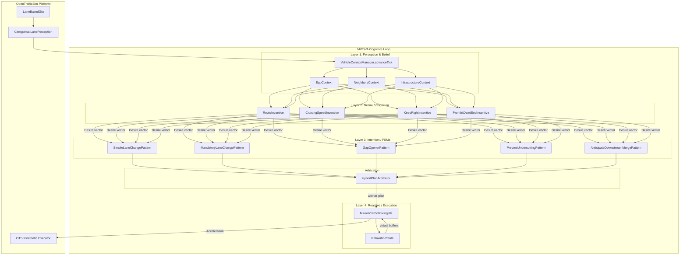

# MiRoVA (Migration of Road Vehicle Automation) Framework Documentation

Welcome to the documentation for the **MiRoVA** framework — a modular, cognitive tactical planner extension built on top of **OpenTrafficSim (OTS)**. MiRoVA models human-like, physically consistent driving behaviors through a cognitive 4-layer decision loop coupled with a 3-step hybrid plan arbitrator.

> **Language**: All code, Javadocs and documentation are in English.  
> **Developer**: Marvin Baumann (KIT — Karlsruhe Institute of Technology)  
> **Reference paper**: *IEEE ITSC 2026 — "Beyond Reactive Driver Agents"* (see `.claude/material/`)

---

## 🗺️ Documentation Directory Map

This documentation is divided into modular files. Each file corresponds to a specific concern so that an AI agent or developer can read **only the file relevant to their task** — saving context and avoiding unnecessary full-codebase parsing.

| # | Document | Focus Areas | Key Classes |
| :-- | :--- | :--- | :--- |
| Overview | [**README.md** (this file)](README.md) | Architecture, data flow, framework overview | — |
| OTS | [**ots_integration.md**](ots_integration.md) | How MiRoVA hooks into OTS GTU lifecycle, perception, factories | `MirovaTacticalPlannerFactory`, `DefaultMirovaPerceptionFactory`, OTS perception categories |
| Layer 1 | [**layer1_perception_belief.md**](layer1_perception_belief.md) | Raw perception filtering, semantic contexts, relaxation init | `VehicleContextManager`, `EgoContext`, `NeighborsContext`, `InfrastructureContext` |
| Layer 2 | [**layer2_desire.md**](layer2_desire.md) | Desire incentives, LMRS formulas, aggregation | `Desire`, `RouteIncentive`, `CruisingSpeedIncentive`, `KeepRightIncentive`, `ProhibitDeadEndIncentive` |
| Layer 3 | [**layer3_decision_intention.md**](layer3_decision_intention.md) | ManeuverPattern FSMs, ActionStates, all pattern descriptions | `ManeuverPattern`, `ActionState`, `SimpleLaneChangePattern`, `MandatoryLaneChangePattern`, `GapOpenerPattern`, `PreventUndercuttingPattern`, `AnticipateDownstreamMergePattern` |
| Layer 4 | [**layer4_reactive_control.md**](layer4_reactive_control.md) | Execution: how relaxation, car-following, damping and the physical net compose into one acceleration | `MirovaCarFollowingUtil`, `RelaxationState`, `MirovaIdmPlus`, `Wiedemann99` |
| Merge | [**mandatory_lane_change_pattern.md**](mandatory_lane_change_pattern.md) | The merge manoeuvre in full: nine-state FSM, merge reference speed, execution precondition, measured design decisions | `MandatoryLaneChangePattern` and its nine `ActionState`s |
| Arb | [**arbitration.md**](arbitration.md) | 3-step plan selection, hysteresis, voting | `HybridPlanArbitrator`, `ScoredOperationalPlan` |
| Demo | [**scenarios_and_simulations.md**](scenarios_and_simulations.md) | Scenario generation, runners, parameter studies | `ScenarioGenerator`, `ScenarioManager`, `FreiburgNord`, `MergeScenario` |
| Cluster | [**scenariomanagement_architecture.md**](scenariomanagement_architecture.md) | Orchestration layer and cluster tooling: studies, run addressing, SLURM job arrays | `StudyDefinition`, `StudyRegistry`, `ScenarioManager`, `RunMirovaClusterStudy`, `cluster/` |
| XML | [**ots_xml_format.md**](ots_xml_format.md) | OTS XML network format, RoadLayouts, offsets, merge/diverge patterns | `XmlParser`, `FreiburgNord.xml`, `MergeBodegraven.xml` |
| Editor | [**ots_editor.md**](ots_editor.md) | OTS Editor desktop app, UI layout, key features, step-by-step editing | `OtsEditor`, `RunEditor`, `EditorMap` |
| Python | [**python_pipeline.md**](python_pipeline.md) | Trajectory import, lane-matching, dashboarding | `match_lanes.py`, `dashboard_trajectories.py`, `execute_db_import.py` |
| Perf | [**performance_investigation_synthesis.md**](performance_investigation_synthesis.md) | Where the CPU actually goes, what was adopted and what was rejected; entry point to the four detailed profiling reports | `ScenarioGenerator` (`LaneBasedGtu.CACHING`), `CruisingSpeedIncentive`, `ParameterSet` |
| Params | [**parameter_access_and_units.md**](parameter_access_and_units.md) | How parameters are read and how DJUnits is used: the per-vehicle snapshot, which parameters must never be snapshotted, SI-vs-scalar arithmetic, and the equivalence-check procedure | `MirovaParameterSnapshot`, `ParameterType`, `ParameterSet`, `MirovaTacticalPlanner` |
| Build | [**troubleshooting_and_compilation.md**](troubleshooting_and_compilation.md) | JAXB ClassLoader issues, Maven `.m2` sync, fast build flags, direct Java execution | `XmlParser`, `RunFreiburgParallel`, `mvn` |

---

## 🔄 The MiRoVA Cognitive Loop ("The Loop")

Every simulation tick (`dt = 0.2 s`), `MirovaTacticalPlanner.update()` runs the following pipeline:

---

## 📐 Layer Architecture Summary

| Layer | OTS Hook | Core Abstraction | Key Rule |
|:--|:--|:--|:--|
| **1 — Perception & Belief** | Wraps `LanePerception` categories | `VehicleContextManager` + `ContextCategory` | Cache is per-tick; never query OTS perception directly more than once |
| **2 — Desire / Cognition** | Reads from contexts | `DesireIncentive` subclasses | Only compute motivations; never trigger actions |
| **3 — Intention / FSMs** | — | `ManeuverPattern` + `ActionState` | FSM must handle abort, transition, and execution separately |
| **4 — Reactive / Execution** | `CarFollowingModel` call | `MirovaCarFollowingUtil` | **Always route through `MirovaCarFollowingUtil`** — never call CF model directly |
| **Arbitration** | — | `HybridPlanArbitrator` | 3-step scheme: lock → threshold → vote |

---

## 🚦 Key Architecture Principles

1. **No raw `double` for physical values** — use DJUnits (`Length`, `Speed`, `Acceleration`, `Duration`) exclusively.
2. **No direct CF model calls** — all longitudinal control routes through `MirovaCarFollowingUtil` to inject `RelaxationState` buffers.
3. **No parameter-hacking** — never modify `ParameterTypes.T` inside tactical states; use the relaxation mechanism instead.
4. **Tick-coherence** — contexts and CF acceleration caches are valid for exactly one tick (`advanceTick()` invalidates them).
5. **Hysteresis prevents oscillation** — the arbitrator applies a 1.10× multiplier to the last active pattern to favor continuity.

---

## 🔑 Global Parameter Reference

| Parameter | Class | Default | Description |
|:--|:--|:--|:--|
| `DT` | `ParameterTypes` | **0.2 s** (MiRoVA override) | Simulation timestep |
| `DFREE` | `MirovaParameters` | 0.365 | Desire threshold for discretionary lane change |
| `DMAND` | `MirovaParameters` | 0.577 | Desire threshold for mandatory lane change |
| `DSEARCH` | `MirovaParameters` | 0.788 | Desire threshold for active gap search |
| `tau_relax_s` | `MirovaParameters` | 20.0 s | Spatial relaxation time constant (Keane & Gao 2021) |
| `tau_relax_v` | `MirovaParameters` | 8.0 s | Speed relaxation time constant (Keane & Gao 2021) |
| `B_CRIT` | `MirovaParameters` | −3.5 m/s² | Comfortable strong braking limit |
| `B_MAX` | `MirovaParameters` | −6.0 m/s² | Absolute emergency braking capability |
| `vGain` | `MirovaParameters` | 69.6 km/h | Speed gain reference (LMRS discretionary desires) |
| `extendedLookAheadDistance` | `MirovaParameters` | 1000 m | Long-range anticipation horizon |
| `cooperativeDecelerationThreshold` | `MirovaParameters` | −3.0 m/s² | Max allowed decel for cooperative patterns |
| `farAnticipationEnabled` | `MirovaParameters` | **true** | Enable far-range merge speed anticipation state |
| `LOOKAHEAD` | `ParameterTypes` | — | Standard OTS infrastructure look-ahead distance |
| `VCONG` | `ParameterTypes` | — | Congestion speed threshold |
| `LCDUR` | `ParameterTypes` | — | Lane change duration |
