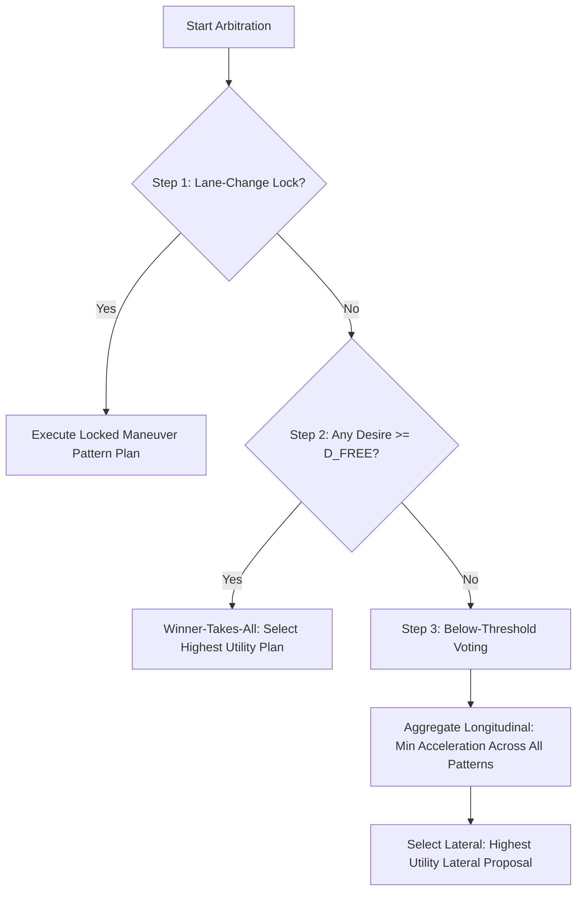

# Maneuver & Plan Arbitration Layer

The **Arbitration Layer** is the final decision-maker of the cognitive tactical planner. It takes the operational plan proposals generated by the active `ManeuverPattern`s and selects or combines them to form the single, final `SimpleOperationalPlan` that the OTS simulator executes.

---

## ⚖️ The Arbitrator: `HybridPlanArbitrator`

The [HybridPlanArbitrator](file:///d:/Mitarbeitende/gw2128/repositories/opentrafficsim/ots-road/src/main/java/org/opentrafficsim/road/gtu/lane/tactical/mirova/core/ArbitrationLayer/HybridPlanArbitrator.java) coordinates plan selection.

Rather than using a simple flat "maximum-utility" strategy (which leads to rapid, unrealistic oscillations in vehicle behavior), the hybrid arbitrator implements a **three-step selection scheme**:

---

## 🔄 The Three-Step Selection Process

### Step 1: Commitment & Lock Check
*   If a lane-change pattern holds the vehicle's action lock, it is executed unconditionally.
*   Once a physical lane change begins, the maneuver cannot be aborted or interrupted mid-way (which would cause unsafe clipping of lanes). 
*   The lock is only released when the action state signals completion (e.g. when the lane change is physically finished).

### Step 2: Above-Threshold (Desire $\ge D_{FREE}$)
*   If any active pattern's utility exceeds the threshold $D_{FREE}$ (configurable parameter in `MirovaParameters.java`), the system executes a "Winner-Takes-All" strategy.
*   The pattern with the highest utility wins the step.
*   If the winner is a lane-change pattern, it immediately commits the vehicle and locks its action state (entering Step 1 for subsequent ticks).

### Step 3: Below-Threshold Voting (Coexistence)
*   When all desires and utilities are low (below $D_{FREE}$), patterns are allowed to coexist.
*   **Longitudinal Aggregation**: The arbitrator calculates the longitudinal acceleration as the **minimum** (most conservative/safe) value proposed across all active patterns:
    
    $$a_{\text{selected}} = \min(a_1, a_2, \dots, a_n)$$
    
    This ensures that if *any* pattern (e.g. approaching a merge or avoiding congestion) calls for slowing down, the vehicle complies.
*   **Lateral Selection**: The lateral direction is taken from the highest-utility lateral proposal, if any.

---

## ⏳ Continuity & Hysteresis

To prevent the vehicle from toggling back and forth between two patterns with similar utilities (e.g., cruising vs. keeping right), the arbitrator applies a hysteresis multiplier:

*   **Continuous Hysteresis**: The utility of the pattern that won in the previous tick (`lastActivePattern`) is multiplied by `HYSTERESIS_MULTIPLIER = 1.10`.
*   This creates a "memory effect" that favors continuing the current behavior unless an alternative pattern is significantly better.
