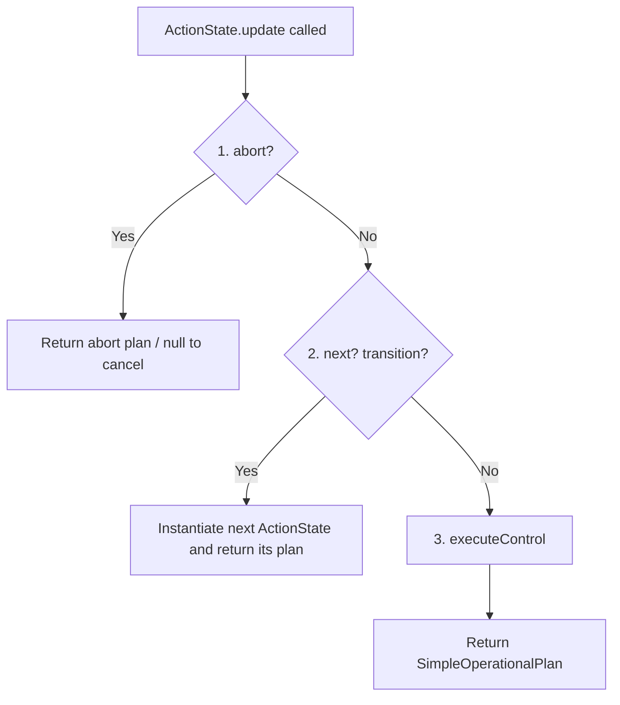

# Layer 3: Decision & Intention Layer

The **Decision & Intention Layer** (Layer 3) governs **Procedural Knowledge** in MiRoVA. While Layer 2 computes *motivations*, Layer 3 translates those motivations into structured behavioral programs implemented as Finite State Machines (FSMs).

---

## 🗺️ Core Abstraction: `ManeuverPattern`

A [ManeuverPattern](file:///d:/Mitarbeitende/gw2128/repositories/opentrafficsim/ots-road/src/main/java/org/opentrafficsim/road/gtu/lane/tactical/mirova/core/IntentionLayer/ManeuverPattern.java) is a structured driving behavior schema. It acts as the shell of an FSM, managing the lifecycle of its internal `ActionState`s.

### No pattern classification any more

Patterns used to be tagged `EXCLUSIVE` or `PARALLEL`, and to declare the perception contexts they
needed. Both were removed in `4d5c3ea`: arbitration ranks patterns by utility and the lateral
action lock is what actually serialises the manoeuvres that must not overlap, so the tag decided
nothing. A pattern that performs a lateral movement says so through `isLaneChangePattern()`.

### Core Interface

Every `ManeuverPattern` subclass implements:

| Method | Purpose |
|:--|:--|
| `checkContext()` | Is the driving situation appropriate for this pattern? |
| `checkAbility()` | Is this pattern physically feasible right now? |
| `getDesire()` | What is this pattern's priority (utility score 0..1)? |
| `isLaneChangePattern()` | Does this pattern perform a physical lateral movement? |

---

## ⚙️ Action States: `ActionState`

The FSM behavior within a ManeuverPattern is broken down into atomic, time-continuous phases using [ActionState](file:///d:/Mitarbeitende/gw2128/repositories/opentrafficsim/ots-road/src/main/java/org/opentrafficsim/road/gtu/lane/tactical/mirova/core/IntentionLayer/ActionState.java).

Each update step runs:



| Method | Purpose |
|:--|:--|
| `abort()` | Check if the maneuver has become unsafe or irrelevant |
| `next()` | Check if the FSM should transition to the next state; instantiate it if so |
| `executeControl()` | Compute physical longitudinal/lateral accelerations → `SimpleOperationalPlan` |

---

## 🚗 All Maneuver Patterns — Detailed Breakdown

---

### 1. `SimpleLaneChangePattern`

**Source**: [SimpleLaneChangePattern.java](file:///d:/Mitarbeitende/gw2128/repositories/opentrafficsim/ots-road/src/main/java/org/opentrafficsim/road/gtu/lane/tactical/mirova/core/IntentionLayer/ManeuverPatterns/SimpleLaneChangePattern.java)

**Purpose**: Handles straightforward discretionary lane changes when the desire threshold is exceeded and physical safety is confirmed.

**Trigger Conditions**:
- `checkContext()`: Total desire magnitude ≥ `DFREE` (0.365)
- `checkAbility()`: Vehicle speed > 1 m/s **or** positive CF acceleration, and a lane change in the dominant desire direction is physically possible (gap check)

**State Machine**:
```
[PerformLaneChangeState]
    → Applies relaxation for current and adjacent lane leaders before/during the change
    → Calculates minimum acceleration across current leader + target lane leaders
    → Returns plan with lateral direction set
    → Terminates when the origin lane is no longer the vehicle's primary lane
```

**Key Detail**: On entry and during the change, `EgoContext.triggerRelaxationWithReducedSafetyDistance()` is called for all relevant leaders. This pre-registers a `RelaxationState` that allows the vehicle to temporarily accept a smaller headway, creating the cooperative merge effect without hard braking.

---

### 2. `MandatoryLaneChangePattern`

**Source**: [MandatoryLaneChangePattern.java](file:///d:/Mitarbeitende/gw2128/repositories/opentrafficsim/ots-road/src/main/java/org/opentrafficsim/road/gtu/lane/tactical/mirova/core/IntentionLayer/ManeuverPatterns/MandatoryLaneChangePattern.java)

> 📖 **Full reference: [mandatory_lane_change_pattern.md](mandatory_lane_change_pattern.md)** — the
> state machine, the four cross-cutting mechanisms, every parameter, the measured design decisions
> and the open points. The summary below is the short version.

**Purpose**: Mandatory lane changes for route following — ramp entries and exits. The largest
pattern in the model, with a nine-state machine.

**Trigger** (`checkContext`): lane-change desire ≥ `DMAND`, **or** the merge point is within
`extendedLookAheadDistance` (1 000 m). `checkAbility()` is constantly `true`.

**The nine states**:

| State | Behaviour |
|:--|:--|
| `AnticipateMergeState` | Before the acceleration lane: steer towards the (EMA-smoothed) speed of the traffic to be joined, floor 20 km/h |
| `SynchroniseMergeSpeedState` | On the acceleration lane: build up speed towards the merge reference speed |
| `MatchLeaderSpeedState` | Brake to drop in behind the target-lane leader |
| `SolveParallelVehicleState` | A vehicle alongside: pass it if 8 s of lane remain, otherwise drop back |
| `CongestedMergeState` | Dispatcher below 15 km/h; emits plain car-following |
| `CongestedCreepState` | Creep at 3 km/h, ≤ 0.3 m/s², to fall behind the blocker |
| `CongestedFollowLeaderState` | Follow the target-lane leader at 15 → 5 km/h as the ramp end nears |
| `EmergencyStopState` | Stop before the lane end, unless a last-minute overtake still fits |
| `ExecuteLaneChangeState` | The lateral movement, with cooperative relaxation for the target-lane leaders |

**What carries the behaviour** — mostly not the states:

- `getMergeReferenceSpeed()` — one reference speed for the whole pattern, from a four-step cascade
  (perceived followers → macroscopic perception → upstream lane scan → speed limit), capped at the
  ego's own desired speed and cached per tick.
- `mayExecuteLaneChange()` — permission to merge as a property of the *vehicle*, enforced on every
  path into `ExecuteLaneChangeState`: out of lane, or synchronised against the kinematically
  achievable speed with a tolerance widening from 20 to 40 km/h, or unable to accelerate, or a
  congested target lane.
- `rampAcceleration()` — accelerates with the physical capability instead of the car-following
  comfort parameter `A`, but only while the car-following model is not the binding constraint.
- `checkCommonTransitions()` in the shared base class — which is why `ExecuteLaneChangeState` and
  `EmergencyStopState` are reachable from every state.

**Timestep**: `ParameterTypes.DT` (0.2 s for MiRoVA vehicles). The pattern no longer shadows this
with a value of its own.

---

### 3. `GapOpenerPattern`

**Source**: [GapOpenerPattern.java](file:///d:/Mitarbeitende/gw2128/repositories/opentrafficsim/ots-road/src/main/java/org/opentrafficsim/road/gtu/lane/tactical/mirova/core/IntentionLayer/ManeuverPatterns/GapOpenerPattern.java)

**Purpose**: Opens a gap for a merging neighbor that has activated its turn indicator toward the ego lane. Models cooperative driver behavior at on-ramps and merges.

**Activation Thresholds**:
- Distance threshold (slow traffic): 250 m to lane end
- Time threshold (free-flow): 30 s time-to-lane-end

**Candidate Detection & Dynamic Cooperation Threshold** (`findNewCandidate()`):
1. Scans adjacent lane leaders within `considerGapOpeningLookaheadDistance` (default: 100 m)
2. Checks if the candidate's turn indicator points toward the ego lane
3. Evaluates **Dynamic Cooperative Deceleration Threshold** ($a_{\text{threshold}}(d_{\text{end}})$):
   - Linear interpolation between `preemptiveCooperativeDeceleration` ($-0.5\text{ m/s}^2$ at $d_{\text{end}} \ge \text{LOOKAHEAD} \approx 400\text{m}$) and `cooperativeDecelerationThreshold` ($-2.0\text{ m/s}^2$ at $d_{\text{end}} \le 100\text{m}$).
   - Prevents unnecessary early/hard braking on the mainline in low-traffic conditions while ensuring full cooperation near ramp ends.
4. Verifies candidate hasn't already passed ego's own leader

**State Machine**:

```
[OpenGapState]
    → Calculates target acceleration to create the required gap in front of the merging vehicle
    → May trigger an evasive lane change to the opposite side if a free gap exists (strictly checked: mandatory desire in target direction must be ≥ 0.0)
    → Terminates when candidate has merged (is no longer in adjacent lane) or the cooperation zone ends
```

> [!IMPORTANT]
> **Cooperative Lane-Change Constraint (Mandatory Desire Check):**
> Evasive/cooperative lane changes (e.g. in `GapOpenerPattern`, `AnticipateDownstreamMergePattern`, `PreventUndercuttingPattern`, or `PerformLaneChangeState`) are strictly restricted:
> A cooperative lane change to `oppositeDir` is ONLY executed if the ego vehicle's mandatory desire in that direction is non-negative (`getMandatoryLaneChangeDesire().getMandatoryDesire(oppositeDir) >= 0.0`). This prevents cooperative evasive maneuvers from forcing a vehicle onto dead-end lanes or causing it to miss an upcoming route split.

---

### 4. `PreventUndercuttingPattern`

**Source**: [PreventUndercuttingPattern.java](file:///d:/Mitarbeitende/gw2128/repositories/opentrafficsim/ots-road/src/main/java/org/opentrafficsim/road/gtu/lane/tactical/mirova/core/IntentionLayer/ManeuverPatterns/PreventUndercuttingPattern.java)

**Purpose**: Prevents illegal right-side overtaking (*Rechtsüberholverbot*, §5 StVO) in free-flow traffic.

**Trigger Conditions** (`checkAbility()`):
1. Traffic is free-flowing: `v_ego > VCONG`
2. A slower vehicle is detected on the **left** lane that the ego vehicle is about to pass on the right: `NeighborsContext.getRightSideOvertakingAhead()` returns `true`

**State Machine**:

```
[ShadowingState]
    → Locks onto the left neighbor's ID (shadowingLeftNeighborId)
    → Limits ego acceleration so that ego speed ≤ left neighbor's speed
    → Maintains this "shadowing" until:
        a) The left neighbor accelerates away (situation resolved)
        b) A lane change to the left becomes possible (ego moves to the left lane)
        c) Traffic drops below VCONG (undercutting is tolerated in congestion)
```

**Key Detail**: Rather than a hard emergency brake, the pattern applies a smooth speed-matching (shadowing) strategy. The acceleration cap is calculated based on the time headway between ego and the left neighbor.

---

### 5. `AnticipateDownstreamMergePattern`

**Source**: [AnticipateDownstreamMergePattern.java](file:///d:/Mitarbeitende/gw2128/repositories/opentrafficsim/ots-road/src/main/java/org/opentrafficsim/road/gtu/lane/tactical/mirova/core/IntentionLayer/ManeuverPatterns/AnticipateDownstreamMergePattern.java)

**Purpose**: Proactively adapts ego vehicle speed when a lane drop on an adjacent lane is detected downstream. This smooths traffic flow at merge bottlenecks by avoiding hard last-minute braking.

**Activation Thresholds** (same as GapOpenerPattern):
- Slow traffic: 250 m to lane end
- Free-flow: 30 s time-to-lane-end

**Context Detection** (`checkContext()`):
- Queries both `InfrastructureContext.getPhysicalDistanceToLaneEnd()` (direct lane structure)
- Falls back to `InfrastructureContext.getAnticipatedLaneDropInfo()` (longer-range anticipation from the network)

**State Machine**:
```
[FarAnticipationState]  ← when the lane drop is distant (anticipated, not yet structural)
    → Samples average downstream speed on the merging lane using extended lookahead (up to 1000 m)
    → Applies EMA filter to smooth speed signal: α = dt / (dt + τ_anticipation)
    → Derives a gentle target approach acceleration
    → Runs each tick, resetting running flag (re-evaluated via checkContext each tick)
    → Transitions to NearAnticipationState when the lane end becomes structural (visible in lane structure)

[NearAnticipationState] ← when the lane drop is physically visible in the lane structure
    → Closer-range speed sampling
    → Potential trigger of evasive lane change to opposite side if free gap available
```

**Signal Smoothing**: The EMA (Exponential Moving Average) low-pass filter prevents oscillatory speed targets:
$$v_{smooth}(t) = \alpha \cdot v_{sample}(t) + (1 - \alpha) \cdot v_{smooth}(t-1), \quad \alpha = \frac{dt}{dt + \tau}$$

---

### 6. `SimpleLaneChangePattern` vs. `MandatoryLaneChangePattern` — When Does Each Fire?

| Condition | SimpleLaneChange | MandatoryLaneChange |
|:--|:--:|:--:|
| Desire ≥ DFREE (0.365), no mandatory component | ✅ | ❌ |
| Desire ≥ DFREE, mandatory component present | ❌ | ✅ |
| Route requires lane change | ❌ | ✅ |
| Lane ends ahead | ❌ | ✅ |
| Pure discretionary (overtake, keep-right) | ✅ | ❌ |

---

## 🔑 Key Parameters Used by Intention Layer

| Parameter | Class | Default | Description |
|:--|:--|:--|:--|
| `DFREE` | `MirovaParameters` | 0.365 | Pattern activation desire threshold |
| `DMAND` | `MirovaParameters` | 0.577 | Mandatory change threshold |
| `DSEARCH` | `MirovaParameters` | 0.788 | Active gap search threshold |
| `extendedLookAheadDistance` | `MirovaParameters` | 1000 m | Long-range anticipation horizon |
| `mandatoryLaneChangeLookAheadDistance` | `MirovaParameters` | 500 m | Mandatory check horizon |
| `considerGapOpeningLookaheadDistance` | `MirovaParameters` | 100 m | Gap-opener candidate scan range |
| `cooperativeDecelerationThreshold` | `MirovaParameters` | −3.0 m/s² | Max allowed decel for cooperation |
| `egoDecelerationThreshold` | `MirovaParameters` | −2.0 m/s² | Ego's acceptable merge decel |
| `followerDecelerationThreshold` | `MirovaParameters` | −1.5 m/s² | Follower's acceptable decel during LC |
| `RAMP_END_BUFFER` | `MandatoryLaneChangePattern` | 10 m | Safety buffer before absolute lane end |
| `B_CRIT` | `MirovaParameters` | −3.5 m/s² | Comfortable strong braking limit |
| `B_MAX` | `MirovaParameters` | −6.0 m/s² | Absolute emergency braking capability |
| `undercuttingTTCThreshold` | `MirovaParameters` | 5 s | TTC threshold for undercutting detection |
