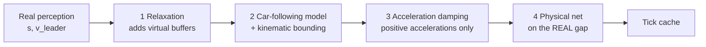
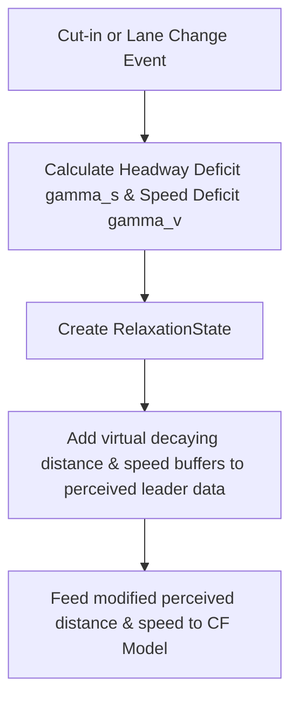

# Layer 4: Reactive & Control Layer (Execution)

The **Reactive & Control Layer** (Layer 4) is responsible for the actual execution of longitudinal and lateral commands. It translates high-level decisions (selected maneuver plans) into concrete physical acceleration inputs for the vehicle.

---

## 🔒 The Core Rule: Use `MirovaCarFollowingUtil`

In the MiRoVA framework, **no maneuver pattern or action state may invoke a car-following model directly**. 

Instead, all longitudinal control requests must route through the utility class [MirovaCarFollowingUtil](file:///d:/Mitarbeitende/gw2128/repositories/opentrafficsim/ots-road/src/main/java/org/opentrafficsim/road/gtu/lane/tactical/mirova/core/ReactiveLayer/MirovaCarFollowingUtil.java).

### Why?
1.  **Relaxation Injection**: It intercepts the true distance and speed of the leader vehicle and adds virtual buffer values. This implements the 2-parameter relaxation phenomenon (Keane & Gao 2021).
2.  **Tick-Based Caching**: It automatically caches calculated accelerations for a given leader ID in a single tick. This avoids executing the car-following calculations multiple times per tick if multiple patterns analyze the same leader, saving computing resources.
3.  **Physical safety net**: it is the only place that holds both the real perception and the relaxed one, so it is where the result is checked against the gap that actually exists.

---

## 🔗 How the pieces compose

Four mechanisms act on one acceleration request, in a fixed order. The order is not
incidental — each one operates on the output of the one before, and reading them in
isolation gives a misleading picture of what any of them does.



1.  **Relaxation** enlarges the perceived gap and shrinks the perceived speed difference, so
    the model sees a milder situation than the physical one.
2.  **The car-following model** answers that milder question. Its kinematic bounding therefore
    reasons about a gap that may not exist — which is why it is a comfort filter, not a safety
    device.
3.  **Damping** scales positive accelerations while a relaxation is active.
4.  **The physical net** re-imposes reality: the result may never be milder than the real gap and
    the real closing speed require. This is one-way — it only ever tightens.

> [!IMPORTANT]
> The relaxation is **discarded outright** when the leader brakes harder than −1.0 m/s² or drops
> below 10 km/h. The perceived gap then snaps back to the real one within a single tick, which is
> a genuine discontinuity in the input to the model. Steps 2 and 4 exist largely to keep that
> discontinuity from turning into an emergency stop.

> [!NOTE]
> The relaxation is model-agnostic. It lives entirely in `MirovaCarFollowingUtil` and
> `EgoContext`, and works with any `CarFollowingModel` — a paired 10-seed comparison of
> `MirovaIdmPlus` against stock `IdmPlus` produced statistically identical results, with the
> relaxation active throughout.

---

## 📉 Keane & Gao (2021) 2-Parameter Relaxation

When a vehicle changes lanes or another vehicle cuts in front, the actual headway drops abruptly. Real human drivers do not instantly slam on the brakes; they temporarily accept a shorter headway and slowly return to their desired spacing over time. 

MiRoVA models this human-like decay using [RelaxationState](file:///d:/Mitarbeitende/gw2128/repositories/opentrafficsim/ots-road/src/main/java/org/opentrafficsim/road/gtu/lane/tactical/mirova/core/BeliefLayer/RelaxationState.java):



### Exponential decay formulas:
$$s_{\text{perceived}}(t) = s_{\text{actual}}(t) + \gamma_s \cdot e^{-\frac{t - t_0}{\tau_s}}$$
$$v_{\text{leader, perceived}}(t) = v_{\text{leader, actual}}(t) + \gamma_v \cdot e^{-\frac{t - t_0}{\tau_v}}$$

Where:
*   $\gamma_s$: Space headway deficit (m) at start.
*   $\gamma_v$: Speed deficit (m/s) between old and new leader at start.
*   $\tau_s$: Spatial decay constant (calibrated to $\approx 15\text{ s}$).
*   $\tau_v$: Velocity decay constant (calibrated to $\approx 5\text{ s}$).

---

## 🏎️ Car-Following Models

MiRoVA interfaces with standard OTS car-following structures. **The Freiburg-Nord studies run on
`MirovaIdmPlus`** — it is what `ScenarioGenerator` hands to `MirovaTacticalPlannerFactory`.
Wiedemann 99 is implemented and calibrated but is currently only instantiated by
`SimpleHighwayScenario`; in `MergeScenario` its factory is commented out.

### 1. Wiedemann 99 Model (`Wiedemann99`)
*   **Location**: [Wiedemann99.java](file:///d:/Mitarbeitende/gw2128/repositories/opentrafficsim/ots-road/src/main/java/org/opentrafficsim/road/gtu/lane/tactical/mirova/core/ReactiveLayer/Wiedemann99.java)
*   **Description**: A physiological-psychological car-following model. It determines the driver's acceleration based on perception thresholds (action points) in the relative-speed vs. distance plane.
*   **Calibration Parameters**: Calibrated via [W99ParameterTypes](file:///d:/Mitarbeitende/gw2128/repositories/opentrafficsim/ots-road/src/main/java/org/opentrafficsim/road/gtu/lane/tactical/mirova/core/ReactiveLayer/W99ParameterTypes.java) using German freeway data (e.g. Duisburg A59, Cologne A4).

### 2. IDM Plus Model (`MirovaIdmPlus`) — the model in use
*   **Location**: [MirovaIdmPlus.java](file:///d:/Mitarbeitende/gw2128/repositories/opentrafficsim/ots-road/src/main/java/org/opentrafficsim/road/gtu/lane/tactical/mirova/core/ReactiveLayer/MirovaIdmPlus.java)
*   **Description**: `IdmPlus` plus two additions — a kinematic bounding of the interaction term
    (below) and a desired-headway model carrying an optional capacity-drop addon.
*   **Capacity-drop addon**: adds `alpha(v) * T_DISCHARGE_ADDON` to the desired headway, ramping
    linearly from full at standstill to zero at `V_CRIT_DISCHARGE`. Governed by
    `CAPACITY_DROP_ENABLED`, which is **`false` by default** — with it off the headway model is
    identical to the standard one.

---

## ⚖️ Kinematic bounding of the interaction term

`MirovaIdmPlus.combineInteractionTerm` filters the deceleration spike that a cut-in produces. It
is a **comfort filter**, and deliberately not a safety device — see the ordering above for why it
cannot be one.

```
aIdm = min(a * (1 - (s_desired/s)^2), aFree)          // raw IDM+
if aIdm >= B_CRIT            -> aIdm                   // comfortable: accept
d_kin = -dv^2 / (2 * (s - s0))                         // what the perceived gap demands
if d_kin >= B_CRIT           -> B_CRIT                  // physics allow the comfort brake
else                         -> max(d_kin, B_MAX)       // give the physics what they demand
```

`B_CRIT` = −3.5 m/s², `B_MAX` = −6.0 m/s². Measured over ten seeds, the bounding touches about
**0.4 % of all time steps** — invisible in capacity or throughput, and clearly visible in
individual trajectories: of the hard decelerations under stock `IdmPlus`, 8.9 % come from plain
car-following with no manoeuvre pattern active, against none with the bounding.

> [!WARNING]
> The `s` in that kinematic check is the **relaxed** distance, not the real one. When a relaxation
> is active the check runs on an enlarged gap and can conclude that a comfortable brake suffices
> where the physical gap says otherwise. That is what the physical net in
> `MirovaCarFollowingUtil` is for; do not re-add a safety argument to this method.

---

## 🛑 Headway Relaxation-Bound Acceleration Damping

To model realistic human behavior after cut-ins and merging maneuvers without generating artificial shockwaves or emergency braking, MiRoVA links positive acceleration damping directly to active Keane & Gao headway relaxation states:

### Dynamics & Formula
When a vehicle is in an active `RelaxationState` following a leader (e.g. after a cut-in), positive acceleration demands ($a > 0$) are automatically damped proportionally to the remaining virtual headway buffer $s_{\text{buf}}(t)$:

$$f_{\text{relax\_acc}}(t) = 1.0 - (1.0 - a_{\text{relax\_damping}}) \cdot \left(\frac{s_{\text{buf}}(t)}{\gamma_s}\right)$$

$$a_{\text{effective}}(t) = a_{\text{calculated}}(t) \cdot f_{\text{relax\_acc}}(t) \quad \text{for } a_{\text{calculated}} > 0$$

- **At Cut-In ($t = t_0$)**: $s_{\text{buf}} = \gamma_s \Rightarrow f_{\text{relax\_acc}} = a_{\text{relax\_damping}} = 0.40$ ($40\%$ of normal acceleration capability).
- **During Relaxation ($t > t_0$)**: As $s_{\text{buf}}(t)$ decays exponentially towards zero ($\tau_s$), $f_{\text{relax\_acc}}(t)$ smoothly recovers towards $1.00$ ($100\%$).
- **Effect**: The follower vehicle refrains from aggressive acceleration while the leader pulls ahead, restoring the desired equilibrium gap naturally without active braking.

> [!IMPORTANT]
> Damping applies **strictly to positive accelerations** ($a > 0$). Decelerations are never damped.
> The only thing that acts on a deceleration afterwards is the physical net, and it acts one way —
> it can make a deceleration stronger, never weaker.

### Parameters
*   `RELAXATION_ACC_DAMPING_FACTOR` (`aRelaxDamping`): Acceleration scaling factor when headway relaxation is 100% active (default $0.40 = 40\%$).
*   `RELAXATION_ACC_DAMPING_ENABLED` (`aRelaxDampingEnabled`): Boolean flag to enable or disable acceleration damping during active headway relaxation (default `true`). When set to `false` or when `aRelaxDamping = 1.0`, acceleration damping is completely bypassed, producing numerically identical results.

---

## ⚠️ Two accelerations with similar names

`MirovaParameters.A_MAX` (`aMaxMirova`, 3.5 m/s² for cars, 1.3 for trucks) and
`ParameterTypes.A` (`a`, OTS default 1.25 m/s²) are not the same quantity and are not
interchangeable:

| | drives the vehicle | used by |
|:---|:---|:---|
| `ParameterTypes.A` | **yes** — the car-following model's acceleration term | every acceleration that goes through a car-following call |
| `MirovaParameters.A_MAX` | no | `EgoContext.getMaxPhysicalAcceleration()`, i.e. capability estimates, ceilings, and `MandatoryLaneChangePattern.rampAcceleration` |

`ParameterTypes.A` is **not set anywhere in the MiRoVA setup**, so it sits at the OTS default of
1.25 m/s² for cars and trucks alike, while a runner that reports `aMax=3.5` is describing
`aMaxMirova`. Measured over a full run of 2295 vehicles, no vehicle ever exceeded 1.25 m/s²
except on the ramp, where `rampAcceleration` commands the physical capability directly and
reaches 3.0 m/s².

The ceilings that use `A_MAX` therefore cannot bind for cars — 2.25 m/s² at 50 km/h against a
model that never asks for more than 1.25 — while for trucks the same ceiling sits *below* what
the model asks for, and only binds in the states that apply it. Setting `ParameterTypes.A` per
vehicle class is the open item; queue discharge and jam speed both depend on it.
