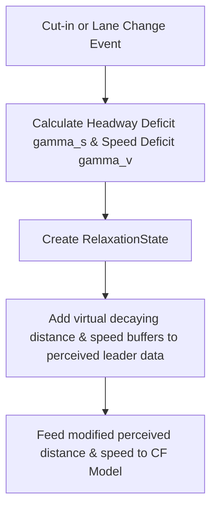

# Layer 4: Reactive & Control Layer (Execution)

The **Reactive & Control Layer** (Layer 4) is responsible for the actual execution of longitudinal and lateral commands. It translates high-level decisions (selected maneuver plans) into concrete physical acceleration inputs for the vehicle.

---

## 🔒 The Core Rule: Use `MirovaCarFollowingUtil`

In the MiRoVA framework, **no maneuver pattern or action state may invoke a car-following model directly**. 

Instead, all longitudinal control requests must route through the utility class [MirovaCarFollowingUtil](file:///d:/Mitarbeitende/gw2128/repositories/opentrafficsim/ots-road/src/main/java/org/opentrafficsim/road/gtu/lane/tactical/mirova/core/ReactiveLayer/MirovaCarFollowingUtil.java).

### Why?
1.  **Relaxation Injection**: It intercepts the true distance and speed of the leader vehicle and adds virtual buffer values. This implements the 2-parameter relaxation phenomenon (Keane & Gao 2021).
2.  **Tick-Based Caching**: It automatically caches calculated accelerations for a given leader ID in a single tick. This avoids executing the car-following calculations multiple times per tick if multiple patterns analyze the same leader, saving computing resources.

---

## 📉 Keane & Gao (2021) 2-Parameter Relaxation

When a vehicle changes lanes or another vehicle cuts in front, the actual headway drops abruptly. Real human drivers do not instantly slam on the brakes; they temporarily accept a shorter headway and slowly return to their desired spacing over time. 

MiRoVA models this human-like decay using [RelaxationState](file:///d:/Mitarbeitende/gw2128/repositories/opentrafficsim/ots-road/src/main/java/org/opentrafficsim/road/gtu/lane/tactical/mirova/core/BeliefLayer/RelaxationState.java):

### Exponential decay formulas:
$$s_{\text{perceived}}(t) = s_{\text{actual}}(t) + \gamma_s \cdot e^{-\frac{t - t_0}{\tau_s}}$$
$$v_{\text{leader, perceived}}(t) = v_{\text{leader, actual}}(t) + \gamma_v \cdot e^{-\frac{t - t_0}{\tau_v}}$$

Where:
*   $\gamma_s$: Space headway deficit (m) at start.
*   $\gamma_v$: Speed deficit (m/s) between old and new leader at start.
*   $\tau_s$: Spatial decay constant (calibrated to $\approx 15\text{ s}$).
*   $\tau_v$: Velocity decay constant (calibrated to $\approx 5\text{ s}$).

---

## 🏎️ Car-Following Models

MiRoVA interfaces with standard OTS car-following structures but relies heavily on the calibrated Wiedemann model for highway merging studies:

### 1. Wiedemann 99 Model (`Wiedemann99`)
*   **Location**: [Wiedemann99.java](file:///d:/Mitarbeitende/gw2128/repositories/opentrafficsim/ots-road/src/main/java/org/opentrafficsim/road/gtu/lane/tactical/mirova/core/ReactiveLayer/Wiedemann99.java)
*   **Description**: A physiological-psychological car-following model. It determines the driver's acceleration based on perception thresholds (action points) in the relative-speed vs. distance plane.
*   **Calibration Parameters**: Calibrated via [W99ParameterTypes](file:///d:/Mitarbeitende/gw2128/repositories/opentrafficsim/ots-road/src/main/java/org/opentrafficsim/road/gtu/lane/tactical/mirova/core/ReactiveLayer/W99ParameterTypes.java) using German freeway data (e.g. Duisburg A59, Cologne A4).

### 2. IDM Plus Model (`MirovaIdmPlus`)
*   **Location**: [MirovaIdmPlus.java](file:///d:/Mitarbeitende/gw2128/repositories/opentrafficsim/ots-road/src/main/java/org/opentrafficsim/road/gtu/lane/tactical/mirova/core/ReactiveLayer/MirovaIdmPlus.java)
*   **Description**: An extension of the Intelligent Driver Model (IDM) that optimizes the acceleration and deceleration behaviors, adapted to work seamlessly with the MiRoVA parameter sets.
