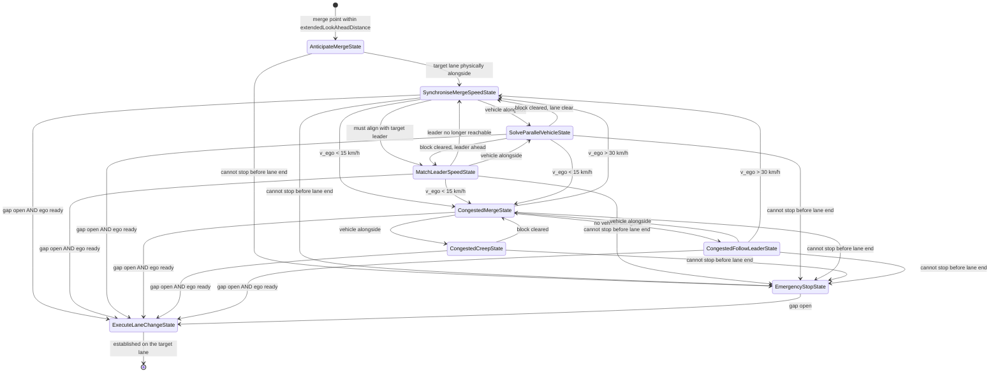

# `MandatoryLaneChangePattern` — Reference

The merge manoeuvre: a nine-state machine that takes a vehicle from first knowledge of an upcoming
mandatory lane change, through building up speed on an acceleration lane, resolving whatever
prevents the merge, to the physical lane change — or, failing all of that, to a controlled stop
before the lane ends.

**Source**: [`MandatoryLaneChangePattern.java`](file:///d:/Mitarbeitende/gw2128/repositories/opentrafficsim/ots-road/src/main/java/org/opentrafficsim/road/gtu/lane/tactical/mirova/core/IntentionLayer/ManeuverPatterns/MandatoryLaneChangePattern.java)
(2 184 lines) · Layer 4 (Intention) · [layer3_decision_intention.md](layer3_decision_intention.md)
for the other patterns · [arbitration.md](arbitration.md) for how one of them is chosen

> This document describes the state of the code as of 2026-08-24. It supersedes the
> `MandatoryLaneChangePattern` section of `layer3_decision_intention.md`, which described a
> `EvaluateTargetGapState`, a `relaxedFraction` speed gate and a `PatternType` classification that
> no longer exist.

---

## 1. What decides that this pattern runs

The pattern is one of the `ManeuverPattern`s registered with `MirovaTacticalPlanner`. Every tick,
`PatternSelector.getAllRelevantPatterns` asks each of them three questions; `HybridPlanArbitrator`
then picks among those that answer yes.

| Method | Implementation | Meaning |
|---|---|---|
| `checkContext()` | lane-change desire ≥ `DMAND` (0.577), **or** distance to the mandatory change < `extendedLookAheadDistance` (1 000 m) | Either the route incentive is already pushing hard, or the merge point is close enough to prepare for |
| `checkAbility()` | `true` | No ability precondition — if the context holds, the vehicle can attempt it |
| `getDesire()` | `laneChangeDesire.magnitude()` | Feeds the arbitration ranking |
| `isLaneChangePattern()` | `true` | Marks the pattern as one that may take the lateral lock |

The distance branch of `checkContext` is what makes the pattern start early: a vehicle enters
`AnticipateMergeState` a kilometre before the ramp, long before its desire alone would qualify it.

Each state reports `getUtility() = mandatoryLaneChangeDesire.magnitude()` to the arbitrator, so the
running manoeuvre competes on the mandatory component only, not on the aggregated desire.

**Ending the pattern.** `MandatoryLaneChangeState.abort()` finishes the manoeuvre as soon as the
lane-change desire falls below `DMAND`. Two states override this: `AnticipateMergeState` also
finishes when the merge point has moved out of the extended lookahead again (the vehicle is not on
that route after all), and `ExecuteLaneChangeState` refuses to abort while the lateral movement is
in progress — an aborted lane change halfway across a lane boundary is not a state the model
recovers from.

---

## 2. The execution cycle

`ManeuverPattern.update()` instantiates `AnticipateMergeState` on first run and then delegates to
whatever state is current. Every state runs the same three-step cycle, in this order:

```
ActionState.update()
   1. abort()          -> plan? finish the manoeuvre, hand control back to car-following
   2. next()           -> plan? a transition fired; the new state's update() produced this plan
   3. executeControl() -> the plan for staying in this state
```

Two consequences worth knowing. A transition takes effect **within the same tick** —
`transitionTo()` calls `update()` on the successor, so the plan returned is already the new
state's, and a chain of transitions resolves in one tick. And `abort()` outranks everything: a
vehicle whose desire collapses stops merging immediately, whatever it was doing.

All plans are built with `getPatternSpecificTimestep()`, which `ManeuverPattern`'s constructor
takes from `ParameterTypes.DT` — **0.2 s** for MiRoVA vehicles, set in
`MirovaTacticalPlannerFactory`. The pattern no longer shadows this with a value of its own.

---

## 3. The state machine



The edges into `ExecuteLaneChangeState` and `EmergencyStopState` are drawn from six states each
because they are not per-state transitions at all: they live in
`MandatoryLaneChangeState.checkCommonTransitions`, which every state calls first. See § 4.4.

| State | Phase | Longitudinal behaviour in one line |
|---|---|---|
| `AnticipateMergeState` | before the acceleration lane | Steer towards the (smoothed) speed of the traffic to be joined, floor 20 km/h |
| `SynchroniseMergeSpeedState` | on the acceleration lane | Build up speed towards the merge reference speed |
| `MatchLeaderSpeedState` | conflict: leader | Brake to drop in behind the target-lane leader |
| `SolveParallelVehicleState` | conflict: alongside | Pass the blocker, or drop back behind it |
| `CongestedMergeState` | congestion | Dispatcher only; emits plain car-following |
| `CongestedCreepState` | congestion, alongside | Creep at 3 km/h, ≤ 0.3 m/s², to fall behind the blocker |
| `CongestedFollowLeaderState` | congestion, leader | Follow the target-lane leader at 15 → 5 km/h as the ramp end nears |
| `EmergencyStopState` | last resort | Stop before the lane end — unless a last-minute overtake still fits |
| `ExecuteLaneChangeState` | execution | Follow the tightest target-lane leader; trigger cooperative relaxation |

---

## 4. The cross-cutting mechanisms

Most of this pattern's behaviour is not in the states. Four static helpers and two shared
transition methods carry the logic; the states mostly choose which of them to apply.

### 4.1 `getMergeReferenceSpeed(vehicle, dir)` — the one speed everything is measured against

Both the control law and the transition criteria need an answer to "how fast is the traffic I am
joining?". The available information changes over the manoeuvre, so the answer comes from a
cascade, ordered by how directly each source observes that traffic:

| # | Source | Available when | Detail |
|---|---|---|---|
| 1 | Perceived **followers** on the target lane | target lane physically adjacent | Mean speed of up to 3 followers at non-negative distance — these are the vehicles the ego must merge in between |
| 2 | `MacroTrafficContext.getAverageSpeed(LEFT/RIGHT)` | target lane physically adjacent | Tolerates the case where no individual follower is resolved |
| 3 | **Long-range lane scan**, 150 m, `BACK_TO_FRONT` | always | The only source during early anticipation |
| 4 | Legal speed limit, capped at 100 km/h | always | Empty target lane |

Two details carry weight. The scan in step 3 runs **from the upstream end towards the merge
point**: the vehicles approaching the merge point from behind are the ones the ego will have to fit
between, whereas vehicles further downstream are already moving away and may report a state the ego
never meets — a shockwave travelling upstream is exactly this case. And the result is finally
capped at the ego's own desired speed, so a truck with `v_desired` = 80 km/h merging into 120 km/h
traffic is judged against the speed it can actually reach rather than one it cannot.

The value is cached in `EgoContext` for the tick under a pre-built key per direction. Both the
control path and the transition criteria ask for it every tick, and the cascade iterates perceived
neighbours and may scan a whole lane.

### 4.2 `mayExecuteLaneChange(vehicle, dir)` — permission, as a property of the vehicle

Whether the manoeuvre may be carried out depends on the ego's speed relative to the traffic it is
joining and on how much lane is left — never on which state it reached the decision from. So it is
a **precondition enforced on every path into `ExecuteLaneChangeState`**, not a transition condition
on one edge. The vehicle is ready when *any* of these holds:

| Criterion | Condition |
|---|---|
| Out of lane | `distanceToLaneEnd ≤ 20 m` — the question is no longer whether merging is comfortable |
| Synchronised | `v_ego ≥ v_achievable − allowedDelta` |
| Cannot accelerate | held back on the ramp (`a_cf ≤ 0.2 m/s²`) and within 30 km/h of the reference |
| Congested target | reference speed < 40 km/h — there is no flow speed to synchronise with |

`v_achievable` is kinematic, not a fraction: `min(v_ref, √(v_ego² + 2·a_max·d_usable))` with
`d_usable = distanceToLaneEnd − 20 m`. The ego is judged against the speed it can *still reach*,
which is what keeps the criterion usable on any geometry — on a 184 m weaving section a fixed
fraction of the target speed is either unreachable from the start or no constraint at all.

`allowedDelta` widens from 20 km/h to 40 km/h as the time left runs out, linearly in
`1 − t_left/6 s`. Both halves matter, and § 7 records what happened when either was missing.

### 4.3 `rampAcceleration(vehicle, targetSpeed, approachDistance)` — building up speed

The states could accelerate through `MirovaCarFollowingUtil.approachTargetSpeed`, but that
evaluates the car-following model and is therefore bounded by `ParameterTypes.A` — 1.25 m/s² by
default, and the same for cars and trucks. That is a comfort parameter for following a leader, not
a limit on what a vehicle can do with clear road ahead, and on a short acceleration lane it is the
difference between reaching the speed of the traffic being joined and not reaching it.

```
if v_ego ≥ v_target                              -> car-following value unchanged
if a_cf < 0.80 · A   (model is the constraint)   -> car-following value unchanged
else                                             -> max(a_cf, a_max · (1 − (v_ego/v_target)⁴))
```

The 0.80 share is the veto: below it the model is reacting to a vehicle ahead rather than to the
desired speed, so a closing gap still brakes the ego and a rear-end conflict is never traded for
merge speed. The fourth-power taper is the shape of the IDM free term, so the boost fades at the
target speed instead of overshooting it.

### 4.4 `checkCommonTransitions` and `checkMergeTransitions`

Both live in the shared base class `MandatoryLaneChangeState`, which is what makes every state
reachable from every other one.

`checkCommonTransitions` — called first by all seven non-terminal states:

1. **gap physically open** (`getIfLaneChangePossible`) **and** `mayExecuteLaneChange` →
   `ExecuteLaneChangeState`. Two independent questions, deliberately kept apart.
2. **stopping before the lane end would need harder than −5 m/s²** → `EmergencyStopState`.

`checkMergeTransitions` — the routing used by `SynchroniseMergeSpeedState`, after the common
checks:

1. Gap open but the ego not ready → **stay and keep accelerating**. Nothing is blocking, so there
   is nothing to resolve; this also skips the expensive follower and reachability analysis below.
2. `v_ego < 15 km/h` → `CongestedMergeState`.
3. A vehicle physically overlapping the ego → `SolveParallelVehicleState`.
4. Otherwise evaluate the **downstream gap**: is the target leader's speed + 3 m/s reachable within
   the remaining lane, minus a lane-change buffer of `min(4 s · v_ego, 25 % of the distance)`, and
   does the closest genuine follower's induced deceleration stay above the threshold? If so →
   `MatchLeaderSpeedState`; if not, stay and wait for the upstream gap to open.

### 4.5 `findBlockingVehicle` — one definition of "blocked"

A vehicle blocks when perception reports it as **parallel**, or when it is closer than a threshold
— and, optionally, only when its speed matches the ego's within 1 m/s. Three call sites pick
different thresholds:

| Helper | Threshold | Matched speed required |
|---|---|---|
| `getPhysicallyOverlappingVehicle` | `0` (overlap, or already passed) | no |
| `getParallelBlock` / `detectParallelBlock` | desired headway × `safetyDistanceReductionFactorLaneChange` | yes |
| `getParallelBlockWithoutSpeedCheck` | same distance | no |

This used to be three separate implementations that disagreed about what counts as a blocker, only
one of which was on the path into `SolveParallelVehicleState` — which is how two earlier attempts
at changing the criterion could leave the simulation bit-identical.

---

## 5. The states in detail

### 5.1 `AnticipateMergeState` — before the acceleration lane exists

The target lane is not yet alongside, so nothing can be perceived on it and no merge conflict can
exist. The only job is speed.

- **Control**: if car-following is not already demanding harder than −2 m/s² and the ego is below
  the speed limit, steer towards `max(EMA(v_ref), 20 km/h)`, capped at the speed limit. Above that
  target it decelerates, floored at the ego deceleration threshold; below it, `rampAcceleration`
  applies — a vehicle should already be gaining speed before the acceleration lane begins.
- **Smoothing**: the reference speed is low-pass filtered with α = `DT · 0.25`. Only here: this is
  a control signal fed into an acceleration request every tick, so jitter would become jerk. The
  transition criteria are discrete decisions and use the raw value.
- **Floor of 20 km/h**: even towards a congested target lane, the ego still has to cover the
  remaining ramp.
- **Exits**: target lane available → `SynchroniseMergeSpeedState`. This is a change of phase, not a
  decision to merge. Plus its own copy of the emergency-stop safety net (the common check would
  test transitions that cannot apply yet).

### 5.2 `SynchroniseMergeSpeedState` — on the acceleration lane

The phase whose entire purpose is to reach the speed of the traffic being joined. A real driver
builds up speed on the ramp largely irrespective of whether a gap happens to be free early, because
merging far below the speed of the target lane forces that traffic to brake.

- **Control**: `rampAcceleration` towards `min(v_ref, speedLimit)`, indicators set.
- **Exits**: entirely delegated to `checkMergeTransitions` (§ 4.4). Deciding *whether* to merge is
  deliberately not this state's job.

### 5.3 `MatchLeaderSpeedState` — dropping in behind the leader

Entered when the ego has to align with the target-lane leader — typically a change into slower
traffic, where the ego deceleration threshold is violated.

- **Control**: the tighter of car-following and `max(followSingleLeader(adjacent leader), ego
  deceleration threshold)`. In congestion (macro speed < `VCONG`) within 200 m of the lane end, an
  additional cap approaches a target speed scaling linearly from `VCONG` down to 5 km/h, so the ego
  does not accelerate hard into a closing gap near the ramp end.
- **Exits**: common transitions; `v_ego < 15 km/h` → congested branch; a vehicle alongside →
  `SolveParallelVehicleState`; and a continuous re-evaluation of the same kinematic reachability
  test as § 4.4 — if the leader has pulled away and overtaking it would need more lane than
  remains (or more speed than the ego desires), → back to `SynchroniseMergeSpeedState` to wait for
  an upstream gap instead.

### 5.4 `SolveParallelVehicleState` — a vehicle alongside

Carries the blocker it was constructed with.

- **Control**, two branches:
  - **Pass**: time to the lane end > 8 s, car-following acceleration > 1 m/s², and the blocker is
    not ahead → accelerate at the physical maximum to get past and merge ahead.
  - **Yield**: otherwise brake to drop behind — the stopping acceleration, floored at the ego
    deceleration threshold within 100 m of the end and at −1.0 m/s² beyond it, and never worse than
    own-lane car-following.
- **Exits**: common transitions; `v_ego < 15 km/h` → congested branch; block cleared → to
  `MatchLeaderSpeedState` if a leader is now ahead, else `SynchroniseMergeSpeedState`.

### 5.5 The congested branch

`CongestedMergeState` is a **pure dispatcher**: it emits plain car-following for the tick and
routes on `next()` — vehicle alongside → `CongestedCreepState`, otherwise
`CongestedFollowLeaderState`, and `v_ego > 30 km/h` → back to `SynchroniseMergeSpeedState`.

`CongestedCreepState` creeps towards 3 km/h with acceleration capped at 0.3 m/s². The point is
*not* to keep pace with the blocker: staying alongside a vehicle in a jam means never getting in.
Falling behind it opens the gap behind it. Returns to the dispatcher when the block clears.

`CongestedFollowLeaderState` follows the target-lane leader, but under a distance-dependent speed
cap that scales from 15 km/h down to 5 km/h over the last 200 m, so the ego does not charge at the
bottleneck. Both states floor their acceleration at own-lane car-following.

### 5.6 `EmergencyStopState` — the last resort

Entered when stopping before the lane end would otherwise require harder than −5 m/s².

- **Control**: decelerate to stop before `laneEnd − 10 m`, respecting own-lane car-following and
  the target-lane leader. If a vehicle is alongside, solve the overtake explicitly:

  ```
  d_rel0      = overlap + 5 m                      (blocker behind)
              = overlap + both lengths + 5 m       (blocker ahead)
  0.5·a_max·t² + Δv·t − d_rel0 = 0                 -> t_overtake
  d_required  = v_blocker·t_overtake + d_rel0 + (v_ego + a_max·t_overtake)·LCDUR
  ```

  If `d_required` fits in the remaining distance minus the 10 m buffer, and the own lane is clear
  enough (`a_cf > 0.5 m/s²`), the ramp-end stop constraint is overridden and the ego accelerates at
  its physical maximum. Otherwise it brakes at **at least** −2.5 m/s² to drop behind the blocker —
  actively giving up the position rather than merely stopping.
- **Exits**: the gap opening is the only way out (`getIfLaneChangePossible` alone — this state does
  not additionally require `mayExecuteLaneChange`, since by construction the ego has run out of
  lane).

### 5.7 `ExecuteLaneChangeState` — the lateral movement

- Takes the action lock (`commitToAction`) so nothing interrupts the manoeuvre.
- Triggers `triggerRelaxationWithReducedSafetyDistance` on the own-lane leader and on every
  target-lane leader — cooperative gap creation, applied only while the lateral movement has not
  yet started.
- Commands the tightest acceleration among own-lane car-following and following each target-lane
  leader, with the lateral direction attached to the plan.
- **Finishes** when the lane change is complete *and* the GTU's lane differs from the one it
  started on, releasing the lock. It refuses to abort mid-change.

---

## 6. Parameters and constants

### Model parameters (tunable per vehicle class)

| Parameter | Id | Used for |
|---|---|---|
| `MirovaParameters.DMAND` | `DMAND` | Desire threshold: entering the pattern, and aborting it |
| `MirovaParameters.extendedLookAheadDistance` | — | How early the pattern starts (1 000 m) |
| `MirovaParameters.safetyDistanceReductionFactorLaneChange` | `SAFETY_DISTANCE_REDUCTION_FACTOR_LANE_CHANGE` | Threshold distance for "blocked" |
| `MirovaParameters.A_MAX` | `aMaxMirova` | Physical acceleration used by the ramp boost and the overtake solutions |
| `ParameterTypes.A` | `a` | Comfort acceleration; the reference the 0.80 veto is measured against |
| `ParameterTypes.DT` | `dt` | Plan duration and the EMA smoothing factor (0.2 s for MiRoVA) |
| `ParameterTypes.LCDUR` | `LCDUR` | Lane-change duration in the last-minute overtake calculation |
| `ParameterTypes.VCONG` | `vCong` | Congestion threshold for the speed cap in `MatchLeaderSpeedState` |

### File-local constants

| Constant | Value | Meaning |
|---|---|---|
| `RAMP_END_BUFFER` | 10 m | Stop this far before the physical lane end |
| `MAX_UNMEASURED_REFERENCE_SPEED` | 100 km/h | Cap when the reference comes from the speed limit |
| `REFERENCE_SPEED_SAMPLE_SIZE` | 3 | Vehicles averaged for the reference speed |
| `REFERENCE_SPEED_SCAN_LENGTH` | 150 m | Length of the upstream lane scan |
| `CONGESTED_TARGET_SPEED` | 11.11 m/s (40 km/h) | Below this the target lane counts as congested |
| `MAX_SPEED_DELTA` | 20 km/h | Speed tolerance while there is still time to close it |
| `MAX_SPEED_DELTA_OUT_OF_TIME` | 40 km/h | Tolerance once the time has run out |
| `SPEED_GATE_TIME_HORIZON` | 6 s | Time left below which the tolerance starts widening |
| `MAX_OBSTRUCTED_DELTA` | 30 km/h | Tolerance for a vehicle that cannot accelerate |
| `OBSTRUCTION_ACCELERATION_THRESHOLD` | 0.2 m/s² | Below this the ego counts as held back |
| `UNRESTRICTED_CAR_FOLLOWING_SHARE` | 0.80 | Share of `A` above which the ramp boost may apply |
| `RAMP_FINAL_APPROACH_DISTANCE` | 20 m | Within this, merging beats merging comfortably |
| `MATCHED_SPEED_DELTA` | 1 m/s | "Same speed" for the blocking test |
| `MIN_ASSUMED_ACCELERATION` | 0.1 m/s² | Guards the kinematic estimate against division by zero |
| `SolveParallelVehicleState.SUFFICIENT_TIME_THRESHOLD` | 8 s | Time left above which passing is attempted |
| `CongestedMergeState.RECOVERY_SPEED_THRESHOLD` | 30 km/h | Leaving the congested branch |
| `CongestedFollowLeaderState.CONGESTION_SPEED_THRESHOLD` | 15 km/h | Upper end of the distance-scaled cap |

Hard-coded in more than one place and worth knowing about: the **15 km/h** entry into the congested
branch appears as a literal in three `next()` methods, the **200 m** window of the distance-scaled
speed cap in two, and the **3 m/s** overtake margin plus the **4 s** lane-change buffer in both
copies of the reachability check.

---

## 7. Design decisions that were measured

These are the changes whose reasoning is recorded in the code because the obvious formulation was
tried first and failed. They are the most useful part of this document for anyone about to "fix"
something here.

**The speed gate is kinematic, and its tolerance widens.** The predecessor demanded 66 % of the
target speed and dropped its delta bound once the remaining lane was too short to close the gap. On
a 184 m weaving section that happened within the first few metres, after which only the 66 %
remained and vehicles merged some 40 km/h below the stream they joined. A constant 20 km/h bound
was no better in the other direction: a vehicle that had braked for a blocker lost ~15 km/h, and
the unchanged bound then refused it the merge for the rest of the ramp — 68 % of samples between
100 and 150 m were blocked by the speed criterion alone, at a median 46 km/h against a 75 km/h main
stream, until they reached the end and stopped.

**A fraction of the achievable speed decided nothing.** Tried as an addition to the kinematic gate:
every sample it admitted was already admitted by the 20 km/h bound, so the bound was the only
criterion in force. Removed again.

**Passing is decided in time, not distance.** `SUFFICIENT_TIME_THRESHOLD` was a fixed 200 m of
remaining lane. The weaving section is 184 m long, so the condition could never hold: all 2 817
measured samples of `SolveParallelVehicleState` commanded exactly the −1.0 m/s² of the yield
branch, and every entry cost the ego 15 km/h that the merge criterion then held against it.

**Yielding to a vehicle alongside is kept, deliberately.** In 91 % of entries into
`SolveParallelVehicleState` the other vehicle was *overtaking* at 11.5 km/h and gone within a median
1.4 s, while the state it triggered ran 4.2 s and cost 17.6 km/h. Ignoring those short overlaps did
halve the time spent in the state (3 156 → 1 471 samples) — and made standstills at the ramp end
*worse*, from 23 vehicles and 366 s to 29 and 435 s. Yielding is not the cause of those standstills;
it is how the conflict gets resolved, by dropping back and taking the gap behind.

**`isParallel()` never fires in the merge scenario.** Instrumentation showed every entry into
`SolveParallelVehicleState` comes through a negative distance instead. Both are therefore tested.

**The ramp boost exists because `A` is not a physical limit.** Measured over a full run, no vehicle
ever exceeded 1.25 m/s² while `aMaxMirova` was set to 3.5.

---

## 8. What it costs

From the full-day profile ([performance_investigation_synthesis.md](performance_investigation_synthesis.md)):

- All nine states together trigger **2.5 % of CPU**. Selection (`checkContext`/`checkAbility` for
  this pattern, on every vehicle every tick) costs another **0.75 %**, of which 65 % is DJUnits
  hashing and parameter lookup rather than the pattern's own logic.
- `AnticipateMergeState` is the expensive state: **2.3 ms per vehicle-tick**, against 0.04–0.24 ms
  for most others — the price of the long-range lookahead, not of the FSM. It is 1.30 % of CPU at
  2.03 % occupancy.
- The congested states are the cheapest in the entire model: `CongestedCreepState` occupies 9.2 %
  of all vehicle-ticks for 0.10 % of CPU.
- `getMergeReferenceSpeed` is cached per tick and direction, which matters: the control path and
  the transition criteria both call it every tick.

---

## 9. Open points

Nothing here is a known misbehaviour — these are the loose ends a reader will otherwise trip over.

- **Two dead constants**: `ANTICIPATION_THRESHOLD` (400 m) and `SynchroniseMergeSpeedState
  .TIME_HORIZON_S` (3.0) are declared and never read. Both are leftovers of the transition rules
  they used to belong to.
- **A dangling javadoc reference**: `findBlockingVehicle` links `{@link
  #MIN_BLOCKING_OVERLAP_DURATION}`, a constant that was removed when the short-overlap experiment
  was reverted. The surrounding paragraph also still describes the reverted behaviour as if it were
  in force, while the body of `blocks()` correctly documents the reversal.
- **The kinematic reachability check exists twice**, in `checkMergeTransitions` and in
  `MatchLeaderSpeedState.next()`, with one deliberate difference (the acceleration is evaluated at
  the desired speed in the first, at the overtake target speed in the second) and several
  accidental ones. A change to one will not reach the other.
- **German comments** survive in a few places (`--> NEU: Übergang in den Congested Merge State …`,
  `// HIER EINFÜGEN`), against the English-only rule in `CLAUDE.md`.
- **Commented-out code** for the slow lane change (`slowLaneChange`, `congestedLaneChangeDuration`)
  remains in `ExecuteLaneChangeState`. It is the parameter-hacking of `LCDUR` that the relaxation
  work replaced; if it is not coming back it should go.
- **`GapCandidate` and `HeuristicGapSelector`** in `ManeuverPatterns/helpers/` are no longer
  referenced by any live pattern — the gap scoring they implemented was replaced by the reference
  speed cascade and the readiness precondition.
- **`checkAbility()` returns a constant `true`**, which makes the selection cost pure overhead for
  this pattern. Whether it should test anything is a modelling question, but as it stands the call
  cannot fail.

---

## 10. Recent change history

| Commit | Change |
|---|---|
| `473c2a2` | One implementation of "is this vehicle blocking the lane change" |
| `94c52e4` | Stop treating a vehicle overtaking on the target lane as a block (reverted on measurement, reasoning kept) |
| `72e0ba2` | Stop the merge FSM from merging early, slow and unsynchronised — the kinematic gate and the widening tolerance |
| `44a7f45` | Pre-build the context cache keys instead of concatenating them |
| `0f60815` | Let the deceleration thresholds reach their maximum |
| `4d5c3ea` | Drop the parallel/exclusive split and the required-context declaration |
| `c3d969b` | Make merge release a precondition of the execution (`mayExecuteLaneChange`) |
| `76190ff` | Isolate the emergency-stop check in `AnticipateMergeState`'s safety net |
