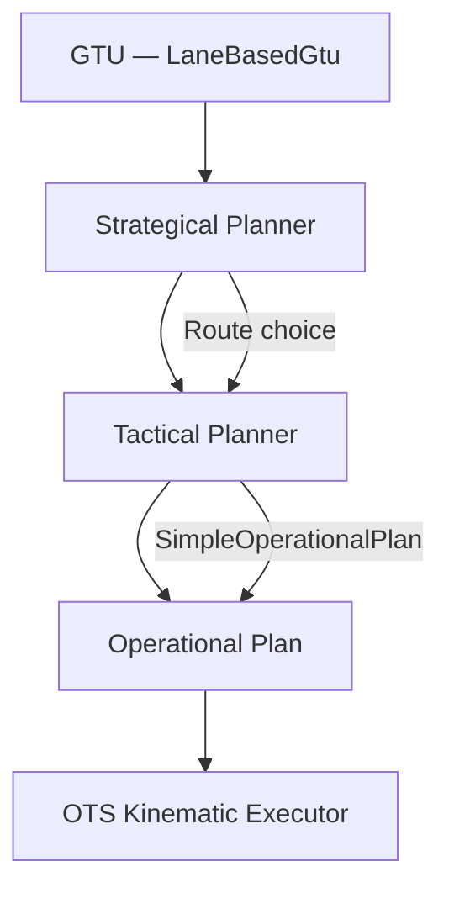
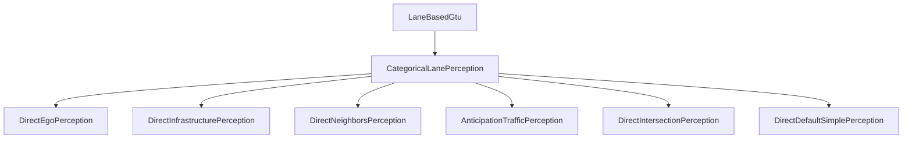
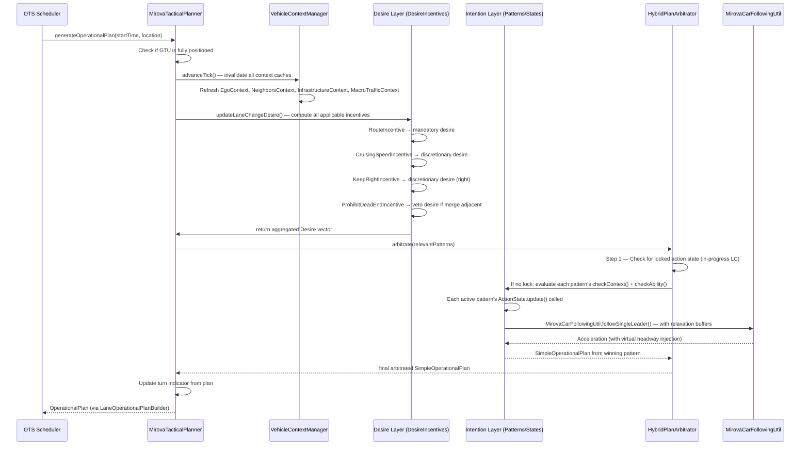

# MiRoVA Integration with OpenTrafficSim (OTS)

This document describes how the MiRoVA framework is embedded in and interacts with the standard OpenTrafficSim (OTS) simulation infrastructure. It covers the GTU lifecycle, the OTS abstraction layers, and how MiRoVA hooks into them.

---

## 🏗️ OTS Architectural Context

OpenTrafficSim follows a hierarchical planning architecture for Ground Transportation Units (GTUs):



| OTS Layer | Role | MiRoVA Class |
|:--|:--|:--|
| **GTU** (`LaneBasedGtu`) | Physical vehicle in the network | Unmodified OTS |
| **Strategical Planner** (`LaneBasedStrategicalRoutePlannerFactory`) | Route management | Unmodified OTS |
| **Tactical Planner** (`AbstractLaneBasedTacticalPlanner`) | Lane-level decision making | `MirovaTacticalPlanner` |
| **Operational Plan** (`SimpleOperationalPlan`) | Acceleration + lateral command | Output of MiRoVA |

MiRoVA operates entirely at the **Tactical Planner** level, extending `AbstractLaneBasedTacticalPlanner`. The OTS kinematic executor converts the `SimpleOperationalPlan` into vehicle position and velocity updates each simulation step.

---

## 🔧 The OTS Perception System

Before MiRoVA's cognitive layers can run, the OTS perception system must deliver raw observations.

### Perception Architecture



### Perception Categories Used by MiRoVA

All categories are initialized by [DefaultMirovaPerceptionFactory](file:///d:/Mitarbeitende/gw2128/repositories/opentrafficsim/ots-road/src/main/java/org/opentrafficsim/road/gtu/lane/tactical/mirova/DefaultMirovaPerceptionFactory.java):

| OTS Category | MiRoVA Usage |
|:--|:--|
| `DirectEgoPerception` | Ego speed, acceleration, route info |
| `DirectInfrastructurePerception` | Lane structure, speed limits, lane-change info, legal possibilities |
| `DirectNeighborsPerception` (`WRAP` mode) | Surrounding vehicles as `HeadwayGtu` objects — includes speed, distance, turn indicator |
| `AnticipationTrafficPerception` | Downstream speed averaging for anticipation patterns |
| `DirectIntersectionPerception` | Traffic lights, conflict zones |
| `DirectDefaultSimplePerception` | General-purpose default perceptions |

> [!NOTE]
> `HeadwayGtuType.WRAP` mode wraps the real `LaneBasedGtu` reference inside the headway object, giving the model access to the vehicle's actual state (including turn indicators) rather than a simplified snapshot.

---

## 🔄 The Full Simulation Tick: Step-by-Step

Each simulation tick, the OTS scheduler calls `MirovaTacticalPlanner.generateOperationalPlan()`. This triggers the following cascade:



---

## 🏭 GTU Lifecycle & Factory Setup

When a new vehicle is spawned by the OTS demand generator, the following happens:

### 1. Factory Creation (`MirovaTacticalPlannerFactory.create()`)

```java
// 1. Set parameters on the GTU (LMRS, IDM+, MiRoVA-specific)
gtu.setParameters(getDefaultParameters());

// 2. Create planner (initializes VehicleContextManager + HybridPlanArbitrator)
MirovaTacticalPlanner planner = new MirovaTacticalPlanner(nextCarFollowingModel(gtu), gtu, perception);

// 3. Register declarative knowledge (Layer 2)
setDesireLayer(planner);  // → adds CruisingSpeedIncentive, KeepRightIncentive, RouteIncentive, ProhibitDeadEndIncentive

// 4. Register procedural knowledge (Layer 3/4)
setIntentionLayer(planner); // → adds SimpleLaneChangePattern, PreventUndercuttingPattern, MandatoryLaneChangePattern, GapOpenerPattern, AnticipateDownstreamMergePattern
```

### 2. GTU Strategical Wrapping

The `MirovaTacticalPlannerFactory` is always wrapped inside a `LaneBasedStrategicalRoutePlannerFactory` which handles:
- Route assignment at spawn time
- Route following across multiple links
- Strategic decisions (which on-ramp to take, etc.)

### 3. MiRoVA-Specific Default Parameters (`getDefaultParameters()`)

The factory applies both standard OTS parameters and MiRoVA-specific ones:

| Group | Examples |
|:--|:--|
| OTS/LMRS | `VCONG`, `T0`, `LCDUR`, `A`, `B`, `BCRIT`, `TMIN`, `TMAX`, `TAU`, `LOOKAHEAD`, `LOOKBACK` |
| Conflict/Light | `ConflictUtil` defaults, `TrafficLightUtil` defaults |
| MiRoVA | All `MirovaParameters.*` (DFREE, DMAND, relaxation tau, cooperation thresholds, etc.) |
| Override | `DT = 0.2 s` (higher resolution than the default OTS timestep) |

---

## 📦 Module Locations in the Repository

| Component | Module | Java Package |
|:--|:--|:--|
| Tactical Planner Core | `ots-road` | `org.opentrafficsim.road.gtu.lane.tactical.mirova` |
| Context / Belief Layer | `ots-road` | `...mirova.core.BeliefLayer` |
| Desire / Cognition Layer | `ots-road` | `...mirova.core.DesireLayer` |
| Intention / FSM Layer | `ots-road` | `...mirova.core.IntentionLayer.ManeuverPatterns` |
| Reactive / Control Layer | `ots-road` | `...mirova.core.ReactiveLayer` |
| Arbitration Layer | `ots-road` | `...mirova.core.ArbitrationLayer` |
| Parameter Definitions | `ots-road` | `...mirova.core.MirovaParameters` |
| Logging Utilities | `ots-road` | `...mirova.util.logging` |
| Scenario Definitions | `ots-demo` | `org.opentrafficsim.demo.mirova.scenariomanagement` |
| Network XML Files | `ots-demo` | `src/main/resources/mirova/` |

---

## 🗂️ Key OTS Interfaces Used

| OTS Interface/Class | Role in MiRoVA |
|:--|:--|
| `AbstractLaneBasedTacticalPlanner` | Base class for `MirovaTacticalPlanner`; provides GTU, perception, CF model access |
| `LaneBasedGtu` | Physical GTU; used for position, speed, lane, turn indicator |
| `LaneChange` | OTS object managing the physical geometry of a lane change (fraction, duration) |
| `SimpleOperationalPlan` | Output unit: a flat (acceleration, lateral direction) command for one timestep |
| `LaneOperationalPlanBuilder` | Converts `SimpleOperationalPlan` into a physical kinematic `OperationalPlan` |
| `HeadwayGtu` | Perception snapshot of a neighboring GTU (distance, speed, acceleration, turn indicator) |
| `RelativeLane` | Relative lane reference: `CURRENT`, `LEFT`, `RIGHT`, `LEFT_2`, etc. |
| `LaneChangeInfo` | Provides remaining distance and required number of lane changes until a mandatory split |
| `LmrsParameters` | Standard LMRS parameter types referenced in MiRoVA |

---

## 🔒 Thread Safety & Simulation Consistency

OTS is a **single-threaded discrete-event simulator** (DSOL-based). Each tick is processed sequentially, so there are no concurrency concerns within a single GTU's update cycle. However, parallel simulation runs (used for parameter studies) create separate simulator instances with independent random streams.

The `VehicleContextManager.advanceTick()` pattern ensures that within a single GTU's tick, any number of components can query context data without triggering redundant OTS perception calls — the cache is valid for the duration of that tick and invalidated at the start of the next.
