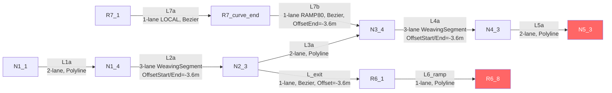

# OTS XML Network Format

This document describes the OTS XML format used to define road networks in MiRoVA simulations. It explains the complete structure, all element types, the offset/alignment system, and documents the concrete networks used in this project.

> **Schema location**: `ots-xml/src/main/resources/xsd/ots.xsd`  
> **Namespace**: `http://www.opentrafficsim.org/ots`  
> **Resource path**: `ots-demo/src/main/resources/mirova/*.xml`

---

## 🗂️ Top-Level Document Structure

Every OTS network XML file has this skeleton:

```xml
<?xml version="1.0" encoding="UTF-8"?>
<ots:Ots xmlns:ots="http://www.opentrafficsim.org/ots"
         xmlns:xi="http://www.w3.org/2001/XInclude"
         xmlns:xsi="http://www.w3.org/2001/XMLSchema-instance"
         xsi:schemaLocation="http://www.opentrafficsim.org/ots ../path/to/ots.xsd">

  <ots:Definitions>     <!-- 1. Reusable type definitions -->
    <!-- GTU types, Link types, Lane types, Stripe types, Road layouts -->
  </ots:Definitions>

  <ots:Network>         <!-- 2. Physical network topology -->
    <!-- Nodes and Links -->
  </ots:Network>

  <ots:Demand>          <!-- 3. Traffic sinks (and optionally sources) -->
    <!-- Sink definitions -->
  </ots:Demand>

  <ots:Run>             <!-- 4. Simulation runtime settings (optional) -->
    <ots:RunLength>1h</ots:RunLength>
  </ots:Run>

</ots:Ots>
```

> [!NOTE]
> The `<ots:Demand>` section in the XML is used for **sinks** only. Traffic **sources** (GTU generators) are always set up programmatically in Java via `OdApplier.applyOd()` or `LaneBasedGtuGenerator` — they are never defined in the XML.

---

## 📦 Section 1: `<ots:Definitions>`

Definitions are reusable templates referenced by ID from `<ots:Network>` elements.

### 1.1 XInclude: Loading Default Definitions

Standard OTS type libraries are loaded via XInclude with fallback paths for both IDE and JAR execution:

```xml
<xi:include href="../xsd/defaults/default_gtutypes.xml">
  <xi:fallback>
    <xi:include href="../../../../../ots-xml/src/main/resources/xsd/defaults/default_gtutypes.xml" />
  </xi:fallback>
</xi:include>
```

| Included File | Defines |
|:--|:--|
| `default_gtutypes.xml` | `NL.VEHICLE`, `NL.CAR`, `NL.TRUCK`, `NL.BICYCLE`, `NL.PEDESTRIAN`, etc. |
| `default_linktypes.xml` | `NL.ROAD`, `NL.FREEWAY`, `NL.RURAL`, etc. with default speed limits |
| `default_lanetypes.xml` | `NL.HIGHWAY`, `NL.CITY_STREET`, `NL.BUS_LANE`, etc. |
| `default_stripetypes.xml` | `NL.SOLID`, `NL.DASHED`, `NL.DOUBLE_SOLID`, etc. |
| `default_detectortypes.xml` | `NL.LOOP_DETECTOR`, `NL.ROAD_USERS`, etc. |

### 1.2 Custom `<ots:LinkTypes>`

Scenario-specific link types override or extend the defaults. A `LinkType` defines which GTU types are **compatible** (can use the link) and sets per-type **legal speed limits**:

```xml
<ots:LinkTypes>
  <ots:LinkType Id="HIGHWAY">
    <ots:Compatibility GtuType="NL.VEHICLE" />          <!-- All vehicles allowed -->
    <ots:SpeedLimit GtuType="NL.CAR"   LegalSpeedLimit="200km/h" />  <!-- effectively unrestricted -->
    <ots:SpeedLimit GtuType="NL.TRUCK" LegalSpeedLimit="120km/h" />  <!-- truck limit -->
  </ots:LinkType>

  <ots:LinkType Id="RAMP80">
    <ots:Compatibility GtuType="NL.VEHICLE" />
    <ots:SpeedLimit GtuType="NL.CAR"   LegalSpeedLimit="80km/h" />
    <ots:SpeedLimit GtuType="NL.TRUCK" LegalSpeedLimit="80km/h" />
  </ots:LinkType>

  <ots:LinkType Id="LOCAL">
    <ots:Compatibility GtuType="NL.VEHICLE" />
    <ots:SpeedLimit GtuType="NL.CAR"   LegalSpeedLimit="65km/h" />
    <ots:SpeedLimit GtuType="NL.TRUCK" LegalSpeedLimit="65km/h" />
  </ots:LinkType>
</ots:LinkTypes>
```

> [!IMPORTANT]
> The `LegalSpeedLimit` in the `LinkType` is the **infrastructure-side** limit seen by `DirectInfrastructurePerception`. MiRoVA's `CruisingSpeedIncentive` uses this to compute the desired speed. It does NOT automatically cap vehicle speed — the behavioral model must respect it.

### 1.3 `<ots:RoadLayouts>`

A `RoadLayout` defines the **cross-sectional geometry** of a road segment: the lateral arrangement of lanes, stripes, and shoulders. It is referenced by links via `<ots:DefinedLayout>`.

```xml
<ots:RoadLayouts>
  <ots:RoadLayout Id="2LaneHighway" LinkType="HIGHWAY">
    <!-- Elements listed from LEFT to RIGHT (positive offset = left) -->
    <ots:Shoulder Id="LeftShoulder">
      <ots:CenterOffset>8.5m</ots:CenterOffset>
      <ots:Width>3m</ots:Width>
    </ots:Shoulder>
    <ots:Stripe Id="1">
      <ots:CenterOffset>7.2m</ots:CenterOffset>
      <ots:DefinedStripe>NL.SOLID</ots:DefinedStripe>   <!-- left boundary -->
    </ots:Stripe>
    <ots:Lane Id="Lane2" LaneType="NL.HIGHWAY">
      <ots:CenterOffset>5.4m</ots:CenterOffset>
      <ots:Width>3.6m</ots:Width>
    </ots:Lane>
    <ots:Stripe Id="2">
      <ots:CenterOffset>3.6m</ots:CenterOffset>
      <ots:DefinedStripe>NL.DASHED</ots:DefinedStripe>  <!-- lane separator -->
    </ots:Stripe>
    <ots:Lane Id="Lane1" LaneType="NL.HIGHWAY">
      <ots:CenterOffset>1.8m</ots:CenterOffset>
      <ots:Width>3.6m</ots:Width>
    </ots:Lane>
    <ots:Stripe Id="3">
      <ots:CenterOffset>0m</ots:CenterOffset>
      <ots:DefinedStripe>NL.SOLID</ots:DefinedStripe>   <!-- right boundary (reference = 0) -->
    </ots:Stripe>
    <ots:Shoulder Id="RightShoulder">
      <ots:CenterOffset>-1.5m</ots:CenterOffset>
      <ots:Width>3m</ots:Width>
    </ots:Shoulder>
  </ots:RoadLayout>
</ots:RoadLayouts>
```

#### Cross-Section Offset System

The **right boundary stripe of the rightmost lane is always at `CenterOffset=0m`**. All other offsets are measured from this zero reference:

```
                    +Y (left)
←←←←←←←←←←←←←←←←←←←←←←←←←←←←←←←←←←←←←→ Link direction
  LeftShoulder │ Stripe │ Lane2 │ Stripe │ Lane1 │ Stripe │ RightShoulder
      8.5m         7.2m     5.4m     3.6m     1.8m      0m       -1.5m
                                              ↑
                                         CenterOffset
```

#### Geometric Formula

For a lane of width `w` centered at `c`: the lane occupies `[c - w/2, c + w/2]` in the lateral axis.

For `Lane1` (center=1.8m, width=3.6m): occupies `[0.0m, 3.6m]` — **exactly between the two bounding stripes at 0m and 3.6m**. ✓

#### Lane Naming Convention

| Convention | Network | Description |
|:--|:--|:--|
| `Lane1`, `Lane2`, … | FreiburgNord | `Lane1` = rightmost, `Lane2` = left of that |
| `FORWARD1`, `FORWARD2`, … | MergeBodegraven | `FORWARD1` = leftmost (fast lane), `FORWARD4` = rightmost |

> [!IMPORTANT]
> OTS uses the **Lane ID as the identifier** referenced in Java (`link.getLane("Lane1")`) and in the XML `<ots:Sink>`. Choose IDs that are consistent within a scenario. The `FORWARD1...N` convention is easier to read for multi-lane layouts but both work equally.

---

## 🌐 Section 2: `<ots:Network>`

The network topology is defined as a **directed graph** of nodes connected by links.

### 2.1 `<ots:Node>`

A node is a named point in 2D space. It acts as a **junction** between links.

```xml
<ots:Node Id="N1_1" Coordinate="(-498.363, 44.159)" Direction="-4.8 deg(E)" />
```

| Attribute | Unit | Description |
|:--|:--|:--|
| `Id` | — | Unique string ID — referenced in Java and OD matrix |
| `Coordinate` | metres | `(X, Y)` in a local Cartesian coordinate system (`X=East`, `Y=North`) |
| `Direction` | degrees | Heading of the node in degrees East. Controls the tangent direction at junctions |

> [!TIP]
> `Direction` is critical when connecting links with a `<ots:Bezier />` geometry. OTS uses the node direction as the tangent endpoint for the Bézier control point computation, so a wrongly set direction will produce incorrect merge/diverge geometry.

**Node naming convention used in FreiburgNord:**
- `N1_1`, `N2_3`, … — mainline nodes (`N<link>_<subIndex>`)
- `R6_1`, `R6_8` — ramp/exit nodes (`R<link>_<position>`)
- `R7_1` — origin node where the OD matrix injects on-ramp vehicles (start of GTU generation)

### 2.2 `<ots:Link>`

A link is a directed road segment from one node to another. It carries one or more lanes.

```xml
<ots:Link Id="L2a" NodeStart="N1_4" NodeEnd="N2_3"
          Type="HIGHWAY"
          OffsetStart="-3.6m"
          OffsetEnd="-3.6m">
  <ots:Straight />
  <ots:DefinedLayout>WeavingSegment</ots:DefinedLayout>
</ots:Link>
```

#### Link Attributes

| Attribute | Description |
|:--|:--|
| `Id` | Unique string identifier (referenced in Java) |
| `NodeStart` | Upstream node ID |
| `NodeEnd` | Downstream node ID |
| `Type` | Must match an `<ots:LinkType>` Id defined in `<Definitions>` |
| `OffsetStart` | Lateral shift applied to the road layout at the start node (positive = left) |
| `OffsetEnd` | Lateral shift applied at the end node |

#### Geometry Elements (mutually exclusive)

| Element | Description |
|:--|:--|
| `<ots:Straight />` | Straight line from `NodeStart` to `NodeEnd` |
| `<ots:Bezier />` | Cubic Bézier curve using the node `Direction` attributes as tangents |
| `<ots:Polyline>` with `<ots:Coordinate>` children | Piecewise linear path through intermediate waypoints |
| `<ots:Arc>` | Circular arc (requires radius and direction) |

**In MiRoVA networks:**
- Straight mainline segments → `<ots:Straight />`
- Ramp diverge/merge connectors with smooth geometry → `<ots:Bezier />`
- Long curved segments from ViSSim coordinates → `<ots:Polyline>`

#### `OffsetStart` / `OffsetEnd`: The Alignment Mechanism

This is the **critical concept** for building merges and diverges. When links of different lane counts meet at a node, the cross-sections must be aligned geometrically so that the correct lanes connect.

**Example: FreiburgNord 2-lane to 3-lane transition:**

```
2LaneHighway (no offset):   0m        3.6m      7.2m
                             |  Lane1  |  Lane2  |
                             ↑                   ↑
                           right boundary      left boundary

WeavingSegment (OffsetStart=-3.6m shifts entire x-section left by 3.6m):
Physical positions:          -3.6m       0m       3.6m      7.2m
                              |   Ramp   | Lane1  |  Lane2  |
                              ↑                              ↑
                        right boundary               left boundary
```

After applying `OffsetStart=-3.6m`, the `Lane1` center is at `1.8 - 3.6 = -1.8m` physical position — which is **offset to the right** of the 2-lane layout's reference.
The `Lane2` and `Lane1` in the weaving segment match the 2-lane layout's lanes at the node junction. The new `Ramp` lane is an **additional rightmost lane with no upstream counterpart**, creating the merge zone.

```
At junction node N1_4:
  2LaneHighway:              Lane1 center = 1.8m,  Lane2 center = 5.4m
  WeavingSegment + offset:   Lane1 center = 1.8m,  Lane2 center = 5.4m,  Ramp center = -1.8m
                             ↑ perfect alignment ↑                       ↑ new lane ↑
```

---

## 🛣️ FreiburgNord Network: Annotated Map

The [FreiburgNord.xml](file:///d:/Mitarbeitende/gw2128/repositories/opentrafficsim/ots-demo/src/main/resources/mirova/FreiburgNord.xml) models a real BAB A5 interchange section transcribed from a ViSSim model.

### Link Topology



### Node Coordinates Summary

| Node | X [m] | Y [m] | Role |
|:--|:--|:--|:--|
| `N1_1` | -498.4 | 44.2 | Mainline entry (GTU generator, 2-lane) |
| `N1_4` | 522.9 | -10.8 | Junction 2→3 lanes |
| `N2_3` | 748.6 | 0.0 | Junction 3→2 + exit ramp diverge |
| `R6_1` | 754.2 | -3.0 | Exit ramp start |
| `R6_8` | 660.0 | -126.5 | Exit ramp end (sink) |
| `N3_4` | 974.8 | 26.4 | Junction 2→3 + entry ramp merge |
| `R7_1` | 725.0 | -160.0 | On-ramp origin (OD origin node) |
| `R7_curve_end` | 836.4 | -70.6 | Ramp curve split node |
| `N4_3` | 1171.8 | 57.9 | Junction 3→2 |
| `N5_3` | 1888.6 | 247.1 | Mainline exit (sink) |

### Road Layout Usage

| Link | RoadLayout | Lanes | Offset |
|:--|:--|:--|:--|
| `L1a` | `2LaneHighway` | Lane1, Lane2 | none |
| `L2a` | `WeavingSegment` | Lane1, Lane2, Ramp (exit zone) | -3.6m |
| `L3a` | `2LaneHighway` | Lane1, Lane2 | none |
| `L4a` | `WeavingSegment` | Lane1, Lane2, Ramp (entry zone) | -3.6m |
| `L5a` | `2LaneHighway` | Lane1, Lane2 | none |
| `L_exit` | `1LaneHighway` | Lane1 | -3.6m (aligns to `L2a.Ramp`) |
| `L6_ramp` | `1LaneHighway` | Lane1 | none |
| `L7a` | `1LaneHighway` (LOCAL) | Lane1 | none |
| `L7b` | `1LaneHighway80` (RAMP80) | Lane1 | -3.6m end (aligns to `L4a.Ramp`) |

---

## 🚦 Section 3: `<ots:Demand>` — Sinks

Sinks remove vehicles from the simulation when they reach the end of a route. Each sink is placed at a specific lane position.

```xml
<ots:Demand>
  <!-- Mainline exit: both lanes of L5a -->
  <ots:Sink Lane="Lane2" Link="L5a" Position="END-50m" Type="NL.ROAD_USERS" />
  <ots:Sink Lane="Lane1" Link="L5a" Position="END-50m" Type="NL.ROAD_USERS" />

  <!-- Exit ramp: single lane of L6_ramp -->
  <ots:Sink Lane="Lane1" Link="L6_ramp" Position="END-10m" Type="NL.ROAD_USERS" />
</ots:Demand>
```

| Attribute | Description |
|:--|:--|
| `Lane` | Lane ID within the link |
| `Link` | Link ID |
| `Position` | Position along the link: absolute distance from start (`50m`), or from end (`END-50m`) |
| `Type` | Detector type — `NL.ROAD_USERS` counts all road users |

> [!TIP]
> **Always place sinks before the actual end** (`END-50m` or similar). A sink at `END` can create a race condition where a fast vehicle exits the link before the sink triggers. A 10–50 m buffer is standard practice.

---

## ⚙️ Section 4: `<ots:Run>`

Optional section for default simulation duration (used by the OTS built-in XML runner; usually overridden programmatically by `ScenarioParameters.setSimulationTime()`):

```xml
<ots:Run>
  <ots:RunLength>1h</ots:RunLength>
</ots:Run>
```

---

## 📐 Designing a New Network: Step-by-Step

### Step 1: Plan Node Positions

1. Use a coordinate system where X=East, Y=North (metres)
2. Place nodes at all geometric junctions: link starts, ends, ramp diverges/merges
3. For Bézier geometry, set `Direction` accurately using `atan2(ΔY, ΔX)` in degrees
4. For ViSSim-imported geometry: use the original polyline points

### Step 2: Define Custom LinkTypes and RoadLayouts

In `<ots:Definitions>`:
- Define one `LinkType` per **speed category** (HIGHWAY 130, RAMP 80, LOCAL 65, etc.)
- Define one `RoadLayout` per **lane count + category** combination you need

**Standard motorway lane widths used in MiRoVA networks:**
- Lane width: **3.6 m**
- Shoulder width: **3.0 m**
- Shoulder offset from rightmost boundary: **-1.5 m** (right) / **+sum** (left)

**CenterOffset formula for an N-lane layout (right boundary = 0):**
```
Lane k center (from right, k=1): CenterOffset = (2k-1) × 1.8m
  → Lane1: 1.8m
  → Lane2: 5.4m
  → Lane3: 9.0m
  → Lane4: 12.6m

Stripe k (between Lane k and Lane k+1): CenterOffset = k × 3.6m
  → Stripe1 (right boundary): 0m
  → Stripe2 (between Lane1/Lane2): 3.6m
  → Stripe3 (between Lane2/Lane3): 7.2m
```

### Step 3: Define the Network Topology

```xml
<ots:Network>
  <!-- Nodes first -->
  <ots:Node Id="A" Coordinate="(0, 0)" />
  <ots:Node Id="B" Coordinate="(1000, 0)" />

  <!-- Links second -->
  <ots:Link Id="AB" NodeStart="A" NodeEnd="B" Type="HIGHWAY">
    <ots:Straight />
    <ots:DefinedLayout>2LaneHighway</ots:DefinedLayout>
  </ots:Link>
</ots:Network>
```

### Step 4: Add Sinks

Place a sink in each exit lane, 10–50 m before the true end.

### Step 5: Set up Sources in Java

After loading the XML, in `ScenarioGenerator.buildNetwork()`, manually register generation positions:
```java
CrossSectionLink linkIn = (CrossSectionLink) this.network.getLink("AB");
for (Lane lane : linkIn.getLanes()) {
    this.initialLongitudinalPositions.add(new LanePosition(lane, Length.instantiateSI(2.0)));
}
```

---

## 🔗 Merge/Diverge Design Patterns

### Pattern 1: Lane-Drop Diverge (exit ramp)

An exit ramp takes the **rightmost lane** off the mainline.

```
Mainline upstream (3-lane, WeavingSegment, OffsetStart=-3.6m):
  Lane2  Lane1  Ramp   ← Ramp is the rightmost "extra" lane
  5.4m   1.8m  -1.8m  (physical offsets)

Mainline downstream (2-lane, no offset):
  Lane2  Lane1
  5.4m   1.8m   ← Lane1 and Lane2 continue straight

Exit ramp (1-lane, OffsetStart=-3.6m):
  Lane1              ← physically at -1.8m → connects to upstream Ramp lane
```

The `OffsetStart=-3.6m` on the exit link connector (`L_exit`) places its `Lane1` center at `1.8 - 3.6 = -1.8m`, matching the `Ramp` lane of `L2a` at the shared node.

### Pattern 2: Lane-Add Merge (entry ramp)

An on-ramp **adds a lane** as the rightmost at the merge node.

```
Mainline upstream (2-lane, no offset):
  Lane2  Lane1
  5.4m   1.8m

On-ramp (1-lane, OffsetEnd=-3.6m):
  Lane1           ← at -1.8m physical → will merge as the extra Ramp lane

Mainline downstream (3-lane, WeavingSegment, OffsetStart=-3.6m):
  Lane2  Lane1  Ramp
  5.4m   1.8m  -1.8m
```

At the merge node (`N3_4`), the on-ramp's `Lane1` (at -1.8m) exactly matches the `Ramp` lane of the downstream `L4a`. OTS automatically connects these.

---

## ⚠️ Common Pitfalls

| Problem | Cause | Fix |
|:--|:--|:--|
| Vehicles disappear at merge node | Route not registered for that GTU type | Register route for **both** `CAR` and `TRUCK` from the ramp origin |
| Jerky geometry at junctions | Node `Direction` wrong | Compute `atan2(ΔY, ΔX)` from the actual link geometry |
| JAXB parse errors in parallel runs | No synchronization on XML parser | Add `synchronized(ScenarioClass.class)` around `XmlParser.build()` |
| Sink not removing vehicles | Sink at `END` position | Use `END-50m` or similar |
| Wrong lane ordering | Assuming `Lane1` = leftmost | Check the XML: rightmost is always at offset 0. `Lane1` = rightmost in FreiburgNord; `FORWARD1` = leftmost in MergeBodegraven |
| `getLane("Lane1")` returns null | Link ID typo or wrong case | Lane IDs are case-sensitive and must exactly match the XML |
