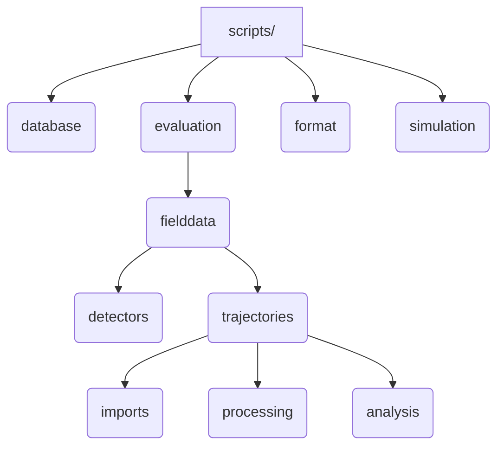
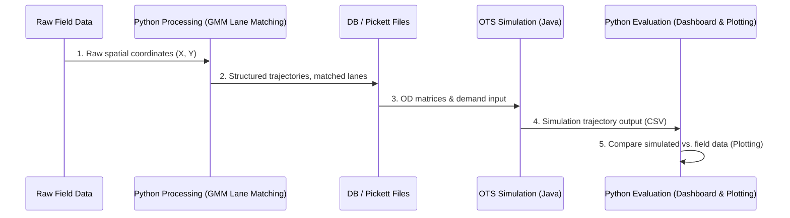

# Python Evaluation & Data Processing Pipeline

While the OpenTrafficSim (OTS) simulator runs in Java, the data processing, validation, calibration, and output plotting are driven by a Python pipeline located in the `diss_mvb` repository under the [scripts/](file:///d:/Mitarbeitende/gw2128/repositories/diss_mvb/scripts/) directory.

---

## 📂 Repository Structure

The `diss_mvb/scripts` directory is organized into four main packages:

---

## 🛠️ Main Packages & Scripts

### 1. Trajectory Imports (`imports/`)
*   **Purpose**: Extracts raw field measurements from datasets (e.g., Freiburg Nord, DLR HT) and structures/imports them into local files or database tables.
*   **Key Script**: [execute_db_import.py](file:///d:/Mitarbeitende/gw2128/repositories/diss_mvb/scripts/evaluation/fielddata/trajectories/imports/datasets/a2_mai23/execute_db_import.py) orchestrates the ingestion of raw trajectory files into a unified PostgreSQL format.

### 2. Trajectory Processing (`processing/`)
*   **Purpose**: Filters outliers, resolves anomalies, and matches raw spatial coordinate trajectories to discrete highway lanes.
*   **Key Algorithms**:
    *   **Lane Tracker (`match_lanes.py`)**: [match_lanes.py](file:///d:/Mitarbeitende/gw2128/repositories/diss_mvb/scripts/evaluation/fielddata/trajectories/processing/match_lanes.py) maps vehicles to lanes using a rolling-window Gaussian Mixture Model (GMM), Hungarian matching, and bi-directional dead reckoning. This solves the "label-switching" problem during section-wise cluster analysis (e.g., at on-ramps and off-ramps).
    *   **Anomaly Checker (`check_trajectory_anomalies.py`)**: [check_trajectory_anomalies.py](file:///d:/Mitarbeitende/gw2128/repositories/diss_mvb/scripts/evaluation/fielddata/trajectories/processing/helpers/check_trajectory_anomalies.py) filters out teleportation spikes, physical acceleration violations, and reverse driving outliers.

### 3. Simulation Verification (`simulation/ots/`)
*   **Purpose**: Configures the execution of OTS simulations from Python and processes the results.
*   **Key Script**: [dashboard_trajectories.py](file:///d:/Mitarbeitende/gw2128/repositories/diss_mvb/scripts/simulation/ots/dashboard_trajectories.py) generates dynamic web-based dashboard plots (using Plotly/Streamlit) to visually inspect simulated vehicle trajectories.

---

## 📈 Calibration & Fundamental Diagram Analysis (Q-V)

The post-run evaluation script [plot_scenario_results.py](file:///d:/Mitarbeitende/gw2128/repositories/diss_mvb/scripts/simulation/ots/plot_scenario_results.py) compares simulated output vs. empirical field data. Recent enhancements focus on robust mathematical modeling of traffic breakdown and capacity.

### 1. Van Aerde Curve Fitting
* **Model Equation**: The Van Aerde model links speed ($v$) and flow ($q$) via:
  $$q = \frac{v}{c_1 + c_2 v + \frac{c_3}{v_f - v}}$$
* **Coefficient Correction**: The $c_2$ coefficient is computed from physical parameters ($v_f$ free flow speed, $v_c$ critical speed, $q_c$ capacity, $k_j$ jam density):
  $$c_2 = \frac{1}{q_c} - \frac{c_1}{v_c} - \frac{c_3}{v_c (v_f - v_c)}$$
  *(Note: A division by $v_c$ in the third term was corrected to ensure robust orthogonal fitting of the curves without optimization degeneracy).*
* **Orthogonal Fitting**: Uses scipy's `minimize` with `L-BFGS-B` to minimize orthogonal distance of points to the curve, with strict penalty values ($10^6$) for invalid parameter spaces where the denominator $\le 0$.

### 2. GMM Critical Speed & Breakdown Capacity
* **Dynamic Critical Speed ($v_{\text{crit}}$)**: Fits a 2-component Gaussian Mixture Model (GMM) on speed distributions to find the intersection of the free-flow and congested speed components.
* **Breakdown Identification**:
  * Excludes the first **45 minutes** of the simulation run to discard initialization warm-up transients.
  * Checks for a persistent breakdown event where the speed drops below $v_{\text{crit}}$ with a speed drop $dv \ge dv_{\text{min}}$ (iterating $dv_{\text{min}}$ from $10.0$ down to $5.0\text{ km/h}$).
  * **Persistence Criteria**: The previous interval must be in free flow ($v_{\text{prev}} \ge v_{\text{crit}}$) and the next interval must remain congested ($v_{\text{after}} < v_{\text{crit}}$) to filter out transient single-interval drops.
* **Capacity Extraction**: The breakdown capacity is defined as the total mainline flow in the 5-minute interval immediately preceding the breakdown.
* **Statistical Aggregation**: Computes the mean, median, standard deviation, and a **95% Student-t confidence interval** of breakdown capacities across all successful seed replications.

### 3. Layout Adjustments & HTML Overview Dashboard
* **Clean Plotting Canvas**: The results annotation box (calibration metrics, fitted coefficients, capacity statistics) is placed outside the main plotting grid (on the right margin using `x=1.02, y=0.70` paper coordinates) by increasing the figure width to $780\text{ px}$ and right margin to $350\text{ px}$.
* **Removal of Zigzag Line**: The non-monotonic `Sim Median` trace was removed from the q-v plot to prevent zigzag clutter.
* **Speed over Time Sparklines Grid**: The top-level `overview_all_scenarios.html` includes a responsive CSS grid section displaying compact Speed-over-Time plots for detector `det_L3a` across all variations. Each plot displays every individual simulation seed run as a thin semi-transparent line, the median trajectory as a bold line, and empirical detector data as a dotted black reference line.
* **CSV Detector Run Cache**: To avoid re-parsing large `detector_periodic.csv.zip` files on repeated pipeline runs, aggregated per-run detector data is automatically cached to `{variation_dir}/plots/detector_runs_cache.csv`. The cache is automatically validated against source zip file modification timestamps (`st_mtime`).

---

## 🔬 Multi-Day Calibration Analysis Extensions (`calibration_analysis_extensions.py`)

The evaluation pipeline includes three advanced calibration extensions and a per-day metrics comparison matrix:

1. **Module 1 — Per-Day & Per-Seed Van Aerde Distributions**:
   * Treats individual fits ($n=6$ empirical, $n=36$ per simulation setting) as the true unit of replication to prevent serial autocorrelation inflation.
   * Outputs: `van_aerde_fits_tidy.csv`, `van_aerde_parameter_distributions.png`.
2. **Module 2 — DTW Time-Series Decomposition**:
   * Employs C-optimized `dtaidistance` to extract breakdown **Onset Lag (minutes)** and timing-corrected **Aligned Speed RMSE / MAE**.
   * Output: `dtw_time_series_metrics.csv` (recorded per individual seed run).
3. **Module 3 — Cross-Day Consistency Hypothesis Test**:
   * Evaluates fixed parameter set stability across varying demand days using Coefficient of Variation ($CV = SD / \text{Mean}$) and Min-Max ranges.
   * Outputs: `cross_day_consistency_summary.csv`, `cross_day_consistency_summary.md`.
4. **Per-Day Metrics Breakdown Matrix**:
   * Compares empirical vs. simulated $q_c, v_c$, Van Aerde fit RMSE, DTW Onset Lag, and Aligned Speed RMSE for **each individual demand date**.
   * Output: `per_day_calibration_metrics.csv`.
5. **Fast Evaluation Runner**:
   * Executable via `python run_calibration_extensions_fast.py --output-dir <path>` to update all metrics and HTML dashboard in $< 5\text{ seconds}$ using detector cache files.

For complete details on execution commands, script parameters, and output artifacts, see the detailed pipeline documentation in [scripts/simulation/ots/README.md](file:///d:/Mitarbeitende/gw2128/repositories/diss_mvb/scripts/simulation/ots/README.md).

---

## 🔄 Simulation & Data Pipeline Flow

