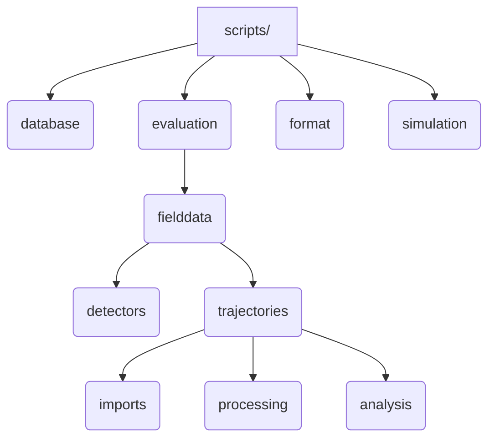
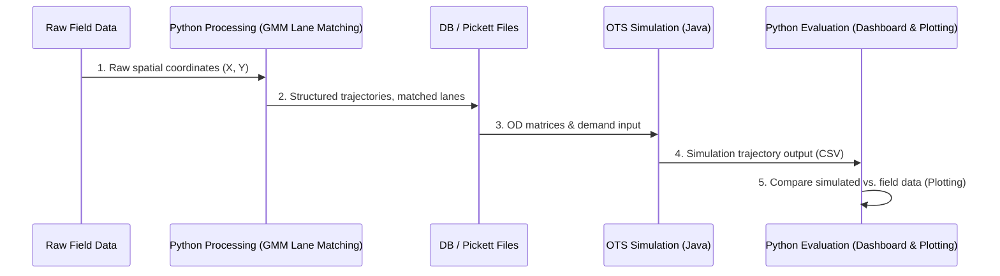

# Python Evaluation & Data Processing Pipeline

While the OpenTrafficSim (OTS) simulator runs in Java, the data processing, validation, calibration, and output plotting are driven by a Python pipeline located in the `diss_mvb` repository under the [scripts/](file:///d:/Mitarbeitende/gw2128/repositories/diss_mvb/scripts/) directory.

---

## 📂 Repository Structure

The `diss_mvb/scripts` directory is organized into four main packages:

---

## 🛠️ Main Packages & Scripts

### 1. Trajectory Imports (`imports/`)
*   **Purpose**: Extracts raw field measurements from datasets (e.g., Freiburg Nord, DLR HT) and structures/imports them into local files or database tables.
*   **Key Script**: [execute_db_import.py](file:///d:/Mitarbeitende/gw2128/repositories/diss_mvb/scripts/evaluation/fielddata/trajectories/imports/datasets/a2_mai23/execute_db_import.py) orchestrates the ingestion of raw trajectory files into a unified PostgreSQL format.

### 2. Trajectory Processing (`processing/`)
*   **Purpose**: Filters outliers, resolves anomalies, and matches raw spatial coordinate trajectories to discrete highway lanes.
*   **Key Algorithms**:
    *   **Lane Tracker (`match_lanes.py`)**: [match_lanes.py](file:///d:/Mitarbeitende/gw2128/repositories/diss_mvb/scripts/evaluation/fielddata/trajectories/processing/match_lanes.py) maps vehicles to lanes using a rolling-window Gaussian Mixture Model (GMM), Hungarian matching, and bi-directional dead reckoning. This solves the "label-switching" problem during section-wise cluster analysis (e.g., at on-ramps and off-ramps).
    *   **Anomaly Checker (`check_trajectory_anomalies.py`)**: [check_trajectory_anomalies.py](file:///d:/Mitarbeitende/gw2128/repositories/diss_mvb/scripts/evaluation/fielddata/trajectories/processing/helpers/check_trajectory_anomalies.py) filters out teleportation spikes, physical acceleration violations, and reverse driving outliers.

### 3. Simulation Verification (`simulation/ots/`)
*   **Purpose**: Configures the execution of OTS simulations from Python and processes the results.
*   **Key Script**: [dashboard_trajectories.py](file:///d:/Mitarbeitende/gw2128/repositories/diss_mvb/scripts/simulation/ots/dashboard_trajectories.py) generates dynamic web-based dashboard plots (using Plotly/Streamlit) to visually inspect simulated vehicle trajectories.

---

## 🔄 Simulation & Data Pipeline Flow

