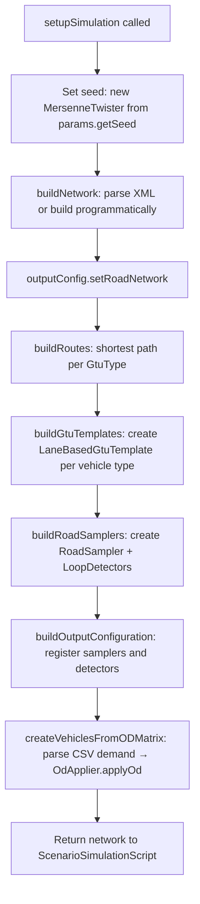
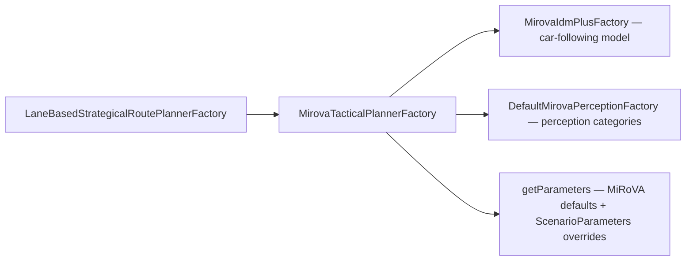
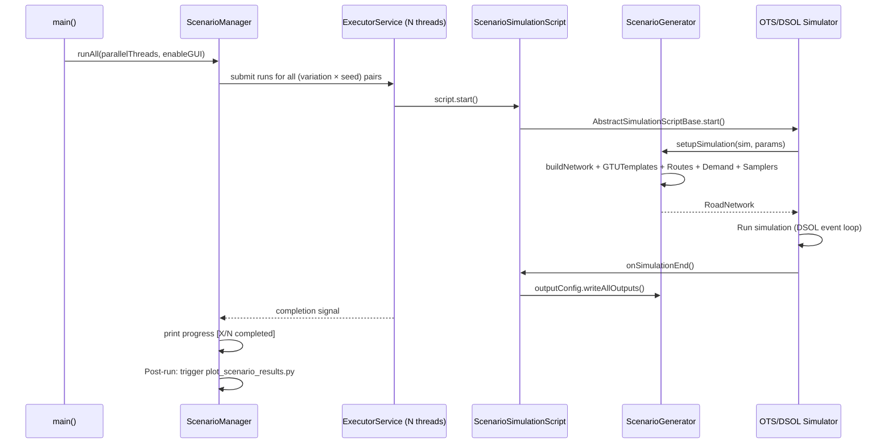

# Scenario Setup & Simulation Configuration

This document describes how simulations are set up starting from the `ots-demo` module — from scenario definition and network loading, through demand modeling, GTU template creation, parameter configuration, and parallel batch execution.

---

## 🗂️ Module Location

All scenario infrastructure lives in:
```
ots-demo/src/main/java/org/opentrafficsim/demo/mirova/
  scenariomanagement/           ← Core infrastructure
    ScenarioGenerator.java      ← Abstract base class for scenarios
    ScenarioManager.java        ← Batch orchestrator (parallel runs)
    ScenarioParameters.java     ← Typed parameter container
    ParameterGridBuilder.java   ← Cartesian product sweep builder
    ScenarioSimulationScript.java ← DSOL script adapter
    ScenarioOutputConfiguration.java ← Output configuration
    libraries/
      DesiredSpeedLibrary.java  ← Empirical speed distributions
    scenarios/
      FreiburgNord.java         ← Real-world scenario (Freiburg Nord highway)
      MergeScenario.java        ← Abstract merge test scenario
      SimpleHighwayScenario.java ← Simple 3-lane motorway scenario
      RunFreiburgNord.java      ← Single-run launcher (with GUI)
      RunFreiburgParallel.java  ← Multi-seed parallel runner
      RunFreiburgParallel_ParameterStudy.java ← OAT parameter study runner
      RunParallelMergeScenarios.java ← Merge scenario batch runner
```

---

## 🏗️ Core Architecture: `ScenarioGenerator`

[ScenarioGenerator](file:///d:/Mitarbeitende/gw2128/repositories/opentrafficsim/ots-demo/src/main/java/org/opentrafficsim/demo/mirova/scenariomanagement/ScenarioGenerator.java) is the abstract base class that all concrete scenarios implement. It encapsulates everything needed to define a complete simulation scenario.

### Internal State

| Field | Type | Description |
|:--|:--|:--|
| `scenarioName` | `String` | Human-readable scenario label |
| `network` | `RoadNetwork` | The built road network |
| `routes` | `Map<String, Route>` | All defined routes keyed by name |
| `gtuTemplates` | `Map<GtuType, LaneBasedGtuTemplate>` | Vehicle templates per GTU type |
| `odMatrix` | `OdMatrix` | Traffic demand specification |
| `stream` | `StreamInterface` | Random number stream (seeded with `params.getSeed()`) |
| `defaultParameters` | `ScenarioParameters` | Default parameter set for this scenario |
| `outputConfiguration` | `ScenarioOutputConfiguration` | Output specification |
| `listLoopDetectors` | `List<LoopDetector>` | All loop detectors placed in the network |
| `listRoadSamplers` | `List<RoadSampler>` | Trajectory samplers |

### Mandatory Abstract Methods

Every concrete scenario must implement:

| Method | Purpose |
|:--|:--|
| `buildNetwork(OtsSimulatorInterface)` | Loads/builds the road network (XML or programmatic) |
| `setupSimulation(sim, params)` | Master initialization: calls all sub-builders in the right order |
| `buildGtuTemplates(OtsSimulatorInterface)` | Defines vehicle types with their size/speed/planner |
| `buildRoutes()` | Calculates and registers route objects |
| `setDefaultParameters()` | Initializes default scenario parameter values |
| `getOrigins(RoadNetwork)` | Returns origin nodes for OD-matrix traffic injection |
| `getDestinations(RoadNetwork)` | Returns destination nodes |

### Optional Override Methods

| Method | Default | Purpose |
|:--|:--|:--|
| `buildOdMatrix(sim)` | No-op | Define traffic demand via an OD matrix |
| `buildHeadwayGenerator()` | No-op | Alternative to OD: define headways directly |
| `buildRoadSamplers()` | No-op | Configure trajectory and KPI recording |
| `buildOutputConfiguration()` | Empty config | Configure output file structure |

---

## 🔄 Simulation Setup Flow: `setupSimulation()`

The typical sequence inside `setupSimulation()` of a concrete scenario:



---

## 🗺️ Network Definition

### XML-Based Networks

Real-world networks are defined in OTS XML format and loaded from `src/main/resources/mirova/`:

```java
URL xmlURL = URLResource.getResource("/resources/mirova/FreiburgNord.xml");
this.network = new RoadNetwork("FreiburgNord", sim);
synchronized (FreiburgNord.class) {  // JAXB parsing is not thread-safe!
    new XmlParser(this.network).setUrl(xmlURL).build();
}
```

> [!IMPORTANT]
> The `synchronized (FreiburgNord.class)` block is **required** for parallel execution. OTS's XML parser uses static JAXB caches that are not thread-safe. Without this lock, parallel runs sharing the same JVM will corrupt each other's network data.

### Available Network Files

| File | Description |
|:--|:--|
| `FreiburgNord.xml` | 4-lane motorway segment with on-ramp (real BAB A5 geometry) |
| `MergeScenario.xml` | Synthetic merge scenario with configurable lane count |
| `SimpleHighway.xml` | 3-lane motorway without on-ramp (baseline) |

### OTS XML Network Format

The XML uses the OTS road network schema (`ots-network.xsd`). Key concepts:

```xml
<ots:Network xmlns:ots="...">
  <ots:Node Id="N1_1" Coordinate="(0.00,0.00)" />
  <ots:Node Id="N2_1" Coordinate="(1000.00,0.00)" />
  
  <ots:Link Id="L1a" NodeStart="N1_1" NodeEnd="N2_1">
    <ots:Straight />
    <ots:RoadLayout ...>
      <ots:Lane Id="Lane1" LaneType="HIGHWAY" SpeedLimit="130 km/h" />
      <ots:Lane Id="Lane2" LaneType="HIGHWAY" SpeedLimit="130 km/h" />
    </ots:RoadLayout>
  </ots:Link>
</ots:Network>
```

**Entry points** (GTU generation positions) are manually specified after network parsing:
```java
CrossSectionLink linkMainIn = (CrossSectionLink) this.network.getLink("L1a");
for (Lane lane : linkMainIn.getLanes()) {
    this.initialLongitudinalPositions.add(new LanePosition(lane, Length.instantiateSI(2.0)));
}
```

---

## 🚗 GTU Templates: Defining Vehicle Types

GTU templates define the physical and behavioral properties of each vehicle type.

### Template Components

A `LaneBasedGtuTemplate` combines:

| Component | Example | Description |
|:--|:--|:--|
| `GtuType` | `DefaultsNl.CAR` / `DefaultsNl.TRUCK` | OTS vehicle type classification |
| Length supplier | `ConstantSupplier<>(Length.instantiateSI(4.0))` | Vehicle length distribution |
| Width supplier | `ConstantSupplier<>(Length.instantiateSI(2.0))` | Vehicle width distribution |
| Speed supplier | `DesiredSpeedLibrary.carsLimit140_DensityLow(stream)` | **Empirical** desired speed distribution |
| Strategical planner factory | `buildStrategicalPlannerFactoryCar()` | Wraps MiRoVA tactical planner |
| Route supplier | `ProbabilisticRouteGenerator(...)` | Probabilistic route assignment |

### Example (from `FreiburgNord`)

```java
LaneBasedGtuTemplate car = new LaneBasedGtuTemplate(
    DefaultsNl.CAR,
    new ConstantSupplier<>(Length.instantiateSI(4.0)),       // length: 4m
    new ConstantSupplier<>(Length.instantiateSI(2.0)),       // width: 2m
    DesiredSpeedLibrary.carsLimit140_DensityLow(this.stream),// free-flow speed dist.
    strategicalPlannerFactoryCars,                           // MiRoVA planner
    routeGenerator                                           // probabilistic route
);
```

---

## 📐 Desired Speed Distributions: `DesiredSpeedLibrary`

[DesiredSpeedLibrary](file:///d:/Mitarbeitende/gw2128\repositories\opentrafficsim\ots-demo\src\main\java\org\opentrafficsim\demo\mirova\scenariomanagement\libraries\DesiredSpeedLibrary.java) provides empirical CDF-based free-flow speed distributions derived from field data on German motorways.

### Available Distributions

| Method | Speed Limit | Source | Note |
|:--|:--|:--|:--|
| `cars100kmh(stream)` | 100 km/h | Vissim calibration | Implicit limit compliance |
| `cars120kmh(stream)` | 120 km/h | Vissim calibration | Implicit limit compliance |
| `cars130kmh(stream)` | 130 km/h | Vissim calibration | Implicit limit compliance |
| `carsUnrestricted(stream)` | None | German Autobahn data | Full speed range |
| `carsLimit140_DensityLow(stream)` | 140 km/h | Weyland (2023) | Low density class |
| `carsLimit140_DensityClass1_Modified(stream)` | 140 km/h | Weyland + KIT | Modified density class 1 |
| `trucksLimit100_DensityClass1_Modified(stream)` | 100 km/h | KIT calibration | Trucks with 100 km/h limit |

### Distribution Format

Each distribution is an interpolated empirical CDF:

```java
InterpolatedEmpiricalDistribution dist = new InterpolatedEmpiricalDistribution(
    new Number[] {80, 99, 109, 121, 131, 149, 165, 185, 205},  // speed breakpoints [km/h]
    new double[] {0.0, 0.03, 0.10, 0.26, 0.47, 0.80, 0.93, 0.99, 1.0}  // CDF values
);
return new ContinuousDistDoubleScalar.Rel<>(new DistEmpiricalInterpolated(stream, dist), SpeedUnit.KM_PER_HOUR);
```

The CDF is sampled at each GTU creation using the scenario's `MersenneTwister` stream.

---

## 🔑 Parameter System: `ScenarioParameters`

[ScenarioParameters](file:///d:/Mitarbeitende/gw2128/repositories/opentrafficsim/ots-demo/src/main/java/org/opentrafficsim/demo/mirova/scenariomanagement/ScenarioParameters.java) is a typed key-value container that passes all relevant configuration into the scenario builder. It is separate from the OTS `Parameters` class — it operates at the scenario level, not per-GTU.

### Built-in Keys

| Key Constant | Type | Description |
|:--|:--|:--|
| `KEY_DEMAND` | `Double` | Total demand in vehicles/hour |
| `KEY_TRUCK_SHARE` | `Double` | Fraction of trucks (0.0–1.0) |
| `KEY_SEED` | `Long` | Random seed for this run |
| `KEY_START_TIME` | `Time` | Simulation clock start |
| `KEY_WARMUP_TIME` | `Duration` | Warmup period (no sampling) |
| `KEY_SIMULATION_TIME` | `Duration` | Total simulation duration |
| `KEY_MERGE_SHARE` | `Double` | Fraction of traffic from on-ramp |
| `"demandStartDate"` | `String` | Database demand query start (`YYYY-MM-DD HH:MM:SS`) |
| `"demandEndDate"` | `String` | Database demand query end |
| `"demandAggregation"` | `Integer` | Demand aggregation interval (minutes) |
| `"demandCsv"` | `String` | Path to the generated demand CSV file |

### Per-Vehicle-Type Parameter Overrides

Individual MiRoVA/IDM+ parameters can be overridden per vehicle type using prefixed keys:

```java
params.set("car.T", 1.2);                  // headway T for cars
params.set("car.VGAIN", 15.0);             // vGain for cars (in m/s)
params.set("truck.T", 1.8);               // headway T for trucks
params.set("car.cooperativeDecelerationThreshold", -3.0);  // in m/s²
```

The prefix is stripped and the remaining string is matched against the parameter's `id` field (case-insensitive, via the `PARAMETER_TYPES` lookup table in `ScenarioGenerator`).

### Fluent API

```java
ScenarioParameters params = new ScenarioParameters()
    .setSeed(42L)
    .setDemand(4500.0)
    .setTruckShare(0.10)
    .setMergeShare(0.20)
    .setSimulationTime(Duration.instantiateSI(3600.0))
    .set("demandStartDate", "2025-09-25 09:00:00")
    .set("demandEndDate",   "2025-09-25 10:00:00")
    .set("car.T", 1.2)
    .set("truck.T", 1.8);
```

---

## 🏭 Strategical Planner Factory: Wiring MiRoVA into the GTU

`ScenarioGenerator.buildStrategicalPlannerFactoryCar()` (and `...Truck()`) creates the full planner chain:



**Key pattern**: An anonymous subclass of `MirovaTacticalPlannerFactory` overrides `getParameters()` to inject per-scenario overrides:

```java
new MirovaTacticalPlannerFactory(new MirovaIdmPlusFactory(stream), new DefaultMirovaPerceptionFactory()) {
    @Override
    public Parameters getParameters() throws ParameterException {
        Parameters parameters = getDefaultParameters();  // load all MiRoVA defaults
        // Then apply overrides from ScenarioParameters with prefix "car."
        for (Map.Entry<String, Object> entry : params.asUnmodifiableMap().entrySet()) {
            if (entry.getKey().startsWith("car.")) {
                String paramId = entry.getKey().substring(4).toLowerCase();
                ParameterType<?> pt = PARAMETER_TYPES.get(paramId);
                if (pt != null) applyParameter(parameters, pt, entry.getValue());
            }
        }
        return parameters;
    }
};
```

---

## 📊 Traffic Demand: OD Matrix

### Option 1: Database-Driven (Primary)

When `demandStartDate` and `demandEndDate` are set in `ScenarioParameters`, the scenario invokes a Python script to query the field data database and generate a demand CSV:

```
Java (ScenarioGenerator.prepareSimulationDemand)
  → ProcessBuilder → prepare_simulation_demand.py
      --start-date "2025-09-25 09:00:00"
      --end-date "2025-09-25 10:00:00"
      --aggregation 5
      --output-file /path/to/cache/demand_*.csv
  → Cached in <outputRoot>/.demand_cache/<cacheKey>.csv
  → Copied to <runFolder>/simulation_demand.csv
```

The cache key format: `demand_<startDate>_<endDate>_<aggregation>_<smoothSuffix>.csv`

### CSV Demand Format

The generated CSV has the following columns:

| Column | Index | Description |
|:--|:--|:--|
| `time_sec` | 0 | Simulation time in seconds |
| (ignored) | 1 | — |
| `origin` | 2 | Node ID in the OTS network (e.g. `N1_1`) |
| `destination` | 3 | Node ID in the OTS network (e.g. `N5_3`) |
| `gtu_type` | 4 | `CAR` or `TRUCK` |
| `demand_veh_h` | 5 | Demand in vehicles per hour |

### Option 2: Programmatic Fallback

If no CSV is available, the scenario falls back to a time-varying programmatic demand:

```java
// Example: linearly increasing demand from 1000 to 6500 veh/h in steps of 100 veh/h
for (int i = 0; i < steps; i++) {
    time[i] = relativeTimeStep * i * simulationHours;
    carDemandMain[i]   = startVolume * (1 - truckShare) * (1 - mergeShare);
    truckDemandMain[i] = startVolume *    truckShare    * (1 - mergeShare);
    // ...
}
OdMatrix odMatrix = new OdMatrix("OD_Merge", origins, destinations, categorization, timeVector, Interpolation.STEPWISE);
odMatrix.putDemandVector(originNode, destNode, carCat, carFreqVector);
```

### OD Matrix Application

```java
OdOptions odOptions = new OdOptions();
odOptions.set(OdOptions.GTU_TYPE, characteristicsGenerator);  // maps GTU type to template
odOptions.set(OdOptions.ERROR_HANDLER, GtuErrorHandler.DELETE); // delete instead of crash on spawn failure
odOptions.set(OdOptions.LANE_BIAS, getLaneBiases());            // prefer right lane for slow vehicles

OdApplier.applyOd(this.network, odMatrix, odOptions, new DetectorType("NL.VEHICLES"));
```

`getLaneBiases()` configures initial lane assignment probabilities:
- **Vehicles**: by speed (`bySpeed(150, 80)`) — fast vehicles prefer left lanes
- **Trucks**: always rightmost lane (`ByValue(0.0)`)

---

## 📡 Output Configuration

### Loop Detectors

`LoopDetector` objects are placed at specific lane midpoints to measure local speed and flow (1-minute aggregation):

```java
LoopDetector detector = new LoopDetector(
    "det_" + lane.getFullId(),
    new LanePosition(lane, lane.getLength().times(0.5)),  // placed at lane midpoint
    Length.ZERO,
    DefaultsNl.LOOP_DETECTOR,
    Time.instantiateSI(0.0),                               // start measuring at t=0
    Duration.instantiateSI(60.0),                          // 60-second aggregation
    LoopDetector.HARMONIC_MEAN_SPEED                       // speed averaging method
);
```

**Detector placement in FreiburgNord**: Links `L3a`, `L5a`, `L6a`, `L7a` (cross-section sensors on the main highway and ramp).

### Road Samplers (Trajectory Recording)

`RoadSampler` records full vehicle trajectories including extended data types. 

**Opt-Out Parameter**: Trajectory recording can be dynamically disabled for performance optimization (e.g. in parallel batch sweeps) by setting the `"enableTrajectoryRecording"` parameter to `false` in the `ScenarioParameters`. When disabled, the samplers are not registered or scheduled.

```java
RoadSampler sampler = RoadSampler.build(this.network)
    .registerExtendedDataType(new ExtendedDataActionState())         // current FSM state
    .registerExtendedDataType(new ExtendedDataLaneChangeDesireLeft()) // left desire value
    .registerExtendedDataType(new ExtendedDataLaneChangeDesireRight()) // right desire value
    .create();

// Start recording on specific links
sampler.scheduleStartRecording(Time.instantiateSI(0), path.get(0).getSource(0));
```

Trajectory data is written at simulation end to `trajectory_data.csv` (compressed).

### `ScenarioOutputConfiguration`

[ScenarioOutputConfiguration](file:///d:/Mitarbeitende/gw2128/repositories/opentrafficsim/ots-demo/src/main/java/org/opentrafficsim/demo/mirova/scenariomanagement/ScenarioOutputConfiguration.java) is the output manifest for a run:

| Method | Purpose |
|:--|:--|
| `addRoadSamplers(list)` | Register samplers for CSV export |
| `addLoopDetectors(list)` | Register detectors for aggregated output |
| `setOutputDirectory(dir)` | Set output path per run |
| `setOutputFilename(name)` | Override default `trajectory_data.csv` |
| `addExtendedDataType(type)` | Add custom MiRoVA data types |
| `writeAllOutputs()` | Triggered at simulation end — writes all CSVs |

---

## 🔂 Parameter Studies: `ParameterGridBuilder`

[ParameterGridBuilder](file:///d:/Mitarbeitende/gw2128/repositories/opentrafficsim/ots-demo/src/main/java/org/opentrafficsim/demo/mirova/scenariomanagement/ParameterGridBuilder.java) enables declarative definition of parameter sweeps.

### Two Build Modes

| Mode | Method | Description |
|:--|:--|:--|
| **Full Grid** | `build()` | Cartesian product of all dimensions |
| **Isolated (OAT)** | `buildIsolated()` | One-at-a-time: each dimension varies independently while others stay at baseline |

### Dimension Types

```java
ParameterGridBuilder builder = new ParameterGridBuilder(baseParams);

// 1. Single-key dimension
builder.addDimension("car.T", 1.0, 1.2, 1.4);

// 2. Multi-key parallel dimension (same value applied to all keys)
builder.addDimensionParallel(
    new String[] {"coopDecel", "car.cooperativeDecelerationThreshold", "truck.cooperativeDecelerationThreshold"},
    -3.0, -2.5, -2.0, -1.5  // all three keys get the same value
);

// 3. Coupled tuple dimension (each tuple maps separately to each key)
builder.addDimension(
    new String[] {"car.minFollowerDecelerationThreshold", "car.maxFollowerDecelerationThreshold"},
    new Object[] {-1.0, -2.5},
    new Object[] {-1.5, -3.0},
    new Object[] {-2.0, -4.0}
);
```

> [!TIP]
> `addDimensionParallel` auto-scales `MAX_FOLLOWER/EGO_DECELERATION_THRESHOLD` to `2 × MIN_...` automatically when those parameter names are detected. No manual coupling needed.

### Example: Full OAT Study

```java
List<ScenarioParameters> variations = new ParameterGridBuilder(baseParams)
    .addDimensionParallel(new String[]{"coopDecel", "car.coopDecel", "truck.coopDecel"}, -3.0, -2.5, -2.0)
    .addDimension("car.T", 1.0, 1.2, 1.4)
    .addDimension("truck.T", 1.6, 1.8, 2.0)
    .buildIsolated();   // ← OAT: produces 3 + 3 + 3 = 9 variations (not 27)
```

---

## ⚙️ Batch Execution: `ScenarioManager`

[ScenarioManager](file:///d:/Mitarbeitende/gw2128/repositories/opentrafficsim/ots-demo/src/main/java/org/opentrafficsim/demo/mirova/scenariomanagement/ScenarioManager.java) orchestrates multi-run batch execution with multiple random seeds.

### Run Structure

```
outputRoot/
  <ScenarioName>/
    variation_<uuid>/
      runParams.txt               ← Parameter dump for this variation
      run_seed_42/
        simulation_demand.csv     ← Demand CSV used in this run
        trajectory_data.csv.gz    ← Compressed trajectory output
        det_*.csv                 ← Loop detector output
      run_seed_43/
        ...
      errors.txt                  ← Stacktraces of failed runs (if any)
```

### API

```java
ScenarioManager manager = new ScenarioManager(outputDirectory);

// Register scenario class + parameter variations
manager.addScenario("FreiburgNord_Study", FreiburgNord.class);
for (ScenarioParameters variation : variations) {
    manager.addParameterVariation("FreiburgNord_Study", variation);
}

// Set how many seeds to run per variation
manager.setReplications(6);

// Start all runs in parallel (16 threads, no GUI)
ScenarioManager.silenceBackgroundThreads(); // suppress verbose logs from threads
manager.runAll(16, false);
```

### 📺 Real-Time Progress Monitoring (Thread-Local Line Buffering)

To prevent console logging spam from multiple concurrent simulations, `ScenarioManager.silenceBackgroundThreads()` redirects `System.out` and `System.err` to a custom `ThreadFilteringPrintStream`.
* **Line Buffering**: Instead of blindly discarding all text printed by background threads, the print stream uses a `ThreadLocal` line-buffering mechanism.
* **Progress Bypass**: Bytes are gathered per-thread until a newline (`\n` or `\r`) is written. The complete line is then inspected. If it contains `[SIM ]`, `[PROGRESS]`, `[ERROR]`, `[WATCHDOG]`, or `[OUTPUT]`, it is written to the original console output. All other verbose library logs (such as class loadings or debug solver steps) are silently ignored.
* This allows monitoring of individual run progress (e.g. `[SIM FreiburgNord (seed 42)] ... 45%  t=14600/32400 s`) in real-time.

### Execution Internals



### Post-Run Automation

After all runs complete, `ScenarioManager` automatically invokes the Python plotting script:
```
diss_mvb/scripts/simulation/ots/plot_scenario_results.py --output-dir <outputRoot>
```

### Watchdog / Deadlock Detection

Each simulation has a built-in watchdog (`ScenarioSimulationScript.setupWatchdog()`):
- Listens to trigger events on **all loop detectors** present in the network (instead of just a specific link).
- If no vehicle triggers any detector for **3 minutes** of simulation time → the run is considered deadlocked and terminated.
- **Opt-Out Parameter**: Can be disabled by setting `"enableWatchdog"` to `false` in the `ScenarioParameters` (useful for zero-demand simulations).
- **Error Signalling**: When aborted, the watchdog invokes `abort()`, which causes the script's `start()` method to throw a `SimRuntimeException` upon exit. This ensures that standalone launchers and the `ScenarioManager` batch execution capture the deadlock as an execution failure (propagating a non-zero exit code).
- **Zero-Demand Testing**: The test launcher `RunFreiburgNordNoDemand.java` runs FreiburgNord with zero traffic demand and disables the watchdog via parameters to test baseline behavior without triggering deadlock aborts.

---

## 🚀 Running a Simulation: Entry Points

### 1. Single Run with GUI (Development)

```java
// RunFreiburgNord.java
FreiburgNord scenario = new FreiburgNord();
ScenarioParameters params = scenario.getDefaultParameters();
scenario.startSimpleSimulation(params, outputDirectory); // opens OTS animation window
```

### 2. Parallel Batch Run (Research)

```java
// RunFreiburgParallel.java
ScenarioManager manager = new ScenarioManager(outputDir);
manager.addScenario("FreiburgNord", FreiburgNord.class);
manager.addParameterVariation("FreiburgNord", baseParams);
manager.setReplications(10);
manager.runAll(8, false);   // 8 threads, headless
```

### 3. Parameter Study (OAT)

See [RunFreiburgParallel_ParameterStudy.java](file:///d:/Mitarbeitende/gw2128/repositories/opentrafficsim/ots-demo/src/main/java/org/opentrafficsim/demo/mirova/scenariomanagement/scenarios/RunFreiburgParallel_ParameterStudy.java) for the full implementation.

---

## 📋 Complete Scenario Implementation Checklist

When creating a new concrete scenario, implement these methods in order:

```
1. Constructor                   → call super(name), setDefaultParameters() is called automatically
2. setDefaultParameters()        → define seed, demand, truckShare, simulationTime, etc.
3. buildNetwork(sim)             → parse XML or build programmatic network
4. buildRoutes()                 → compute shortest paths for each GtuType
5. buildGtuTemplates(sim)        → create LaneBasedGtuTemplate for CAR and TRUCK
6. buildRoadSamplers()           → create RoadSampler + LoopDetectors
7. buildOutputConfiguration()    → register samplers and detectors in ScenarioOutputConfiguration
8. createVehiclesFromODMatrix()  → parse CSV or programmatic OdMatrix → OdApplier.applyOd()
9. setupSimulation(sim, params)  → call all of the above in order, return network
10. getOrigins / getDestinations → return origin/destination Node lists
```
